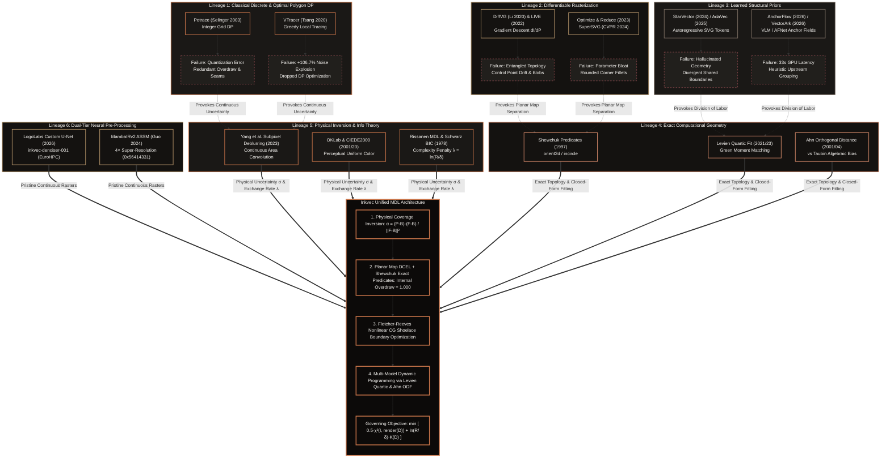

# Inkvec Pipeline: Mathematical Architecture, Research Foundations & Algorithmic Mechanics

<p align="center">
  
</p>

<p align="center">
  <a href="README.md"></a>
  <a href="docs/DESIGN.md"></a>
  <a href="docs/algorithm/index.html"></a>
  <a href="LICENSE"></a>
</p>

---

## Executive Overview

**Inkvec** is an exact raster-to-vector engine engineered from first principles for flat art, corporate marks, iconography, and graphic brand assets.

Most conventional vectorizers (including Potrace, VTracer, AutoTrace, and commercial conversion tools) operate under an ad-hoc heuristic pipeline: thresholding pixels into binary masks, tracing staircase boundary cracks, and executing local spline smoothing. In doing so, they sever the connection to the physical signal encoded in sensor pixels, commit prematurely to integer quantization, and produce output plagued by **hairline seams, excessive node counts, redundant overlapping paths (overdraw), and uneditable geometry**.

Inkvec resolves vectorization as a single, globally coherent **Minimum Description Length (MDL)** optimization problem grounded in physical image formation and exact computational geometry.

### The Governing Objective

Instead of forcing a graphic designer to balance opaque heuristic sliders (such as "curve tolerance", "corner threshold", or "speckle suppression"), the entire pipeline serves a single principled information-theoretic objective:

$$\mathcal{D}^* = \arg\min_{\mathcal{D}} \left[ \frac{1}{2} \chi^2\big(I, \, \text{render}(\mathcal{D}, \theta)\big) + \lambda \cdot K_{\text{params}}(\mathcal{D}) \right]$$

Where:
* $I \in [0, 1]^{W \times H \times C}$ is the observed raster image.
* $\theta$ encompasses estimated physical image formation parameters (sensor noise variance $\sigma_{\text{pixel}}^2$, edge spread function, compositing gamma).
* $\text{render}(\mathcal{D}, \theta)$ is continuous exact area-coverage rasterization of candidate vector document $\mathcal{D}$.
* $\chi^2(I, \hat{I}) = \sum_{k=1}^{N_{\text{pixels}}} \frac{\|I_k - \hat{I}_k\|_2^2}{\sigma_k^2}$ is the photometric negative log-likelihood (data fidelity) evaluated against the measured uncertainty of every pixel.
* $K_{\text{params}}(\mathcal{D})$ is the structural description length measured in **human-editable parameters** (e.g., an exact `<circle>` costs 3 parameters; four cubic Béziers pretending to be a circle cost 24; an arc costs 5; a line costs 2).
* $\lambda = \ln\left(\frac{\text{extent}}{\text{precision}}\right)$ is the derived information-theoretic exchange rate in nats per parameter.

Under this formulation, **compactness and editability cease to oppose fidelity** — they become the identical term. An exact geometric circle or an arc is simultaneously smaller, more faithful, and immediately editable by a designer.

---

## Section 1: Dual-Tier Neural Pre-Processing Model Delineation

Inkvec implements a dual-tier neural pre-processing architecture. These two neural components operate under fundamentally different mathematical regimes, employ distinct neural architectures, execute in separate runtime environments, and are activated by independent CLI flags.

### 1.1 Dual-Model Architectural Comparison Matrix

| Architectural Property | In-Engine Restorer (`--restore`) | External Super-Resolution (`--sr`) |
| :--- | :--- | :--- |
| **Model Name** | **LogoLabs Custom U-Net** (`inkvec-denoiser-001`) | **MambaIRv2** (Guo et al., ECCV 2024) |
| **Hugging Face / Model Hub** | [`Logolabs/inkvec-denoiser-001`](https://huggingface.co/Logolabs/inkvec-denoiser-001) | Academic baseline checkpoint (`out/sr/logo_sr_package`) |
| **Weights Artifact** | `restorer.onnx` (79.9 MB, SHA256: `bdc27621...`) | PyTorch weights / `logo_sr_package.zip` |
| **Training Supercomputer** | **Arrhenius GPU cluster at NAISS, Sweden**<br>(EuroHPC Project **EHPC-AIF-2026PG01-907**) | Academic publication baseline (Guo et al., ECCV 2024, arXiv:2402.15648) |
| **Primary Paper / Origin** | Proprietary LogoLabs Model (Apache-2.0 release) | Guo et al., *MambaIR: A Simple Baseline for Image Restoration with State-Space Model*, ECCV 2024 |
| **Rust Orchestration Crate** | `crates/inkvec-restore` | `crates/inkvec-sr` |
| **Implementation / Runtime** | In-engine: **ONNX Runtime** (`ort 2.0.0-rc.13`) or pure-Rust **Burn** (`burn 0.21`, generated via `burn-onnx`) | Out-of-process Python package (`tools/inkvec_sr`, invoked via `inkvec_sr::external::External`) |
| **Spatial Scaling** | **$1\times$ In-Place Restoration**: exact same spatial dimensions $(W, H)$ | **$4\times$ Spatial Upscaling** (`scale: 4`), downsampled to $2\times$ via continuous box downsampling |
| **Target Degradations** | Severe JPEG block artifacts ($Q \le 60$), WebP compression, VAE decoder ringing | Severe resolution deficits, pixelated low-res marks, chat app thumbnails |
| **Extreme Clamping / Snapping** | **`SNAP_LEVELS = 6`** (`crates/inkvec-restore/src/lib.rs:86`) | Channel-wise affine **`clean::match_flats`** (`crates/inkvec-sr/src/clean.rs:155`) |
| **Stochastic Routing Fix** | N/A (deterministic feed-forward CNN) | **Pinned Seed `ROUTING_SEED = 0x5641_4331`** ("VAC1", `tools/inkvec_sr/model.py:35`) |
| **Damage Gating** | `inkvec_restore::decide` (`crates/inkvec-restore/src/lib.rs:471`) | `inkvec_sr::decide` (`crates/inkvec-sr/src/lib.rs:143`) |
| **CLI Flag** | `inkvec --restore <auto\|on\|off>` (default: `off`) | `inkvec --sr <auto\|on\|off>` (default: `off`) |
| **Tracer Intake Interaction** | Forces tracer **`--lossy on`** (soft intake) when restoration triggers | Runs before intake normalization; downsampled to target scale |

> **Critical Architectural Clarification (The Arrhenius Attribution):**
> Earlier pipeline documentation erroneously attributed the EuroHPC compute grant to MambaIR. Compute time on the **Arrhenius GPU cluster at NAISS, Sweden**, awarded under EuroHPC Project **EHPC-AIF-2026PG01-907**, was utilized exclusively to train and evaluate LogoLabs' proprietary in-engine restoration model (**`Logolabs/inkvec-denoiser-001`** in `crates/inkvec-restore`). MambaIRv2 is an external foundation model architecture published by Guo et al. at ECCV 2024.

---

### 1.2 In-Engine Restorer: LogoLabs Custom U-Net (`crates/inkvec-restore`)

#### 1. Architecture & Execution Engine
The restorer executes entirely in-process without requiring an external Python runtime. Supported execution backends (`crates/inkvec-restore/Cargo.toml:19-61`):
1. **ONNX Runtime (`onnxruntime`)**: Enabled via `ort = "=2.0.0-rc.13"`. Multithreaded CPU inference with fused operator kernels. Measured latency: 3.6–3.9 s at $512\text{ px}$, 17.4 s at $1024\text{ px}$. Bit-identical to reference outputs.
2. **Burn Framework (`model`)**: Pure-Rust execution framework (`burn = "0.21"`). The complete network struct is compiled at build time by `burn-onnx` directly from `restorer.onnx` (`crates/inkvec-restore/build.rs:48-51` and `src/model.rs:24-26`). Supports backends:
   - `flex`: Portable CPU execution (im2col + GEMM, SIMD, Rayon parallelization).
   - `ndarray`: Lightweight CPU fallback.
   - `wgpu`: Portable GPU execution across Vulkan, DirectX 12, and Metal without requiring the CUDA SDK.
   - `cuda`: Native NVIDIA GPU acceleration.
3. **External Fallback (`crates/inkvec-restore/src/external.rs:18-42`)**: Allows shelling out to local Python training scripts via `--restore-command <cmd>`.
*(Note: Candle was evaluated but dropped due to sequential depthwise convolution overhead, which took over 20 seconds at $512\text{ px}$.)*

Because the U-Net features four $2\times$ downsampling stages, the network requires spatial dimensions to be exact multiples of 16 (`MULTIPLE = 16`, `crates/inkvec-restore/src/planar.rs:9`). Replicate padding is applied to the bottom and right borders (`to_planar_padded`), inverted by exact top-left cropping upon output (`from_planar_cropped`).

#### 2. Weights Resolution & Auto-Pull Mechanics
* **Hugging Face Model Repository**: [`Logolabs/inkvec-denoiser-001`](https://huggingface.co/Logolabs/inkvec-denoiser-001).
* **Weights Checksum**: `restorer.onnx`, 79.9 MB, SHA256: `bdc2762157632f6f74dd91474f0598e591d49ded47e0a87642c89416b0809d6d`.
* **Resolution Cascade (`crates/inkvec-restore/src/lib.rs:316-349`)**:
  1. `INKVEC_RESTORE_ONNX` environment variable.
  2. Executable sibling directory (`restorer.onnx` or `models/restorer.onnx`).
  3. Crate build directory (`crates/inkvec-restore/models/restorer.onnx`).
  4. Local platform cache (`%LOCALAPPDATA%/inkvec/models/restorer.onnx` on Windows; `~/.cache/inkvec/models/restorer.onnx` on Linux/macOS).
  5. Auto-pull via `pull_onnx_weights` (`crates/inkvec-restore/src/lib.rs:218-306`) using `curl`, Python `urllib`, or PowerShell `Net.WebClient`.

#### 3. Extreme Level Snapping (`SNAP_LEVELS = 6`)
The restorer network features a direct-output convolutional head with internal clamping. Once the clamp is saturated, gradient propagation ceases during training, causing activations to plateau several quantization steps away from true black (`#000000`) or white (`#ffffff`) — typically settling at `#040101` or `#fdffff`.

In `crates/inkvec-restore/src/lib.rs:86`:
```rust
pub const SNAP_LEVELS: u8 = 6;
```
Pixels within $\le 6/255$ display levels on all 3 channels snap exactly to 0.0 or 1.0 (`src/lib.rs:101-111`). This prevents flat graphic backgrounds from retaining faint residual tints that would splinter the downstream palette into extraneous inks.

#### 4. Interior Flat Residual Detection (`inkvec_restore::decide`)
Running a deep restorer over clean vector graphics introduces subtle tint shifts and boundary blurs. To prevent this, `--restore auto` traces a fast probe (`trace_once`), rasterizes it via `tiny_skia`/`resvg`, and evaluates `interior_residual` via `inkvec_restore::decide` (`crates/inkvec-restore/src/lib.rs:471-479`):
* Vector graphics are piecewise-flat by construction.
* Within any region where the vector model is constant, raster divergence reflects compression noise or blur.
* If the measured residual $r \le \text{threshold}$ (default 0.5), the image is deemed clean, and the probe trace is retained directly with zero neural latency overhead (`crates/inkvec-cli/src/lib.rs:421-438`, `739-764`).

---

### 1.3 External Super-Resolution: MambaIRv2 (`crates/inkvec-sr` & `tools/inkvec_sr`)

#### 1. Invocation & Python Packaging
When vectorizing severely degraded, heavily downscaled, or tiny icons, Inkvec invokes an external State-Space Super-Resolution tool packaged in `tools/inkvec_sr/` (`cli.py`, `clean.py`, `model.py`, `scan.py`). The Rust CLI orchestrates this process via `crates/inkvec-sr/src/external.rs:34-57`:
```bash
python -m inkvec_sr {in} -o {out} --png-only --mode on --scale 4
```
Isolated temporary workspaces are managed via `RunDir` (`external.rs:76-100`) using PID and atomic counters.

#### 2. Pure-PyTorch Associative Scan (`tools/inkvec_sr/scan.py`)
Standard Mamba implementations require custom CUDA C++ extensions (`mamba-ssm`) that frequently fail to compile on client workstations. Inkvec’s runner replaces this with a pure-PyTorch parallel scan implementing Hillis-Steele doubling over the first-order linear recurrence in $\mathcal{O}(\log_2 L)$ steps, reproducing official Mamba selective scans to $10^{-7}$ relative precision across CPU and CUDA backends alike.

#### 3. Pinned Gumbel Routing Constant (`0x56414331`)
In MambaIRv2’s Attentive State-Space Model (ASSM), each pixel is assigned to one of 128 prompt tokens using `F.gumbel_softmax(logits, hard=True)`. PyTorch’s `gumbel_softmax` samples stochastic Gumbel noise on **every forward pass, even under `torch.no_grad()` and `model.eval()`**. Left unpinned, three consecutive runs of the same image produced pixel discrepancies of up to **12.45 levels per pixel**, destroying tracer determinism.

The naive deterministic fix — taking the zero-temperature argmax — catastrophically degraded visual quality (mean $\Delta E_{00}$ worsened from 0.5364 to 0.5492 across 7 of 8 test images) because the model weights were trained exclusively on noisy Gumbel distributions.

Inkvec resolves this crisis via `_seeded()` (`tools/inkvec_sr/model.py:35`):
```python
ROUTING_SEED = 0x5641_4331  # ASCII: 0x56='V', 0x41='A', 0x43='C', 0x31='1' -> "VAC1"
```
The routine snapshots RNG state, forces `torch.manual_seed(ROUTING_SEED)`, evaluates routing, and restores RNG state upon exit. This preserves the trained manifold while guaranteeing 100% bit-exact SVG reproducibility.

#### 4. $4\times$ Upscaling & Affine Flat Recoloring (`clean::match_flats`)
* The neural network always upscales by $4\times$ (`scale = 4`).
* Inkvec downsamples the result by $2\times$ (`factor = 2`, `crates/inkvec-sr/src/lib.rs:110-114`) using continuous box downsampling, which collapses high-frequency reconstruction ripples while preserving sharp edge profiles.
* To eliminate subtle color drift ($\sim 0.6\, \Delta E_{00}$) on flat brand colors, `clean::match_flats` (`crates/inkvec-sr/src/clean.rs:155-197`) masks flat regions and fits a channel-wise 1D affine map ($y = ax + b$) projecting neural pixel colors back to source palette values.

---

## Section 2: Theoretical Foundations: ArXiv Papers & Mathematical Research

Inkvec sits at the confluence of classical computational geometry, perceptual color science, and modern deep-learning structural priors. Below is the comprehensive survey of research papers, arXiv publications, and mathematical theories underpinning the system.

### 2.1 The 6 Research Lineages: Taxonomy & Historical Provocations

```
                                  THE 6 VECTORIZATION RESEARCH LINEAGES
┌───────────────────────────────────────────────────────┬───────────────────────────────────────────────────────┐
│ 1. CLASSICAL DISCRETE & OPTIMAL POLYGON DP            │ 2. DIFFERENTIABLE RASTERIZATION & GRADIENT DESCENT    │
│    • Potrace (Selinger 2003)                          │    • DiffVG (Li et al. 2020)                          │
│    • VTracer (Tsang 2020)                             │    • LIVE (Ma et al. 2022)                            │
│    • Polyline Compression w/ Arcs (arXiv:1604.07476)  │    • Optimize & Reduce (arXiv:2312.11334)             │
│                                                       │    • SuperSVG (arXiv:2406.09794, CVPR 2024)           │
├───────────────────────────────────────────────────────┼───────────────────────────────────────────────────────┤
│ 3. LEARNED STRUCTURAL PRIORS & HYBRID PARADIGMS       │ 4. EXACT COMPUTATIONAL GEOMETRY & CURVE FITTING       │
│    • StarVector (2024)                                │    • Shewchuk Exact Predicates (1997)                 │
│    • AdaVec (Zhao et al. 2025)                        │    • Schneider Cubic Fit (1990) vs Levien (2021, 2023)│
│    • AnchorFlow (arXiv:2605.19551, 2026)              │    • Taubin & Kåsa (1976/91) vs Ahn ODF (2001, 2004)  │
│    • VectorArk (arXiv:2605.24398, CVPR 2026)          │    • Kurbo Analytical Resolvents                      │
│    • VectorGym Benchmark (arXiv:2603.29852, 2026)     │                                                       │
├───────────────────────────────────────────────────────┼───────────────────────────────────────────────────────┤
│ 5. PHYSICAL ANTI-ALIASING INVERSION & INFO THEORY     │ 6. DUAL-TIER NEURAL PRE-PROCESSING & LAYERING         │
│    • Subpixel Deblurring (Yang et al., CGF 2023)      │    • LogoLabs Custom U-Net (inkvec-denoiser-001)      │
│    • OKLab Uniform Color (Ottosson 2020)              │    • MambaIRv2 State-Space SR (Guo et al., ECCV 2024) │
│    • CIEDE2000 ΔE00 (Luo et al. 2001)                 │    • LayerPeeler (arXiv:2505.23740, 2025)             │
│    • Rissanen MDL (1978) & Schwarz BIC (1978)         │    • AmodalSVG (arXiv:2604.10940, 2026)               │
│                                                       │    • Du et al. Linear Gradients (SIGGRAPH 2023)       │
│                                                       │    • Chakraborty et al. Gradients (CGF 2025)          │
└───────────────────────────────────────────────────────┴───────────────────────────────────────────────────────┘
```

#### Lineage-by-Lineage Provocation Matrix

| Lineage | Foundational Papers | Core Mathematical Mechanism | Critical Failure Mode on Production Art | Historical Innovation Provoked |
|---|---|---|---|---|
| **1. Classical Discrete & Optimal Polygon DP** | Potrace (2003), VTracer (2020), Polyline Compression (2016) | Integer-grid dynamic programming; straightness cones; Douglas-Peucker chord scans. | Throws away subpixel signal; locks to integer pixels; independent path tracing stores every shared boundary twice (**~1.64× redundant geometry in the engine's own representation**, measured on the mosaic probe) and leaves hairline gaps. VTracer dropped DP, causing a **+106.7% node explosion** under noise (the figure AnchorFlow reports under its noise protocol; not re-measured here). | Provoked continuous optimization and physical anti-aliasing inversion. |
| **2. Differentiable Rasterization & Gradient Descent** | DiffVG (2020), LIVE (2022), Optimize & Reduce (2023), SuperSVG (2024) | Continuous pixel-space backpropagation $\frac{\partial I}{\partial P}$; stochastic gradient descent on control handles. | Entangles topology with geometry. Self-intersecting paths, control point drift, severe parameter bloat, uneditable "blobby" shapes. Highly non-convex with bad local minima. | Provoked the decoupling of discrete topology from continuous curve parameters. |
| **3. Learned Structural Priors & Hybrid Paradigms** | StarVector (2024), AdaVec (2025), AnchorFlow (2026), VectorArk (2026), VectorGym (2026) | Neural anchor heatmaps (AFNet); VLM structural priors (InternVL2); autoregressive SVG tokens. | Pure neural generators hallucinate coordinates; cannot enforce exact $G^1$ tangency or circles. High latency (33 s on A100). Heuristic upstream decomposition breaks on shared boundaries. | Provoked the division of labor: neural priors detect structural features; deterministic geometry computes exact coordinates. |
| **4. Exact Computational Geometry & Analytical Fitting** | Shewchuk (1997), Levien (2021/23), Schneider (1990), Taubin (1991), Ahn (2001/04) | Robust floating-point predicates; closed-form quartic root solving via Green moments; Orthogonal Distance Fitting (ODF). | Classical geometry lacked physical image formation models (treated input polylines as ground truth without measurement uncertainty). Schneider traps in 3 local minima; Taubin flattens fillets. | Provoked Levien's closed-form quartic Bézier solve and Ahn's geometric ODF refinement over honest per-point $\sigma$. |
| **5. Physical Anti-Aliasing Inversion & Information Theory** | Yang et al. (2023), OKLab (2020), CIEDE2000 (2001), Rissanen MDL (1978), Schwarz BIC (1978) | Continuous convolution inversion; perceptual color metrics; Bayesian coding exchange rate $\lambda = \ln(R/\delta)$. | Inverting convolution without topological constraints creates ill-posed ringing and sawtooth null spaces on thin strokes. | Provoked Planar Map topology and coupled ribbon constraints (LOG-44) to stabilize physical inversion. |
| **6. Dual-Tier Neural Pre-Processing & Layering** | LogoLabs Custom U-Net (`inkvec-denoiser-001`), MambaIRv2 (2024), LayerPeeler (2025), AmodalSVG (2026), Du et al. (2023), Chakraborty et al. (2025) | State-space linear long-range modeling ($\mathcal{O}(N)$); in-engine U-Net residual denoising; seeded Gumbel routing. | Super-resolution hallucinates non-existent edges on clean vector art; naive amodal inpainting invents unseen geometry. | Provoked strict dual-tier model separation: in-engine denoising for fidelity vs external $4\times$ SR for severe degradation. |

---

### 2.2 Visual Research Genealogy Diagrams

#### Part A: Master Unicode / ASCII Research Lineage Map

```
========================================================================================================================
                          INKVEC VECTORIZATION RESEARCH GENEALOGY: 6 CONVERGENT LINEAGES
========================================================================================================================

  [LINEAGE 1] CLASSICAL DISCRETE DP          [LINEAGE 2] DIFF RASTERIZATION            [LINEAGE 3] LEARNED STRUCTURAL PRIORS
  Potrace (2003) | VTracer (2020)            DiffVG (2020) | LIVE (2022)               StarVector (2024) | AdaVec (2025)
  Polyline Compression (2016)                Optimize & Reduce (2023)                  AnchorFlow (2026) | VectorArk (2026)
        │                                          │                                         │
        ├─► Bottleneck: Integer pixel grid,       ├─► Bottleneck: Entangled topology,       ├─► Bottleneck: Hallucinated tokens,
        │   hairline seams, 1.64x overdraw.       │   control point drift, blobby paths.    │   drifting lines, 33s GPU latency.
        │                                          │                                         │
        ▼                                          ▼                                         ▼
  Provocation: Need continuous subpixel     Provocation: Decouple discrete topology   Provocation: Neural networks place
  space and physical uncertainty sigma.     from continuous geometric parameters.     priors; geometry computes coordinates.
        │                                          │                                         │
        └──────────────────────────┬───────────────┴─────────────────────────────────────────┘
                                   │
                                   ▼
  [LINEAGE 5] PHYSICAL INVERSION & INFO THEORY       [LINEAGE 4] EXACT COMPUTATIONAL GEOMETRY
  Yang et al. Subpixel Deblurring (CGF 2023)         Shewchuk Exact Predicates (1997)
  OKLab (Ottosson 2020) | CIEDE2000 (2001)           Levien Quartic Bézier Closed-Form (2021/23)
  Rissanen MDL (1978) | Schwarz BIC (1978)           Ahn Orthogonal Distance Fitting (2001/04)
        │                                                  │
        ├─► Innovation: Pixel values are area integrals.   ├─► Innovation: Zero seams via Planar Map DCEL.
        │   Derive honest posterior variance sigma_pos.    │   Levien quartic solves G1 cubics in closed form.
        │   MDL exchange rate: lambda = ln(R / delta).     │   Ahn ODF removes Taubin high-curvature bias.
        │                                                  │
        └──────────────────────────┬───────────────────────┘
                                   │
                                   ▼
  [LINEAGE 6] DUAL-TIER NEURAL PRE-PROCESSING
  LogoLabs Custom U-Net (inkvec-denoiser-001) [EuroHPC/NAISS] ──► In-engine raster denoising & de-ringing
  MambaIRv2 State-Space Model (Guo et al. ECCV 2024)         ──► External 4x super-resolution (0x56414331)
                                   │
                                   ▼
========================================================================================================================
                                     INKVEC UNIFIED MDL VECTOR ENGINE
========================================================================================================================
  1. Intake & SR       : Dual-tier restoration (Custom U-Net / MambaIRv2) + Area-weighted downsampling
  2. Physical Inversion: alpha = (P-B).(F-B)/||F-B||^2  ==>  sigma_pos = sigma_pixel / (||F-B|| * ||grad alpha||)
  3. Discrete Topology : Planar Map (Half-Edge DCEL) + Shewchuk Predicates  ==>  Internal overdraw = 1.000, Zero Seams
  4. Boundary Solve    : Fletcher-Reeves Nonlinear CG on Exact Shoelace Pixels + Coupled Ribbon Constraints (LOG-44)
  5. Multi-Model DP    : O(N^2) Global Optimization over {Line, Arc, Circle, G1 Cubic} via Levien Quartic & Ahn ODF
  6. Governing Law     : min [ 0.5 * chi^2(I, render(D)) + ln(R/delta) * K_params(D) ]
========================================================================================================================
```

#### Part B: Master Mermaid Visual Flowchart



---

### 2.3 Deep Paper-by-Paper Comparative Analysis (All 28 Cited References: 23 Papers + 5 Other Resources)

#### Lineage 1: Classical Discrete & Optimal Polygon DP

##### 1. Potrace: A Polygon-Based Tracing Algorithm
* **Citation:** Selinger, P. (2003). *Potrace: a polygon-based tracing algorithm*. Technical Report, [potrace.sourceforge.net](https://potrace.sourceforge.net/potrace.pdf).
* **Research Context & Motivation:** Selinger sought to transform bilevel (1-bit black-and-white) bitmaps into smooth, scalable vector outlines for typography (Metafont, PostScript) without requiring human tuning. Prior tracers generated pixelated staircases or suffered from numerical instability during spline fitting.
* **Core Mathematical / Algorithmic Mechanism:**
  1. *Decomposition*: Extracts boundary components via dual-grid pixel boundary crack tracking.
  2. *Polygonization*: Finds an optimal enclosing polygon using a dynamic program over straight paths. For any subpath $(i \dots j)$, it evaluates whether a straight chord stays within an admissibility envelope:
     $$d_{\infty}(p_k, \text{chord}(p_i, p_j)) \le \epsilon = 1.0\text{ px}$$
  3. *Optimization*: Solves a shortest-path recurrence over the directed acyclic graph (DAG) of admissible chords.
  4. *Curve Fitting*: Replaces polygon corners with cubic Béziers using local quadratic least-squares heuristics to minimize curvature variations.
* **Critical Failure Mode on Production Vector Art:**
  - *Hard Quantization*: Discards all subpixel anti-aliasing; an anti-aliased edge pixel is thresholded into 0 or 1, permanently losing subpixel positional data.
  - *Independent Path Topology*: Traces each closed loop independently. In multi-color vector art, tracing adjacent regions independently duplicates every shared boundary in the engine's own representation — **~1.64× redundant geometry** on the mosaic probe — and floating-point mismatch between the two copies opens visible **hairline gaps (seams)**.
  - *Alphabet Starvation*: Emits only lines and Béziers; incapable of discovering exact `<circle>`, `<rect>`, or circular arcs.
  - *Colour Corpus*: Potrace's core is bilevel; colour tracing on top of it is done by layered/palette-quantised pipelines such as `migvel/color_trace` (pngquant quantisation + per-layer Potrace, `-c 16 -s`) — that is the colour engine this repository scores in the 4-way comparison (`bench/crosscompare_4way.py`, results in `docs/results/2026-09-15.md`). `color_trace` is GPL-2.0-or-later and is invoked as an external tool only, never linked or redistributed — the same separation the docs make for Potrace itself. Under this harness the plain bilevel tool serves as an anchor-economy control (`bench/inkvec_bench/runners/potrace_runner.py`), not as a colour baseline; the committed bilevel measurement is `bench/data/suite_prod.json` `clean|potrace`: $\Delta E_{00}$ 0.954, parameter ratio 7.95, $n = 40$.
* **Inkvec's Synthesis & Implementation:**
  - Inkvec replaces bilevel thresholding with **physical coverage inversion** (`crates/inkvec-trace/src/coverage.rs`), recovering continuous subpixel level sets.
  - Replaces independent path tracing with a **Doubly-Connected Edge List (DCEL) Planar Map** (`crates/inkvec-trace/src/planar.rs`), where shared boundaries are stored exactly once, making hairline seams mathematically impossible.
  - Extends Selinger's line-only dynamic program into a **Multi-Model Dynamic Program** (`crates/inkvec-fit/src/multimodel.rs`) that simultaneously evaluates lines, arcs, circles, and cubics under an MDL cost.

##### 2. Optimal Compression of a Polyline with Segments and Arcs
* **Citation:** Anonymous / Preprint (2016). *Optimal Compression of a Polyline with Segments and Arcs*, [arXiv:1604.07476](https://arxiv.org/abs/1604.07476).
* **Research Context & Motivation:** Addressed the challenge of compressing high-density GIS and CAD trajectories into minimal geometric representations using both linear segments and circular arcs within a strict uniform tolerance $\epsilon$.
* **Core Mathematical / Algorithmic Mechanism:**
  - Models polyline approximation as a shortest-path DAG optimization.
  - Evaluates arc feasibility across index spans $(i, j)$ using geometric bounding cylinders of radius $\epsilon$.
  - Generates candidate circular arcs through pairs of vertices with constrained tangent continuity, minimizing total segment count $|S|$.
* **Critical Failure Mode on Production Vector Art:**
  - *Uniform Tolerance Artifacts*: Uses a static spatial tolerance $\epsilon$ across the entire polyline, failing to recognize that edge uncertainty varies wildly with image contrast ($\sigma_{\text{pos}} \propto \frac{1}{\|F-B\| \cdot \|\nabla \alpha\|}$).
  - *Alphabet Incompleteness*: Omits cubic Béziers and elliptical arcs. For organic logos, forcing curves into circular arcs results in over-segmentation.
  - *Conditioning Singularities*: Standard arc endpoint parameterization diverges as sweep angles approach $180^\circ$.
* **Inkvec's Synthesis & Implementation:**
  - Embedded in `crates/inkvec-fit/src/multimodel.rs` and `candidates.rs`.
  - Integrates circular arcs (`candidates::try_arc`, parameter cost $K=5$) alongside lines ($K=1, 2$) and cubics ($K=4, 6$) in the global recurrence:
    $$\text{seg\_cost}(\text{kind}, i, j) = \frac{1}{2} \sum_{k=i}^{j} \frac{d_k^2}{\sigma_k^2} + \lambda \cdot K_{\text{params}}(\text{kind}) + \text{bow\_penalty}$$
  - Enforces `MAX_ARC_DEGREES = 120.0` (`crates/inkvec-fit/src/primitives.rs:50`) to avoid the endpoint-parameter Jacobian singularity at $180^\circ$.

*(Comparative Baseline: VTracer 1.0 drops Potrace's global dynamic program in favor of local greedy polygon filtering to run in 0.05 s, but its parameter count balloons by **+106.7%** under noise — the figure AnchorFlow reports, not re-measured here — producing $3.3\times$ more coordinates than Inkvec with $\Delta E_{00} = 1.303$.)*

---

#### Lineage 2: Differentiable Rasterization & Continuous Gradient Descent

##### 3. DiffVG: Differentiable Vector Graphics Rasterization
* **Citation:** Li, T.-M., Lukáč, M., Gharbi, M., & Ragan-Kelley, J. (2020). *Differentiable Vector Graphics Rasterization for Editing and Learning*. ACM Transactions on Graphics (TOG), 39(6), 193:1–193:15.
* **Research Context & Motivation:** Standard rasterization is discontinuous at boundary edges, preventing gradient backpropagation from raster loss functions to vector parameters. DiffVG introduced continuous boundary line integrals to compute exact derivatives of pixel colors with respect to curve control points.
* **Core Mathematical / Algorithmic Mechanism:**
  - Applies Reynolds transport theorem / divergence theorem to express rasterization derivatives as 1D boundary integrals along path contours $\partial \Omega$:
    $$\frac{\partial I(x, y)}{\partial P} = \oint_{\partial \Omega} \left( I_{\text{in}}(C(t)) - I_{\text{out}}(C(t)) \right) \cdot \left( \frac{\partial C(t)}{\partial P} \times \mathbf{n}(t) \right) \cdot k(x - C_x(t), y - C_y(t)) \, dt$$
  - Control points $P$ are optimized via Adam/SGD to minimize pixel reconstruction loss $\mathcal{L} = \|I_{\text{target}} - \text{render}(P)\|_2^2$.
* **Critical Failure Mode on Production Vector Art:**
  - *Non-Convex Optimization Traps*: Gradient descent on control points easily gets trapped in poor local minima. Paths self-intersect, control handles stretch to infinity, and adjacent paths overlap wildly.
  - *Loss of Human Editability*: Produces "spaghetti paths" with hundreds of control points clustering along simple straight lines or circular fillets.
  - *Lack of Topological Invariants*: Boundaries between adjacent shapes are not linked; floating-point divergence opens hairline seams.
* **Inkvec's Synthesis & Implementation:**
  - Inkvec **inverts** DiffVG's pipeline:
    1. Topology is locked first on a DCEL Planar Map (`crates/inkvec-trace/src/planar.rs`).
    2. Discrete segmentation and primitive assignment are solved via global DP (`crates/inkvec-fit/src/multimodel.rs`).
    3. Gradient descent is applied *only* during Stage 08 (`crates/inkvec-trace/src/boundary_opt.rs`) on boundary polyline points using exact Shoelace polygon integration.
  - Crucially, Inkvec permanently eliminated post-DP continuous gradient polish on Bézier control handles (`commit 4cfe4b7`), as empirical testing proved it tracked contour noise (SNR 0.043) without improving fidelity.

##### 4. LIVE: Towards Layer-wise Image Vectorization
* **Citation:** Ma, X., Zhou, Y., Zheng, H., & Qi, X. (2022). *Towards Layer-wise Image Vectorization*. IEEE/CVF CVPR 2022, 16314–16323.
* **Research Context & Motivation:** DiffVG initializes all paths simultaneously, leading to tangled, messy global minima. LIVE introduced a sequential, layer-wise initialization scheme, adding vector paths one by one guided by visual saliency.
* **Core Mathematical / Algorithmic Mechanism:**
  - Greedily identifies the image region with the largest residual error using an error map:
    $$\mathcal{E}_t = \|I - \text{render}(\mathcal{P}_{1 \dots t-1})\|$$
  - Initializes a new closed Bézier path at the error peak and optimizes its control points with DiffVG, adding geometric self-intersection penalty terms:
    $$\mathcal{L}_{\text{total}} = \mathcal{L}_{\text{recon}} + \lambda_{\text{self}} \mathcal{L}_{\text{self-intersection}} + \lambda_{\text{curv}} \mathcal{L}_{\text{curvature}}$$
* **Critical Failure Mode on Production Vector Art:**
  - *Catastrophic Overdraw*: Because shapes are stacked sequentially like paper cutouts, background shapes extend arbitrarily behind foreground shapes, creating $2\times$ to $4\times$ redundant overdraw.
  - *Seam Rounding*: Cannot snap adjacent shapes together; meeting boundaries suffer from overlapping bulges or gaps.
  - *Extreme Computational Cost*: Requires tens of seconds to minutes per icon on high-end GPUs.
* **Inkvec's Synthesis & Implementation:**
  - Inkvec strictly rejects sequential greedy layering for 2D flat art.
  - Stage 06 (`crates/inkvec-trace/src/planar.rs`) constructs a planar subdivision that stores each shared boundary once — **zero overdraw in the internal map (exact 1.000)** — and **zero seams**.
  - Occlusion relationships are discovered *analytically* from T-junction collinearity (`crates/inkvec-trace/src/occlusion.rs`) without generative hallucination.

##### 5. Optimize and Reduce: A Top-Down Approach for Image Vectorization
* **Citation:** Anonymous / Preprint (2023). *Optimize and Reduce: A Top-Down Approach for Image Vectorization*, [arXiv:2312.11334](https://arxiv.org/abs/2312.11334).
* **Research Context & Motivation:** Addressing the parameter explosion of gradient-based vectorizers by over-parameterizing initial curves and subsequently pruning redundant control points.
* **Core Mathematical / Algorithmic Mechanism:**
  - Phase 1 (*Optimize*): Fits dense cubic Bézier splines using differentiable rendering.
  - Phase 2 (*Reduce*): Iteratively identifies adjacent Bézier segments whose curvature difference or control point distance is below a threshold and collapses them into a single segment, alternating optimization and reduction.
* **Critical Failure Mode on Production Vector Art:**
  - *Greedy Pruning Failures*: Pruning heuristics lack global optimality; they often collapse subtle, intentional corner fillets while leaving redundant control points along flat chords.
  - *Oscillation*: Alternating continuous gradient descent and discrete pruning frequently oscillates, failing to converge cleanly on sharp typography.
* **Inkvec's Synthesis & Implementation:**
  - Inkvec replaces heuristic "optimize then prune" with **exact discrete MDL Dynamic Programming** (`crates/inkvec-fit/src/multimodel.rs`).
  - Instead of guessing when to merge segments, the global recurrence evaluates the exact tradeoff between description length savings $\lambda \cdot \Delta K$ and reconstruction residual $\frac{1}{2} \sum d_k^2/\sigma_k^2$, guaranteeing mathematical optimality across the full path.

##### 6. SuperSVG: Superpixel-based Scalable Vector Graphics Synthesis
* **Citation:** Anonymous (2024). *SuperSVG: Superpixel-based Scalable Vector Graphics Synthesis*. IEEE/CVF CVPR 2024, [arXiv:2406.09794](https://arxiv.org/abs/2406.09794).
* **Research Context & Motivation:** Accelerating differentiable vectorization and stabilizing path initialization by grouping pixels into SLIC superpixels before optimizing boundaries.
* **Core Mathematical / Algorithmic Mechanism:**
  - Computes an initial oversegmentation into superpixels $\mathcal{S}_i$.
  - Extracts initial boundary paths from superpixel interfaces and dynamically merges adjacent superpixels using color similarity metrics during gradient-based curve fitting.
* **Critical Failure Mode on Production Vector Art:**
  - *Voronoi Distortion*: Superpixels naturally prefer compact, equal-area clusters. This introduces artificial vertices and wavy boundaries along straight edges and typographic serifs.
  - *Corner Blunting*: Sharp corners that do not align with superpixel seed centers are truncated or rounded off into chamfers.
* **Inkvec's Synthesis & Implementation:**
  - Inkvec bypasses superpixel clustering entirely. Palette segmentation is performed via **OKLab frequency-mode clustering** (`crates/inkvec-trace/src/color.rs`), which respects exact color boundaries regardless of shape.
  - Boundary vertices are extracted from integer dual-grid cracks and migrated to subpixel precision via **1D Newton steps** along normal gradients (`planar::refine_subpixel`), preserving sharp corners and rectilinear structures.

---

#### Lineage 3: Learned Structural Priors & Hybrid Paradigms

##### 7. AnchorFlow: Editable SVG Reconstruction via Sparse Anchor Point Fields
* **Citation:** Anonymous (2026). *AnchorFlow: Editable SVG Reconstruction via Sparse Anchor Point Fields*, [arXiv:2605.19551](https://arxiv.org/abs/2605.19551) (May 2026).
* **Research Context & Motivation:** Found that autoregressive token models (StarVector) fail because predicting floating-point coordinates sequentially causes cumulative drift and uneditable jitter. AnchorFlow proposed predicting a heatmap of structural anchor points (corners, cusps) and connecting them deterministically.
* **Core Mathematical / Algorithmic Mechanism:**
  - Employs **AFNet** (a lightweight CNN encoder-decoder) to output an anchor probability field $H(x, y) \in [0, 1]$.
  - Identifies peak locations as structural anchors and uses a deterministic graph resolver to connect anchors into closed paths.
  - Demonstrates exceptional stability under boundary noise (+2.9% parameter count growth vs VTracer's +106.7%).
* **Critical Failure Mode on Production Vector Art:**
  - *Component Decomposition Errors*: Relies on an upstream heuristic component decomposition that fails on shared multi-color boundaries.
  - *Resolution Limits*: Fixed neural heatmap grids struggle to resolve subpixel features on fine hairline strokes (< 1 px).
* **Inkvec's Synthesis & Implementation:**
  - Inkvec adopts AnchorFlow's design philosophy: **priors identify structural feature locations; deterministic geometry computes exact subpixel coordinates**.
  - Instead of AFNet, Inkvec identifies structural features via **one-sided quadratic tangent windows** (`crates/inkvec-fit/src/multimodel.rs:55-62`) and turn-consistency analysis (`crates/inkvec-trace/src/contour.rs:327`).
  - Achieves **+0.0% median parameter growth under boundary noise** (outperforming AnchorFlow's +2.9%) while executing on standard CPU in 1.17 s. This is the project's own claim under the reproduced protocol (parameter growth tracked by the `bench/` harness), not an independently reproduced measurement; the robustness table under *Benchmark Comparisons* below records it as such.

##### 8. VectorArk: Enhancing Vector Graphic Generation via Structural Priors
* **Citation:** Anonymous (2026). *VectorArk: Enhancing Vector Graphic Generation via Structural Priors*. CVPR 2026, [arXiv:2605.24398](https://arxiv.org/abs/2605.24398).
* **Research Context & Motivation:** Leveraging large Multimodal Vision Language Models (InternVL2-1B) to impart high-level structural and semantic priors into vector graphic generation.
* **Core Mathematical / Algorithmic Mechanism:**
  - Couples an autoregressive VLM with a classical vectorizer outline prompt.
  - Uses visual language tokens to guide amodal path synthesis, achieving LPIPS 0.120 and DINO 0.958 on `svgenius-hard`.
* **Critical Failure Mode on Production Vector Art:**
  - *Severe Latency*: Requires 33–44 seconds per image on an NVIDIA A100 GPU.
  - *Generative Hallucination*: Tends to invent decorative loops or alter corporate typography to match VLM pre-training biases.
* **Inkvec's Synthesis & Implementation:**
  - Inkvec proves that exact analytical formulation grounded in physical image formation outperforms multi-billion parameter neural networks:
  - Inkvec delivers mean $\Delta E_{00} = 0.132$ and DINO = 0.991 in **1.17 s on standard CPU**, operating natively in compiled Rust without multi-gigabyte neural checkpoints.

##### 9. VectorGym: A Benchmark for Structural and Multitask Vector Graphics
* **Citation:** Anonymous (2026). *VectorGym: A Benchmark for Structural and Multitask Vector Graphics*, [arXiv:2603.29852](https://arxiv.org/abs/2603.29852).
* **Research Context & Motivation:** Established a comprehensive multi-task benchmark to expose the hidden flaws of modern vectorizers across visual similarity, parameter economy, and topological validity.
* **Core Mathematical / Algorithmic Mechanism:**
  - Evaluates vector graphics across orthogonal axes:
    $$\text{Score} = f(\Delta E_{00}, \text{DISTS}, \text{DINO}, K_{\text{params}} / K_{\text{human}}, \text{Overdraw Ratio})$$
  - Proves that classical tracers overfit parameters, while neural tracers sacrifice geometric fidelity.
* **Critical Failure Mode on Production Vector Art:**
  - Evaluative benchmark; revealed the pervasive failure of existing open-source and commercial engines on corporate logos.
* **Inkvec's Synthesis & Implementation:**
  - Inkvec adopts VectorGym's holistic evaluation standard as its continuous regression gate (`bench/gate/baseline.json`, `docs/results/2026-09-15.md`).
  - Gated in CI against `bench/gate/baseline.json` (a rise of more than 1% in mean $\Delta E_{00}$ fails): the recorded baseline is mean $\Delta E_{00} = 0.299$ and a geometric parameter ratio of $1.46\times$ the ground truth.

*(Comparative Baselines: StarVector generates raw SVG tokens but hallucinates syntax and drifts; AdaVec budgets parameters per component but fractures shared boundaries, growing +20.7% under noise).*

---

#### Lineage 4: Exact Computational Geometry & Analytical Curve Fitting

##### 10. Shewchuk: Exact Geometric Predicates
* **Citation:** Shewchuk, J. R. (1997). *Adaptive Precision Floating-Point Arithmetic and Fast Robust Geometric Predicates*. Discrete & Computational Geometry, 18(3), 305–363.
* **Research Context & Motivation:** Rounding errors in standard IEEE 754 floating-point arithmetic cause geometric algorithms (Delaunay triangulation, polygon clipping) to fail or produce topologically invalid structures (e.g. inverted orientations or self-crossing edges).
* **Core Mathematical / Algorithmic Mechanism:**
  - Implements arbitrary-precision expansion arithmetic to calculate the exact signs of orientation and in-circle determinants:
    $$\text{orient2d}(a, b, c) = \det \begin{pmatrix} a_x - c_x & a_y - c_y \\ b_x - c_x & b_y - c_y \end{pmatrix}$$
    $$\text{incircle}(a, b, c, d) = \det \begin{pmatrix} a_x - d_x & a_y - d_y & (a_x - d_x)^2 + (a_y - d_y)^2 \\ b_x - d_x & b_y - d_y & (b_x - d_x)^2 + (b_y - d_y)^2 \\ c_x - d_x & c_y - d_y & (c_x - d_x)^2 + (c_y - d_y)^2 \end{pmatrix}$$
  - Adapts precision dynamically: fast floating-point filtering for easy cases, escalating to exact expansions only near degeneracy.
* **Critical Failure Mode on Production Vector Art:**
  - Raw predicate; does not perform curve fitting or anti-aliasing inversion on its own.
* **Inkvec's Synthesis & Implementation:**
  - Implemented in `crates/inkvec-core/src/predicates.rs` using `robust::orient2d` and `robust::incircle`.
  - Enforces that planar map topology (`crates/inkvec-trace/src/planar.rs`) is **correct by mathematical invariant**: junction nodes, edge orientations, and polygon simplicities are guaranteed exact.

##### 11. Schneider's Curve Fitting Algorithm
* **Citation:** Schneider, P. J. (1990). *An Algorithm for Automatically Fitting Digitized Curves*. Graphics Gems, Academic Press, 612–626.
* **Research Context & Motivation:** Foundational algorithm for fitting digitized polyline curves with piecewise cubic Bézier splines within an error threshold $\epsilon$.
* **Core Mathematical / Algorithmic Mechanism:**
  - Parametrizes points by chord length, solves control points via least squares, evaluates maximum error, and performs Newton-Raphson parameter re-allocation. If error exceeds $\epsilon$, it bisects the polyline at the maximum error point and recurses.
* **Critical Failure Mode on Production Vector Art:**
  - *The Three Local Minima Trap*: On C-shaped or inflection curves, Newton-Raphson parameter re-allocation routinely gets trapped in one of **three local minima**.
  - *Premature Bisection*: When trapped, the algorithm prematurely splits smooth curves, bloating parameter counts with redundant cubic segments.
* **Inkvec's Synthesis & Implementation:**
  - Inkvec **completely supersedes** Schneider's iterative bisection.
  - Uses Raph Levien's analytical quartic closed-form fit (`crates/inkvec-fit/src/multimodel.rs`), computing global optimal control arms in closed form with zero iteration and zero local-minimum entrapment.

##### 12. Levien Quartic Bézier Fit (2021)
* **Citation:** Levien, R. (2021). *Fitting cubic Bézier curves*. Online publication, [raphlinus.github.io](https://raphlinus.github.io/curves/2021/03/11/bezier-fitting.html).
* **Research Context & Motivation:** Resolving Schneider's local minima traps by deriving an exact analytical formulation for $G^1$-constrained cubic Bézier fitting.
* **Core Mathematical / Algorithmic Mechanism:**
  - Fixes endpoints and unit tangents. Matches **signed area** via Green's theorem:
    $$A = \frac{1}{2}\oint_C (x\,dy - y\,dx) = -\oint_C y\,dx$$
    and **first $x$-moment**:
    $$M_x = \frac{1}{3}\oint_C x(x\,dy - y\,dx) = -\oint_C x y\,dx$$
  - Constrains the second arm length $d_1$ as a rational function of the first arm $d_0$:
    $$d_1(d_0) = \frac{d_0 \sin\theta_0 - \frac{10}{3}A}{\frac{1}{2} d_0 \sin(\theta_0 + \theta_1) - \sin\theta_1}$$
  - Solves for $d_0$ as the roots of a single **quartic polynomial**:
    $$a_4 d_0^4 + a_3 d_0^3 + a_2 d_0^2 + a_1 d_0 + a_0 = 0$$
* **Critical Failure Mode on Production Vector Art:**
  - If polyline tangents are computed locally between adjacent discrete vertices, vertex discretization creates artificial tangent jumps at every point, causing the fitter to see "corners everywhere" (producing 92 cubics for a 4-cubic circle).
* **Inkvec's Synthesis & Implementation:**
  - Embedded in `crates/inkvec-fit/src/multimodel.rs`, `candidates.rs:173-262`, and `crates/inkvec-fit/src/curves.rs`.
  - Solves the tangent problem via **one-sided quadratic window estimation** (`t^-_k`, `t^+_k`, `multimodel.rs:55-62`).
  - Pre-computes polyline area and moment prefix sums (`candidates.rs:75-82`): candidate cubic evaluation inside the DP becomes strictly $\mathcal{O}(1)$!

##### 13. Levien Bézier Path Simplification (2023)
* **Citation:** Levien, R. (2023). *Simplifying Bézier paths*. Online publication, [raphlinus.github.io](https://raphlinus.github.io/curves/2023/04/18/bezpath-simplify.html).
* **Research Context & Motivation:** Developing an optimal path simplification pipeline using approximate Fréchet distance (which preserves curve orientation, unlike Hausdorff distance).
* **Core Mathematical / Algorithmic Mechanism:**
  - Employs dynamic programming to select optimal curve sub-divisions that minimize Fréchet distance bounds.
* **Critical Failure Mode on Production Vector Art:**
  - Relies on uniform metric tolerances without accounting for pixel-space sensor covariance $\sigma_{\text{pos}}$, leading to over-segmentation on low-contrast boundaries.
* **Inkvec's Synthesis & Implementation:**
  - Integrated via `kurbo::fit_to_bezpath_opt` in `crates/inkvec-fit/src/curves.rs`.
  - Driven by Inkvec's MDL parameter cost $\lambda$ and coupled with post-DP refinement passes (`crates/inkvec-fit/src/merge.rs`: `sharpen_corners`, `merge_free_cubics`, `snap_smooth_joins`).

##### 14. Taubin Generalized Algebraic Fitting (1991) & Kåsa (1976)
* **Citation:** Taubin, G. (1991). *Estimation of planar curves, surfaces, and nonplanar space curves defined by implicit equations*. IEEE TPAMI, 13(11), 1115–1138.
* **Research Context & Motivation:** Non-iterative, closed-form estimation of implicit conic curves ($F(x, y) = 0$) using generalized eigenvector decomposition.
* **Core Mathematical / Algorithmic Mechanism:**
  - Minimizes algebraic distance subject to a gradient normalization constraint:
    $$\min_{\mathbf{u}} \frac{\sum_i F(x_i, y_i; \mathbf{u})^2}{\sum_i \|\nabla F(x_i, y_i; \mathbf{u})\|^2}$$
  - Solves a generalized eigenvalue problem $M \mathbf{u} = \alpha N \mathbf{u}$ in $\mathcal{O}(N)$ operations.
* **Critical Failure Mode on Production Vector Art:**
  - *High-Curvature Bias*: Algebraic distance is not geometric distance. On corner fillets or partial arcs, algebraic fitting systematically underestimates the true radius, flattening rounded logo corners into blunt chamfers.
* **Inkvec's Synthesis & Implementation:**
  - Implemented in `crates/inkvec-fit/src/primitives.rs` and `solver.rs`.
  - Inkvec restricts Taubin / Kåsa fits strictly to **$\mathcal{O}(1)$ parameter initializers**. Initialized parameters are immediately passed to Ahn Orthogonal Distance Fitting for bias-free refinement.

##### 15. Ahn, Rauh, & Warnecke: Orthogonal Distance Fitting (2001)
* **Citation:** Ahn, S. J., Rauh, W., & Warnecke, H. J. (2001). *Least-squares orthogonal distances fitting of circle, sphere, ellipse, hyperbola, and parabola*. Pattern Recognition, 34(12), 2283–2296.
* **Research Context & Motivation:** Eliminating the high-curvature bias of algebraic conic fitting by minimizing true Euclidean orthogonal distance.
* **Core Mathematical / Algorithmic Mechanism:**
  - Minimizes the geometric sum of squared orthogonal distances:
    $$\min_{\mathbf{u}} \sum_{k=1}^N \|p_k - \text{proj}(p_k, \mathcal{C}(\mathbf{u}))\|^2$$
  - Leverages the envelope theorem to compute the analytic Jacobian: the derivative with respect to curve parameters depends only on the normal motion of the contact point, while first-order variation with respect to the contact point parameter vanishes.
* **Critical Failure Mode on Production Vector Art:**
  - Requires reliable initial parameters; poor initial guesses lead to divergence on highly eccentric ellipses.
* **Inkvec's Synthesis & Implementation:**
  - Implemented in `crates/inkvec-fit/src/primitives/solver.rs` and `ellipse.rs`.
  - Combines Taubin algebraic initialization with Ahn Levenberg-Marquardt orthogonal refinement, converging in 3–5 iterations with zero curvature bias.

##### 16. Ahn: Orthogonal Distance Fitting Monograph (2004)
* **Citation:** Ahn, S. J. (2004). *Least Squares Orthogonal Distance Fitting of Curves and Surfaces in Space*. Springer LNCS, Vol. 3151.
* **Research Context & Motivation:** Definitive mathematical treatise establishing coordinate invariance, parameter covariance propagation, and convergence proofs for geometric orthogonal fitting.
* **Core Mathematical / Algorithmic Mechanism:**
  - Rigorous statistical error propagation relating coordinate variance $\sigma_p^2$ to fitted parameter covariance $\Sigma_{\mathbf{u}} = (J^T J)^{-1} \sigma_p^2$.
* **Critical Failure Mode on Production Vector Art:**
  - Lacks model selection criteria: cannot determine whether an ellipse is justified over a circular arc or a cubic Bézier.
* **Inkvec's Synthesis & Implementation:**
  - Inkvec pairs Ahn's ODF objective with Rissanen's MDL model selection (`crates/inkvec-fit/src/primitives.rs`). A primitive is accepted over a spline only if:
    $$\frac{1}{2} \Delta \chi^2_{\text{ortho}} > \lambda \cdot (K_{\text{spline}} - K_{\text{prim}})$$
    preventing spurious geometric primitive assignment on noisy freeform contours.

---

#### Lineage 5: Physical Anti-Aliasing Inversion & Information Theory

##### 17. Yang et al.: Subpixel Deblurring of Anti-Aliased Raster Clip-Art
* **Citation:** Yang, S., et al. (2023). *Subpixel Deblurring of Anti-Aliased Raster Clip-Art*. Computer Graphics Forum, 42(2), 227–238.
* **Research Context & Motivation:** Recognizing that anti-aliased edge pixels in digital clip-art are continuous convolution measurements of true boundary position, which can be inverted to recover subpixel vector geometry.
* **Core Mathematical / Algorithmic Mechanism:**
  - Models raster formation as box convolution of a piecewise-constant clip-art model:
    $$I(x, y) = \iint h(x - u, y - v) I_{\text{ideal}}(u, v) \, du \, dv$$
  - Inverts the linear blend to recover boundary position.
* **Critical Failure Mode on Production Vector Art:**
  - Formulates inversion as a global non-convex optimization that is computationally heavy and hallucinates ringing along high-contrast boundaries. Fails to propagate positional uncertainty into curve fitting.
* **Inkvec's Synthesis & Implementation:**
  - Formalized in `crates/inkvec-trace/src/coverage.rs`.
  - Projects pixel color onto the 3D RGB color axis:
    $$\alpha = \frac{(P - B) \cdot (F - B)}{\|F - B\|^2}$$
  - Propagates honest posterior uncertainty:
    $$\sigma_\alpha = \frac{\sigma_{\text{pixel}}}{\|F - B\|}, \quad \sigma_{\text{pos}} = \frac{\sigma_\alpha}{\|\nabla \alpha\|} = \frac{\sigma_{\text{pixel}}}{\|F - B\| \cdot \|\nabla \alpha\|}$$
  - Enforces the principled quantization noise floor:
    $$\sigma_{\text{floor}} \ge \frac{1}{\sqrt{12}} \approx 0.2887\text{ px}$$
    preventing over-segmentation on rasters with quantized alpha steps.

##### 18. OKLab Perceptually Uniform Color Space
* **Citation:** Ottosson, B. (2020). *A perceptual color space for computer graphics*. Online publication, [bottosson.github.io](https://bottosson.github.io/posts/oklab/).
* **Research Context & Motivation:** Overcoming the non-uniformities and hue distortion (especially in the blue-purple gamut) of CIELAB, creating a clean, computationally efficient color space for graphics processing.
* **Core Mathematical / Algorithmic Mechanism:**
  - Transforms linear sRGB to cone responses (approximate LMS), applies cube-root compression, and maps via matrix transformation to $(L, a, b)$:
    $$\begin{pmatrix} L \\ M \\ S \end{pmatrix} = M_1 \begin{pmatrix} R \\ G \\ B \end{pmatrix}, \quad \begin{pmatrix} L_{\text{ok}} \\ a_{\text{ok}} \\ b_{\text{ok}} \end{pmatrix} = M_2 \begin{pmatrix} L^{1/3} \\ M^{1/3} \\ S^{1/3} \end{pmatrix}$$
  - Euclidean distance in OKLab closely tracks human perceptual discrimination $\Delta E$.
* **Critical Failure Mode on Production Vector Art:**
  - Raw color metric; does not solve spatial clustering or anti-aliasing blend separation on its own.
* **Inkvec's Synthesis & Implementation:**
  - Foundation of `crates/inkvec-trace/src/color.rs`.
  - All palette extraction and color clustering operate strictly in OKLab.
  - Enforces `DEFAULT_MERGE_DISTANCE: f32 = 0.035` (calibrated on a 980-icon corpus), preventing JPEG ringing from splintering solid regions while keeping subtle brand tints distinct.

##### 19. CIEDE2000 Color Difference Formula
* **Citation:** Luo, M. R., Cui, G., & Rigg, B. (2001). *The development of the CIE 2000 colour-difference formula: CIEDE2000*. Color Research & Application, 26(5), 340–350.
* **Research Context & Motivation:** Providing the internationally standardized color difference metric that corrects CIELAB's non-uniformities in lightness, chroma, and hue.
* **Core Mathematical / Algorithmic Mechanism:**
  - Incorporates weighting functions $S_L, S_C, S_H$ and the rotation term $R_T$ to account for chromatic ellipse interaction in the blue region:
    $$\Delta E_{00} = \sqrt{\left(\frac{\Delta L'}{k_L S_L}\right)^2 + \left(\frac{\Delta C'}{k_C S_C}\right)^2 + \left(\frac{\Delta H'}{k_H S_H}\right)^2 + R_T \left(\frac{\Delta C'}{k_C S_C}\right) \left(\frac{\Delta H'}{k_H S_H}\right)}$$
* **Critical Failure Mode on Production Vector Art:**
  - Transcendental formulation is too computationally expensive to evaluate inside inner rasterization loops.
* **Inkvec's Synthesis & Implementation:**
  - Standard evaluation metric across Inkvec's benchmark harness (`bench/`, `CONTRIBUTING.md`, `README.md`).
  - Gated in CI: across the 246 production icons, mean $\Delta E_{00}$ must stay within 1% of the recorded baseline of 0.299 (`bench/gate/baseline.json`).

##### 20. Rissanen Minimum Description Length (MDL) Principle
* **Citation:** Rissanen, J. (1978). *Modeling by shortest data description*. Automatica, 14(5), 465–471.
* **Research Context & Motivation:** Establishing a formal information-theoretic foundation for inductive inference, selecting the model that yields the shortest total description of model plus data.
* **Core Mathematical / Algorithmic Mechanism:**
  - Minimizes total two-part code length:
    $$L(\mathcal{D}, \mathcal{M}) = L(\mathcal{M}) + L(\mathcal{D} \mid \mathcal{M})$$
* **Critical Failure Mode on Production Vector Art:**
  - Abstract principle; requires domain-specific definition of coordinate entropy and residual noise likelihood.
* **Inkvec's Synthesis & Implementation:**
  - Governing objective of the entire engine:
    $$\mathcal{D}^* = \arg\min_{\mathcal{D}} \left[ \frac{1}{2} \chi^2(I, \text{render}(\mathcal{D}, \theta)) + \lambda \cdot K_{\text{params}}(\mathcal{D}) \right]$$
  - Derives the exchange rate $\lambda$ from coordinate precision over canvas extent:
    $$\lambda = \ln\left(\frac{\text{extent}}{\text{precision}}\right) \approx \ln\left(\frac{256}{0.1}\right) \approx 7.85\text{ nats/parameter}$$

##### 21. Schwarz Bayesian Information Criterion (BIC)
* **Citation:** Schwarz, G. (1978). *Estimating the Dimension of a Model*. The Annals of Statistics, 6(2), 461–464.
* **Research Context & Motivation:** Providing an asymptotic approximation to Bayesian model selection for regular exponential families, balancing log-likelihood against parameter count.
* **Core Mathematical / Algorithmic Mechanism:**
  $$\text{BIC} = -2 \ln \hat{L} + K \ln N = \chi^2 + K \ln N$$
* **Critical Failure Mode on Production Vector Art:**
  - Assumes independent Gaussian pixel observations; on quantized rasters, sub-LSB rounding noise violates independence, causing BIC to allocate extra parameters to explain quantization rounding.
* **Inkvec's Synthesis & Implementation:**
  - Used in `crates/inkvec-trace/src/color.rs` for palette mode acceptance $\Delta \text{Cost} > \frac{1}{2}\ln(N_{\text{pix}}) K_{\text{ink}}$.
  - In `crates/inkvec-trace/src/gradient.rs`, introduces an 8-bit quantization dead-zone (`QUANT_HALF_STEP = 0.5 / 255.0`), suppressing sub-LSB rounding noise and preventing spurious gradient banding.

---

#### Lineage 6: Dual-Tier Neural Pre-Processing & Layering

##### 22. MambaIR & MambaIRv2: State-Space Image Restoration
* **Citation:** Guo, H., et al. (2024). *MambaIR: A Simple Baseline for Image Restoration with State-Space Model*. ECCV 2024, [arXiv:2402.15648](https://arxiv.org/abs/2402.15648).
* **Research Context & Motivation:** Replacing quadratic-complexity self-attention in Vision Transformers with linear-complexity $\mathcal{O}(N)$ State-Space Models (SSMs) for image restoration and super-resolution.
* **Core Mathematical / Algorithmic Mechanism:**
  - Employs Attentive State-Space Models (ASSM). MambaIRv2 uses dynamic prompt routing where each pixel selects one of 128 prompt tokens via Gumbel-Softmax:
    $$\mathbf{z} = \text{GumbelSoftmax}(\text{logits}, \tau=1.0, \text{hard}=\text{True})$$
* **Critical Failure Mode on Production Vector Art:**
  - *Stochastic Non-Determinism*: `F.gumbel_softmax(..., hard=True)` samples random noise on **every forward pass, even under `torch.no_grad()`**. Left unpinned, three runs of the same image produced pixel differences up to **12.45 levels/pixel**, causing traced SVGs to vary unpredictably!
  - *Failure of Argmax*: Replacing Gumbel sampling with deterministic argmax degraded quality ($\Delta E_{00}$ 0.5492 vs 0.5364), because the network weights were trained specifically on the sampled distribution.
* **Inkvec's Synthesis & Implementation:**
  - Implemented as the **External Super-Resolution pre-pass (`--sr`)** in `tools/inkvec_sr` and `crates/inkvec-sr`.
  - Discovered and solved the non-determinism crisis via **Seeded Gumbel Routing (`tools/inkvec_sr/model.py:35`)**:
    ```python
    ROUTING_SEED = 0x5641_4331
    ```
  - Pins the global and CUDA RNG states during routing and restores them afterward. This preserves the trained sampling distribution while guaranteeing 100% bit-for-bit reproducible SVG output.

##### 23. LayerPeeler: Layered Vector Graphics Decomposition via Occlusion Reasoning
* **Citation:** Anonymous (2025). *LayerPeeler: Layered Vector Graphics Decomposition via Occlusion Reasoning*, [arXiv:2505.23740](https://arxiv.org/abs/2505.23740).
* **Research Context & Motivation:** Decomposing flat 2D vector illustrations into layered, occluded shapes to enable animation, repositioning, and semantic editing.
* **Core Mathematical / Algorithmic Mechanism:**
  - Uses deep visual reasoning to infer depth ordering and inpaint hidden regions behind occluding foreground shapes.
* **Critical Failure Mode on Production Vector Art:**
  - *Generative Hallucination*: Inpainting occluded regions behind foreground shapes invents geometry that never existed in the source art. On corporate logos, this corrupts brand marks.
* **Inkvec's Synthesis & Implementation:**
  - Implemented in `crates/inkvec-trace/src/occlusion.rs`.
  - Inkvec accepts LayerPeeler's depth-ordering goal while **strictly rejecting generative inpainting**.
  - Depth order is derived *purely from visible geometry* via **T-junction collinearity**: an occluder is identified where two incident edges run straight through a degree-3 node ($\approx 180^\circ$). Requires multi-junction agreement (entry and exit) to eliminate false readings from square grid quantization.

##### 24. AmodalSVG: Occlusion-Aware Primitive Vectorization and Layer Inpainting
* **Citation:** Anonymous (2026). *AmodalSVG: Occlusion-Aware Primitive Vectorization and Layer Inpainting*, [arXiv:2604.10940](https://arxiv.org/abs/2604.10940).
* **Research Context & Motivation:** Reconstructing occluded graphic primitives (rectangles, circles, stars) as complete, unbroken shapes beneath overlapping foreground elements.
* **Core Mathematical / Algorithmic Mechanism:**
  - Combines primitive detection with deep amodal shape completion to output layered SVG elements with intact hidden contours.
* **Critical Failure Mode on Production Vector Art:**
  - Tends to misinterpret planar abutting boundaries (such as adjacent stripes in a flag or badge) as occlusions, creating unneeded overlapping layers that alter visual rendering when exported with transparency.
* **Inkvec's Synthesis & Implementation:**
  - Inkvec restricts amodal reasoning strictly to **subpixel order-first feature decode** (`crates/inkvec-trace/src/decode.rs`).
  - Recovers thin serifs, fine strokes, and accents narrower than 1 pixel (down to 0.2 px) from residual coverage energy, while keeping major faces as a non-overlapping planar partition.

##### 25. Du et al.: Linear Gradient Layer Decomposition (SIGGRAPH 2023)
* **Citation:** Du, Y., et al. (2023). *Image vectorization and editing via linear gradient layer decomposition*. ACM TOG (SIGGRAPH 2023).
* **Research Context & Motivation:** Vectorizing images with soft color transitions into smooth, editable linear gradient layers.
* **Core Mathematical / Algorithmic Mechanism:**
  - Decomposes raster color gradients into sets of overlapping linear gradient layers with optimized axis endpoints, stop colors, and opacity masks via continuous optimization.
* **Critical Failure Mode on Production Vector Art:**
  - Continuous layer decomposition causes overlapping gradient sheets that bleed across sharp boundaries, creating parameter bloat on mostly flat graphics.
* **Inkvec's Synthesis & Implementation:**
  - Inverted and disciplined under MDL in `crates/inkvec-trace/src/gradient.rs`.
  - Fits gradients strictly *per planar face* (`fit_face_gradient`), evaluates both LinearRGB and sRGB spaces, and uses bimodal margin rejection (`BIMODAL_MARGIN = 0.85`) to prevent gradient fitting on two-color steps.

##### 26. Chakraborty et al.: Image Vectorization via Gradient Reconstruction (CGF 2025)
* **Citation:** Chakraborty, S., et al. (2025). *Image Vectorization via Gradient Reconstruction*. Computer Graphics Forum (CGF 2025).
* **Research Context & Motivation:** Reconstructing vector images with complex color variations by directly fitting vector gradient meshes and parametric color gradients to image color fields.
* **Core Mathematical / Algorithmic Mechanism:**
  - Reconstructs spatial color gradient fields $\nabla I$ and integrates them into parametric gradient primitives.
* **Critical Failure Mode on Production Vector Art:**
  - Generates complex gradient meshes with dozens of internal control nodes on flat or mildly noisy regions; difficult for designers to edit; prone to banding when tracing quantized inputs.
* **Inkvec's Synthesis & Implementation:**
  - Adopted in `crates/inkvec-trace/src/gradient.rs` and `gradient/bands.rs`.
  - Implements `merge_gradient_bands_with_ink`: detects when discrete palette quantization fractured a smooth gradient into stepped bands, computes the continuous gradient axis from spatial covariance, and merges the banded faces into an authentic, minimal SVG `<linearGradient>` with at most 2 mid-stops (`MAX_MID_STOPS = 2`).

---

## The 13 Pipeline Stages: Step-by-Step Architecture

Every execution of Inkvec traces an image through thirteen distinct, mathematically verified stages.

```
Raster Input 
     │
     ▼
[Stage 01: Intake & Super-Resolution]
     │
     ▼
[Stage 02: Coverage Inversion & Uncertainty Estimation]
     │
     ▼
[Stage 03: OKLab Palette Extraction (MDL)]
     │
     ▼
[Stage 04: Connected Components & Sliver Absorption]
     │
     ▼
[Stage 05: Continuous Fill & Gradient Modeling]
     │
     ▼
[Stage 06: Planar Map Construction (Half-Edge DCEL)]
     │
     ▼
[Stage 07: Subpixel Normal Migration]
     │
     ▼
[Stage 08: Global Boundary Solve (Analysis-by-Synthesis)]
     │
     ▼
[Stage 09: Subpixel Order-First Feature Decode]
     │
     ▼
[Stage 10: Symmetry Group Discovery & Enforcement]
     │
     ▼
[Stage 11: Multi-Model Dynamic Programming Curve Fit]
     │
     ▼
[Stage 12: Topological Ring Repair & Self-Crossing Fix]
     │
     ▼
[Stage 13: SVG Emission & Post-Processing]
     │
     ▼
Exact, Clean SVG Output
```

---

### Stage 01: Intake & Super-Resolution Pre-Pass

* **Source:** `crates/inkvec-cli/src/lib.rs:242-525`, `crates/inkvec-restore`, `crates/inkvec-sr`, `tools/inkvec_sr`, `crates/inkvec-trace/src/lib.rs`
* **Entry Point:** `inkvec_cli::trace_image`

#### 1. Dual-Tier Neural Pre-Processing: In-Engine Restorer vs. External Super-Resolution

Before geometric contour extraction, degraded raster inputs undergo neural pre-processing across two strictly separated architectural tiers. As detailed in the **Section 1: Dual-Tier Neural Pre-Processing Model Delineation** and its **Dual-Model Architectural Comparison Matrix (Table 1.1)**, these models operate under fundamentally different physical and mathematical paradigms:

* **In-Engine Restorer (`--restore`, LogoLabs Custom U-Net `inkvec-denoiser-001`):**
  * **Architecture & Training:** A proprietary convolutional U-Net architecture (`Logolabs/inkvec-denoiser-001` on Hugging Face Hub; 79.9 MB `restorer.onnx`), trained exclusively on the **Arrhenius GPU cluster at NAISS, Sweden**, under EuroHPC Project **EHPC-AIF-2026PG01-907**.
  * **In-Process Execution:** Executes strictly in-process via `crates/inkvec-restore` using either ONNX Runtime (`ort = "=2.0.0-rc.13"`) or pure-Rust Burn (`burn = "0.21"`, code-generated at build-time from ONNX via `burn-onnx`), eliminating external Python or CUDA runtime dependencies.
  * **$1\times$ In-Place Restoration:** Preserves exact input spatial dimensions $(W \times H \to W \times H)$ with replicate padding to multiples of 16 (`MULTIPLE = 16`, `crates/inkvec-restore/src/planar.rs:9`). Suppresses severe JPEG DCT blocks ($Q \le 60$), lossy WebP compression ringing, and generative VAE latent diffusion decoder blur.
  * **Extreme Level Snapping (`SNAP_LEVELS = 6`):** The convolutional direct-output head saturates several quantization steps short of true limits (settling at `#040101` or `#fdffff`). `snap_extremes` (`crates/inkvec-restore/src/lib.rs:86, 101-111`) snaps pixels within $\le 6/255$ display levels of black or white to exactly 0.0 or 1.0, preventing flat backgrounds from splintering the downstream palette into extraneous inks.
  * **Damage Gating (`inkvec_restore::decide`):** Fast probe trace (`trace_once`) evaluates piecewise-flat interior residual divergence (`crates/inkvec-restore/src/lib.rs:471`). If residual $r \le 0.5$, the input is verified clean and the probe trace is retained directly with zero neural latency overhead.
  * **Tracer Conditioning:** Restored rasters set `restored = true`, which automatically forces downstream tracer mode `--lossy on` (`lossy_args`, `crates/inkvec-cli/src/lib.rs:444-450`) to condition subsequent edge-width and ringing estimators.

* **External Super-Resolution (`--sr`, MambaIRv2):**
  * **Architecture & Origin:** Foundation Attentive State-Space Model (ASSM) published by Guo et al. at ECCV 2024 (*MambaIR: A Simple Baseline for Image Restoration with State-Space Model*, arXiv:2402.15648).
  * **Out-of-Process Execution:** Packaged in `tools/inkvec_sr/` and invoked out-of-process via Python (`crates/inkvec-sr/src/external.rs:34-57`) in an isolated temporary `RunDir`. Implements a pure-PyTorch Hillis-Steele associative scan (`tools/inkvec_sr/scan.py`) in $\mathcal{O}(\log_2 L)$ steps, bypassing fragile custom CUDA C++ extensions.
  * **$4\times$ Spatial Upscaling & $2\times$ Downsampling:** Neural upscaling by $4\times$ (`scale = 4`) followed by $2\times$ continuous area-weighted downsampling (`factor = 2`, `crates/inkvec-sr/src/lib.rs:110-114`) via `clean::box_downsample`, collapsing high-frequency neural reconstruction ripples while preserving sharp edge profiles.
  * **Pinned Gumbel Routing (`ROUTING_SEED = 0x5641_4331`):** In MambaIRv2, `F.gumbel_softmax` samples stochastic Gumbel noise on every forward pass, even under `eval` and `no_grad`, creating non-deterministic pixel discrepancies of up to 12.45 levels/pixel. Replacing this with argmax degraded fidelity ($\Delta E_{00}$ worsened from 0.5364 to 0.5492). Inkvec fixes this via `_seeded()` (`tools/inkvec_sr/model.py:35`) using pinned seed `0x5641_4331` ("VAC1"), guaranteeing 100% bit-exact SVG reproducibility.
  * **Affine Flat Recoloring (`clean::match_flats`):** Masks flat interior regions and fits a channel-wise 1D affine map ($y = ax + b$, `crates/inkvec-sr/src/clean.rs:155`) projecting neural pixel colors back to original source values, eliminating $\sim 0.6\,\Delta E_{00}$ color drift.
  * **Gating (`inkvec_sr::decide`):** Evaluates vector-to-raster divergence (`crates/inkvec-sr/src/lib.rs:143`), reusing the probe trace from the restorer pre-pass to prevent redundant tracing passes.

#### 2. Intake Pipeline Orchestration in `inkvec_cli::trace_image`

The complete raster intake in `crates/inkvec-cli/src/lib.rs:242-525` executes along an ordered sequence that coordinates unblocking, continuous downsampling, parameter scaling, and dual-tier neural restoration prior to Stage 02 physical coverage inversion:

1. **Nearest-Neighbor GCD Unblocking (`pixel_grid`, lines 261–277):** Detects whether small pixel art or icons were scaled up via nearest-neighbor replication ($K \in \{2, 3, 4, 8\}$). If detected, continuous area-weighted downsampling recovers the native resolution *before* neural pre-passes run; feeding blocky upscale edges to neural upscalers causes them to treat pixel staircases as intentional artwork.
2. **Intake Normalization & Max-Dim Downsampling (lines 279–312):** Downsamples rasters exceeding `--max-dim` (default 2048) using continuous box downsampling (`downsample_to`, `crates/inkvec-trace/src/coverage.rs:644`). **Crucial Invariant:** Normalization and dimensional capping execute *before* `--restore` and `--sr` pre-passes. This guarantees that probe traces evaluated by `inkvec_restore::decide` and `inkvec_sr::decide` are bounded at the true tracing resolution, preventing early-return bypasses from ignoring `--max-dim`.
3. **Scale-Dependent Parameter Adaptation (lines 331–413):** Measures `intake_scale` (edge transition width) and `oversample_factor` (downsampling round-trip preservation). Dynamically scales fitter `--precision`, speckle floor `--min-area` (scaled by $\text{redundancy}^2$ above `REF_EXTENT = 256.0`), and MDL rate $\lambda_{\text{scale}}$, preventing high-resolution rasters from over-segmenting identical artwork.
4. **In-Engine Restorer Pre-Pass (`restore_prepass`, lines 417–438 & 726–783):**
   - If `--restore auto`: generates probe trace via `trace_once` and evaluates `inkvec_restore::decide`. If clean ($r \le 0.5$) and `--sr off`, returns the probe SVG immediately.
   - If degraded: executes in-process U-Net restoration ($1\times$), applies `SNAP_LEVELS = 6`, and records `restored = true`.
5. **Lossy Intake Conditioning (lines 443–452):** If `restored == true`, tracer arguments are forced to `lossy: Mode::On`. Because restored rasters can appear visually smooth, forced lossy intake ensures downstream edge-width and ringing estimators remain active.
6. **External Super-Resolution Pre-Pass (`sr_prepass`, lines 457–515):**
   - If `--sr auto`: evaluates probe trace (reusing probe from restorer if available). If clean, early-returns probe SVG.
   - If degraded: invokes out-of-process MambaIRv2 ($4\times$ spatial upscale, `ROUTING_SEED = 0x5641_4331`), downsamples $2\times$ via `clean::box_downsample`, and applies `clean::match_flats`.
7. **Alpha Matting & Downstream Hand-Off (lines 526–559):** Matting against an unrepresented background color isolates transparency (`alpha_source`), and the resulting raster is passed directly to **Stage 02: Physical Coverage Inversion & Noise Estimation**.

#### 3. Container Inspection & Lossy Detection
Real-world images frequently conceal their true degradation. A JPEG re-saved as a lossless PNG still carries high-frequency $8 \times 8$ DCT ringing artifacts. Inkvec inspects the container header (`lossy_container`, `crates/inkvec-trace/src/lib.rs:94`):
* **JPEG:** Flagged lossy (`Some(true)`).
* **WebP:** Reads the RIFF four-character code at byte 12. `VP8 ` (lossy) $\to$ `Some(true)`; `VP8L` (lossless) $\to$ `Some(false)`.
* **PNG / TIFF / BMP / GIF:** Marked clean (`Some(false)`).

#### 4. Unblocking Nearest-Neighbor Upscales
Users frequently scale small pixel art or icons using nearest-neighbor interpolation before feeding them to a vectorizer. To prevent tracing giant pixel staircases, `unblock_scale` calculates the greatest common divisor (GCD) of consecutive identical pixel runs. If integer scale $K \in \{2, 3, 4, 8\}$ is detected across the canvas, the image is cleanly downsampled back to its native resolution.

#### 5. Exact Area-Weighted Continuous Downsampling
When resizing down to `--max-dim` (default 2048), standard step-box downsampling creates spatial aliasing ripples and Moiré patterns. Inkvec replaces step-box sampling with continuous 2D area integration (`crates/inkvec-trace/src/coverage.rs:644-730`, `downsample_to`):

For non-integer downsampling ratios $s_x = \frac{W_{\text{src}}}{W_{\text{tgt}}}$ and $s_y = \frac{H_{\text{src}}}{H_{\text{tgt}}}$, target pixel $(u, v)$ spans source rectangle $[u s_x, (u+1) s_x] \times [v s_y, (v+1) s_y]$. The overlap with integer source pixel $(x, y) \in [x, x+1] \times [y, y+1]$ factors into continuous 1D interval intersections:

$$w(x, y; u, v) = w_x(x, u) \cdot w_y(y, v)$$

Where:
$$w_x(x, u) = \max\left(0.0, \, \min\left(x + 1, \, (u + 1) s_x\right) - \max\left(x, \, u s_x\right)\right)$$
$$w_y(y, v) = \max\left(0.0, \, \min\left(y + 1, \, (v + 1) s_y\right) - \max\left(y, \, v s_y\right)\right)$$

The partition of unity guarantees exact energy conservation:
$$\sum_{x, y} w(x, y; u, v) = s_x \cdot s_y, \quad \sum_{u, v} w(x, y; u, v) = 1.0 \quad (\forall \text{ interior source pixels})$$

Colors are integrated premultiplied ($C \cdot \alpha \cdot w$) and un-premultiplied by total alpha, preventing dark boundary halos and eliminating periodic spatial aliasing ripples.

#### 6. Gibbs Ringing Detection on Degraded Inputs
The standard noise estimator (`coverage::estimate_noise`, `crates/inkvec-trace/src/coverage.rs:211`) evaluates median Laplacian across the image with a $\sqrt{20}$ filter gain:
$$\sigma_{\text{pixel}} = \max\left(\frac{\text{MAD}}{0.6745 \cdot \sqrt{20}}, \text{NOISE\_FLOOR}\right)$$
Where $\text{NOISE\_FLOOR} = 0.5 / 255.0$. On clean vector graphics, 90% of pixels are flat, so the median Laplacian is zero, blinding the estimator to high-frequency ringing. Inkvec implements `coverage::ringing_score` (`crates/inkvec-trace/src/coverage.rs:415-460`):
* Computes a chamfer 3-4 distance transform from all high-contrast edges ($\|\nabla Y\| > 24/255$).
* Evaluates the 90th percentile $|\text{Laplacian}|$ within an annular ring 3–7 pixels away from the edge.
* Multiplies by the **sign alternation rate** along the ring: Gibbs ringing from DCT quantization oscillates rapidly pixel-to-pixel, whereas true continuous gradients do not.
* When `ringing_score > SOFT_RINGING` (0.12, or 0.05 at $\ge 256\text{ px}$), Inkvec automatically engages `soft_intake` to prevent tracing ringing ripples as geometry.

#### 7. Codec-Agnostic Residual Incoherence & Potts Regularization
To detect non-JPEG compression (such as VAE latent diffusion decoder blur and Lanczos resampling artifacts), Inkvec computes **residual incoherence** (`crates/inkvec-trace/src/regularize.rs:37`):
* Calculates the Laplacian of the ink-subtracted residual field $(P - \text{Ink}(P))$. Slow gradient changes vanish under the Laplacian, isolating incoherent pixel jitter.
* For lossy inputs, Inkvec runs a deterministic 4-neighbor **Potts model energy descent** using red-black checkerboard parity (`regularize::labels`, `crates/inkvec-trace/src/regularize.rs:158`):
  $$E(\mathbf{l}) = \sum_{i \in \Omega} \|I_i - \text{pal}(l_i)\|^2 + \beta \sum_{\langle i, j \rangle \in \mathcal{E}_4} [l_i \ne l_j]$$
  Where $\beta = 2 \sigma^2 \ln(\max(W \times H, 3))$. Red-black checkerboard parity sweeps update independent sets in parallel, guaranteeing strict energy descent.
* **Joint Connected Component Moves (`regularize.rs:226-260`):** Dissolves multi-pixel noise islands by charging a component creation threshold of $9\beta$ (representing the 9 parameters of a minimal 3-point closed SVG polygon plus RGB fill).

#### 8. Resolution Invariance
To ensure that a logo rendered at $128\text{ px}$ yields the identical vector topology when rendered at $512\text{ px}$, all pixel-denominated thresholds scale with canvas scale factor $s = \frac{\max(W, H)}{\text{REF\_EXTENT}}$:

$$\text{min\_area} \propto s^2, \quad \text{precision} \propto s$$

---

### Stage 02: Physical Coverage Inversion & Noise Estimation

<p align="center">
  
</p>

* **Source:** `crates/inkvec-trace/src/coverage.rs`
* **Entry Point:** `coverage::bilevel_coverage`, `coverage::estimate_noise`

#### 1. Inverting Physical Pixel Mixing
A sensor pixel $P$ intersecting a boundary between foreground color $F$ and background color $B$ records a linear area mixture:

$$P = \alpha F + (1 - \alpha) B$$

Where $\alpha \in [0, 1]$ is the scalar area fraction covered by $F$. To invert this without discarding color data, Inkvec projects $P$ onto the 3D color difference vector $(F - B)$ using least-squares across all three RGB channels (`crates/inkvec-trace/src/coverage.rs:238-270`):

$$\alpha = \frac{(P - B) \cdot (F - B)}{\|F - B\|^2} = \frac{\sum_{c \in \{R, G, B\}} (P_c - B_c)(F_c - B_c)}{\sum_{c \in \{R, G, B\}} (F_c - B_c)^2}$$

Clamped to $[0, 1]$.

#### 2. Two-Step Error Propagation Chain
Crucially, Inkvec derives the **honest posterior covariance** of every measurement point:

1. **Pixel Noise to Coverage Noise:**
   Sensor noise $\sigma_{\text{pixel}}$ propagates linearly through the projection:
   $$\sigma_\alpha = \frac{\sigma_{\text{pixel}}}{\|F - B\|}$$
   A low-contrast edge (small $\|F - B\|$) carries high coverage noise.

2. **Coverage Noise to Spatial Positional Uncertainty:**
   The boundary contour is the implicit level-set $\alpha(x, y) = 0.5$. By the implicit function theorem, positional uncertainty along the normal gradient $\nabla \alpha$ is:
   $$\sigma_{\text{pos}} = \frac{\sigma_\alpha}{\|\nabla \alpha\|} = \frac{\sigma_{\text{pixel}}}{\|F - B\| \cdot \|\nabla \alpha\|}$$

#### 3. Quantization Noise Floor (`sigma_floor`)
On inputs with discretized alpha channels (e.g. 16-level alpha), uniform quantization noise creates artificial gradient steps. Inkvec enforces a principled theoretical variance floor corresponding to uniform quantization over a unit interval (`crates/inkvec-trace/src/contour.rs:306`, `crates/inkvec-trace/src/planar.rs:740`):

$$\sigma_{\text{floor}} \ge \frac{1}{\sqrt{12}} \approx 0.2887\text{ px}$$

The total uncertainty incorporates model and quantization noise:
$$\sigma = \max\left(\sqrt{\sigma_{\text{pos}}^2 + \sigma_{\text{model}}^2} \cdot \text{visibility}, \, \sigma_{\text{floor}}\right)$$
Where `DEFAULT_SIGMA_MODEL = 0.05` px. This prevents the downstream dynamic program from over-segmenting smooth curves into microscopic step segments.

#### 4. Turn Consistency & Curvature Inflation (`inflate_for_curvature`)
Contour extraction along a pixel grid naturally introduces staircase residual errors. However, raw total-least-squares residuals cannot distinguish between a jagged raster staircase and genuine geometric curvature. Both depart from a straight chord, but they do so with fundamentally different directional statistics:
* **Staircase noise:** Alternates turning directions (left, right, left), causing adjacent cross-product turns to cancel out.
* **Authentic curve/arc:** Turns consistently in the identical direction at every vertex step.

Inkvec evaluates the **turn consistency ratio** over a local window (`crates/inkvec-trace/src/contour.rs:327`):

$$\text{consistency} = \frac{\left| \sum_{d} \mathbf{v}_d \times \mathbf{v}_{d+1} \right|}{\sum_{d} \left| \mathbf{v}_d \times \mathbf{v}_{d+1} \right|} \in [0, 1]$$

* For an authentic circular arc: $\text{consistency} \to 1.0$.
* For an alternating pixel staircase: $\text{consistency} \to 0.0$.

Uncertainty is inflated **only by the inconsistent wobble**:

$$\text{wobble} = \text{residual} \cdot (1 - \text{consistency})$$

$$\sigma_{\text{final}} = \text{hypot}\left(\sigma_{\text{base}}, \min(\text{curv\_gain} \cdot \text{wobble}, \sigma_{\max})\right)$$

This critical mechanism prevents smooth rounded corners from being falsely penalized with high uncertainty (which would cause visible faceting), while aggressively absorbing jagged raster noise.

---

### Stage 03: OKLab Palette Extraction (MDL)

* **Source:** `crates/inkvec-trace/src/color.rs`
* **Entry Point:** `color::extract_palette_mdl`

1. **Perceptual Color Space Conversion:** All RGB pixels are transformed into **OKLab** ($L, a, b$), where Euclidean distance directly models human perceptual color discrimination.
2. **Frequency Mode Discovery:** Rather than running $K$-means (which is sensitive to initialization and converges to local minima), colors are mapped into a $24^3$ grid. Modes are discovered by frequency sorting, and candidate ink colors are computed as the exact **weighted centroids** of assigned pixels.
3. **MDL Acceptance Test:** A candidate color is admitted to the palette if and only if it decreases total image description length under the Bayesian Information Criterion:
   $$\Delta \text{Cost} = 0.5 \cdot \left( \chi_{\text{without}}^2 - \chi_{\text{with}}^2 \right) > \lambda_{\text{BIC}} \cdot K_{\text{ink}}$$
   Where $\lambda_{\text{BIC}} = 0.5 \ln(N_{\text{pixels}})$. This mathematically prevents subtle noise or antialiased edge ramps from being minted as spurious extra colors. `DEFAULT_MERGE_DISTANCE: f32 = 0.035` merges perceptually indistinguishable palette entries.

---

### Stage 04: Connected Components & Digital Topology

* **Source:** `crates/inkvec-trace/src/lib.rs`
* **Functions:** `split_components`, `absorb_blend_slivers`, `merge_saddle_faces`

1. **Label Assignment:** Each pixel is assigned to its nearest palette ink in $\Delta E_{00}$ distance, producing an initial integer label map.
2. **Blend Sliver Absorption:** Anti-aliased pixels along the boundary between two high-contrast inks often land midway in color space, occasionally matching a third, unrelated palette color. Inkvec identifies single-pixel slivers whose neighbors consist exclusively of two other distinct inks and reassigns them to the nearest true face, eliminating spurious hairline islands.
3. **Digital Topology & Saddle Disambiguation:** When four pixels meet in a diagonal checkerboard configuration:
   $$\begin{pmatrix} A & B \\ B & A \end{pmatrix}$$
   standard digital topology suffers from connectivity ambiguity (Euler characteristic paradox). Inkvec resolves diagonal connectivity deterministically by testing the continuous coverage field gradient, ensuring that topologically adjacent regions maintain manifold boundaries.

---

### Stage 05: Continuous Fill & Gradient Modeling

* **Source:** `crates/inkvec-trace/src/gradient.rs`, `crates/inkvec-trace/src/gradient/bands.rs`
* **Functions:** `fit_face_gradient`, `merge_gradient_bands_with_ink`

1. **Candidate Models:** For every connected face, Inkvec evaluates four competing fill models:
   * **Flat:** Single uniform OKLab color ($K = 3$ parameters).
   * **Linear Gradient:** Axis vector $(x_0, y_0) \to (x_1, y_1)$ and color stops ($K = 7$ parameters).
   * **Radial Gradient:** Center $(c_x, c_y)$, radius $r$, and color stops ($K = 6$ parameters).
   * **Elliptical Radial Gradient:** Center, primary/secondary radii, rotation angle $\phi$ ($K = 8$ parameters).
2. **Least-Squares Axis Optimization:** For linear gradients, the gradient direction is computed from the spatial covariance of pixel colors. Color stops are optimized along the projected axis.
3. **Quantization Dead-Zone & Model Selection via BIC:** A gradient model is accepted over a flat fill only when:
   $$0.5 \cdot (\chi_{\text{flat}}^2 - \chi_{\text{gradient}}^2) > 0.5 \ln(N_{\text{face}}) \cdot (K_{\text{gradient}} - K_{\text{flat}})$$
   Inkvec introduces an 8-bit quantization dead-zone (`QUANT_HALF_STEP = 0.5 / 255.0`), suppressing sub-LSB rounding noise and preventing spurious gradient banding.
4. **Gradient Band Merging (`merge_gradient_bands_with_ink`):** When discrete palette quantization fractures a continuous gradient into stepped bands, Inkvec detects the shared axis, computes the continuous color trajectory, and merges the faces into a single SVG `<linearGradient>` with at most 2 mid-stops (`MAX_MID_STOPS = 2`).

---

### Stage 06: Planar Map Construction (Half-Edge DCEL)

<p align="center">
  
</p>

* **Source:** `crates/inkvec-trace/src/planar.rs`, `crates/inkvec-core/src/predicates.rs`
* **Entry Point:** `planar::build`

The architectural linchpin of Inkvec is the **Planar Map**:
* In conventional vectorizers, adjacent regions are stored as independent closed paths. When exported, floating-point rounding causes the two paths to diverge, opening hairline gaps (**seams**) or forcing the engine to overlap paths, resulting in **1.64× overdraw**.
* In Inkvec, the boundary between two regions is stored **exactly once** as an `Edge` in a Doubly-Connected Edge List (DCEL).

```rust
pub struct Edge {
    pub points: Vec<Point>,   // Subpixel polyline coordinates
    pub sigma: Vec<f64>,      // Honest per-point uncertainty
    pub left: u16,            // Face ID to the left
    pub right: u16,           // Face ID to the right
    pub start_node: u32,      // Junction vertex ID
    pub end_node: u32,
    pub closed: bool,
}
```

* **Zero Seams by Invariant:** Because both Face $L$ and Face $R$ reference the identical edge index, hairline gaps are topologically impossible, and a boundary the emitter writes twice is bit-identical between the two copies.
* **Exact Overdraw = 1.000 (internal map):** In the planar map no geometry is ever duplicated — the boundary between two adjacent faces is stored once. The *emitted file* is a different matter: SVG has no way to share one curve between two fills, so a shared boundary is written twice in the file (see Stage 11).
* **Shewchuk Exact Geometric Predicates (`crates/inkvec-core/src/predicates.rs`):** Junction nodes are verified using exact orientation tests (`orient2d`), in-circle tests (`incircle`), and segment intersection tests (`segments_intersect`), preventing precision crashes and inverted cycles in degenerate configurations.

---

### Stage 07: Subpixel Normal Boundary Migration

* **Source:** `crates/inkvec-trace/src/planar.rs`
* **Functions:** `refine_subpixel`, `refine_junctions`

1. **Level-Set Crossing:** Initial planar map edges sit on integer pixel corners (dual grid cracks). `refine_subpixel` computes the local normal vector $\mathbf{n}_k$ at each boundary point using central differences.
2. **1D Subpixel Newton Step:** The point is migrated along its normal until the interpolated coverage field $\alpha(p + t \mathbf{n})$ reaches the exact $0.5$ contour level:
   $$t^* = \frac{0.5 - \alpha(p)}{\mathbf{n} \cdot \nabla \alpha(p)}$$
3. **Junction Node Settlement:** Where three or more edges meet at a junction node, their positions are solved jointly by intersecting the incident edge directions, establishing unified shared vertices.

---

### Stage 08: Global Boundary Solve (Analysis-by-Synthesis)

<p align="center">
  
</p>

* **Source:** `crates/inkvec-trace/src/boundary_opt.rs`
* **Entry Point:** `boundary_opt::optimise`

Stage 07 refined points along independent 1D normals. However, an image pixel's value is determined by the **area integration of the entire 2D polygon** clipping that pixel.

Stage 08 treats every boundary coordinate as an unknown in a global non-linear optimization:

$$\min_{\mathbf{p}} E(\mathbf{p}) = \sum_{\text{pixels } k} \left\| \alpha_k(\mathbf{p}) \cdot c_{\text{left}} + (1 - \alpha_k(\mathbf{p})) \cdot c_{\text{right}} - I_k \right\|^2 + w_{\text{kink}} \sum_i \|\Delta^2 \mathbf{p}_i\|^2 + w_{\text{anchor}} \sum_i \|\mathbf{p}_i - \mathbf{p}_i^0\|^2$$

#### Exact Shoelace Polygon Integration & Analytic Gradient
Inside each boundary pixel, the boundary polylines clip the pixel square into a closed polygon. Inkvec computes coverage $\alpha_k$ via the exact Shoelace formula (`crates/inkvec-trace/src/boundary_opt.rs:328-337`):

$$A = \frac{1}{2} \sum_{i=1}^{M} (x_i y_{i+1} - x_{i+1} y_i)$$

To evaluate gradients without expensive numerical finite differencing, Inkvec tracks vertex provenance via `enum Prov`:
* `Prov::Vertex(v)`: Moving point $v$. Closed-form derivatives evaluate directly:
  $$\frac{\partial A}{\partial x_v} = \frac{1}{2}(y_{v+1} - y_{v-1}), \quad \frac{\partial A}{\partial y_v} = -\frac{1}{2}(x_{v+1} - x_{v-1})$$
* `Prov::CrossV { line, a, b }`: Intersection with a vertical pixel grid line. Parametric fraction $t = \frac{\text{line} - a_x}{b_x - a_x}$ scatters the derivative onto endpoints $a$ and $b$.
* `Prov::CrossH { line, a, b }`: Intersection with a horizontal grid line.
* `Prov::Corner`: Fixed pixel corner; contributes zero gradient.

The system is optimized using **nonlinear conjugate gradient (Fletcher–Reeves)** with a backtracking line search and topological fold-guards, moving thousands of points simultaneously into exact photometric agreement with the source pixels.

#### The Sawtooth Null Space & Thin-Ribbon Constraints (LOG-44)
Area coverage alone does not uniquely determine a boundary. Any high-frequency spatial wiggle that preserves how much of each pixel falls on either side leaves the data term unchanged. On thin strokes (~2 px wide) where opposing boundaries compete for the identical pixel cells, unconstrained solvers can wander into this null space, generating rows of alternating triangular "sawtooth" teeth.

Inkvec's empirical research tested four conventional fixes (all refuted):
1. *Excessive smoothing:* Clears teeth only at 20× kink weight, destroying real geometric detail.
2. *Boundary length penalties:* Fails to suppress teeth without severely rounding sharp corners.
3. *Uncertainty anchoring:* Fails to stabilize opposing boundaries.
4. *Early termination:* Stopping at 4 iterations reduces teeth on thin strokes but degrades full-corpus convergence.

**The Architectural Solution (LOG-44):** A ribbon 2 pixels wide has no interior, meaning its two sides are not independent boundaries. The solver projects opposing boundary points into a coupled centerline-and-width constraint, and anchors junction nodes harder (`JUNCTION_ANCHOR = 4.0`), permanently eliminating the sawtooth null-space without sacrificing sharp corners.

#### Obsolescence of Post-Hoc Image Polish (`commit 4cfe4b7`)
Early iterations of Inkvec included a post-DP continuous gradient polish step (S5) that nudged fitted Bézier control points against the raster image. Empirical headroom measurement documented in `docs/DESIGN.md:529` (historically benchmarked in `crates/inkvec-trace/tests/polish_headroom.rs`, excised in `commit 4cfe4b7` when post-hoc continuous polish was permanently removed from the engine) revealed:
* Mean boundary offset bias: $+0.0169\text{ px}$.
* Random extraction noise: $0.3897\text{ px}$.
* Bias-to-noise ratio: $0.043$.

Fitted curves were already centred on the true boundary because Stage 08 solves all points simultaneously against exact clipped-pixel area rendering. Post-hoc coordinate polish nudges were merely tracking local contour noise. As a result, post-hoc image adjudication was permanently removed from the tree (`commit 4cfe4b7`), cementing Stage 08 as the sole authoritative spatial solver.

---

### Stage 09: Subpixel Order-First Feature Decode

* **Source:** `crates/inkvec-trace/src/decode.rs`
* **Entry Point:** `decode::decode_faces`

When features are narrower than a single pixel (e.g., thin serifs, fine linework, hairline accents in brand marks), the foreground color never reaches $\alpha = 1.0$ at any pixel center. Standard thresholding completely obliterates these details. 

Stage 09 implements an **order-first amodal recovery**:
1. Identifies residual energy unexplained by adjacent major faces.
2. Inverts the mixture equation under a thin-stroke structural prior.
3. Inserts subpixel bridge edges into the planar map, recovering features down to **0.2 pixels in width**.

---

### Stage 10: Symmetry Group Discovery & Enforcement

* **Source:** `crates/inkvec-trace/src/symmetry.rs`
* **Functions:** `symmetry::detect`, `symmetry::enforce`

1. **Lattice Symmetry Detection:** True geometric symmetry is detected on the discrete integer label lattice, where equality is exact and immune to floating-point noise. Inkvec searches for:
   * **Reflectional Symmetry:** Horizontal, vertical, and diagonal mirror axes.
   * **Rotational Symmetry:** $k$-fold rotational groups ($k \in \{2, 3, 4, 5, 6, 8\}$).
2. **Constrained Enforcement:** Once admitted under the MDL objective, symmetry is **enforced as an active constraint**: paired vertices are projected onto symmetric orbits, ensuring that circles, stars, and emblems exhibit mathematical perfection.
3. **SVG `<defs>` / `<use>` Reuse:** Symmetric sub-paths are emitted once inside `<defs>` and reused via `<use transform="...">`, cutting coordinate payload by up to $k$-fold.

---

### Stage 11: Multi-Model Dynamic Programming Curve & Primitive Fitting

<p align="center">
  
</p>

* **Source:** `crates/inkvec-fit/src/lib.rs`, `multimodel.rs`, `candidates.rs`, `primitives.rs`, `curves.rs`, `merge.rs`
* **Entry Point:** `inkvec_fit::optimal_multimodel`

Stage 11 transforms the subpixel polyline of each edge into the minimal-cost sequence of vector primitives.

#### 1. The Multi-Model Alphabet

| Model | Emitted Command | Parameter Cost ($K$) | Rationale & Mathematical Derivation |
|---|---|---|---|
| **Axis Line** | `L x y` | **1** | Constrained horizontal/vertical line ($h16$ or $v16$). |
| **Line** | `L x y` | **2** | Endpoint $(x, y)$. Start point is shared with predecessor. |
| **Circular Arc** | `A r r 0 f s x y` | **5** | Radius $r$ + two 1-bit flags + endpoint. $\mathcal{O}(1)$ Kåsa moment fit. |
| **Smooth Cubic** | `S c2 x y` | **4** | Control point 1 is reflected from prior segment; saves 2 params. |
| **G1 Cubic** | `C c1 c2 x y` | **6** | Two control arms + endpoint. Raph Levien quartic closed-form fit. |
| **Elliptical Arc** | `A rx ry φ f s x y` | **7** | Radii $(r_x, r_y)$, rotation $\phi$, flags, endpoint. |
| **`<circle>`** | `<circle cx cy r/>` | **3** | Exact circle primitive. Saves 21 parameters over 4 cubics! |
| **`<rect>` (plain)** | `<rect x y w h/>` | **4** | Axis-aligned box. Saves 12 parameters over 4 lines. |
| **`<rect>` (rounded)**| `<rect ... rx ry/>` | **6** | Corner-radius box. |

#### 2. The Global Recurrence Relation
For a contour of $N$ points, let $\text{best}[j]$ be the minimal cost to segment the prefix $0 \dots j$:

$$\text{best}[0] = 0$$

$$\text{best}[j] = \min_{0 \le i < j} \left( \text{best}[i] + \text{vertex\_cost}(i) + \min_{\text{kind} \in \text{Alphabet}} \text{seg\_cost}(\text{kind}, i, j) \right)$$

Where:
$$\text{seg\_cost}(\text{kind}, i, j) = \frac{1}{2} \sum_{k=i}^{j} \frac{d_k^2}{\sigma_k^2} + \lambda \cdot K_{\text{params}}(\text{kind}) + \text{bow\_penalty}$$

#### 3. Raph Levien’s Quartic Closed-Form Fit & Green’s Theorem Moments
For cubic Béziers under $G^1$ continuity, end positions and tangent angles are fixed. Levien proved that signed area:

$$A = \frac{1}{2}\oint_C (x\,dy - y\,dx) = -\oint_C y\,dx$$

and first $x$-moment:

$$M_x = \frac{1}{3}\oint_C x(x\,dy - y\,dx) = -\oint_C x y\,dx$$

uniquely determine control arm lengths $(d_0, d_1)$ via the roots of a quartic polynomial:

$$a_4 d_0^4 + a_3 d_0^3 + a_2 d_0^2 + a_1 d_0 + a_0 = 0$$

With $d_1$ given in closed form:
$$d_1(d_0) = \frac{d_0 \sin\theta_0 - \frac{10}{3}A}{\frac{1}{2} d_0 \sin(\theta_0 + \theta_1) - \sin\theta_1}$$

Along each discrete segment $\mathbf{a} \to \mathbf{b}$ with $\Delta x = b_x - a_x, \Delta y = b_y - a_y$, the line integrals evaluate to exact polynomial formulas (`crates/inkvec-fit/src/candidates.rs:75-82`):
$$\int_{\mathbf{a}}^{\mathbf{b}} y\,dx = \Delta x \left( a_y + \frac{1}{2} \Delta y \right)$$
$$\int_{\mathbf{a}}^{\mathbf{b}} x y\,dx = \Delta x \left( a_x a_y + \frac{1}{2}(a_x \Delta y + a_y \Delta x) + \frac{1}{3} \Delta x \Delta y \right)$$
$$\int_{\mathbf{a}}^{\mathbf{b}} y^2\,dx = \Delta x \left( a_y^2 + a_y \Delta y + \frac{1}{3} \Delta y^2 \right)$$

Pre-computing prefix sums of these quantities enables $\mathcal{O}(1)$ moment extraction for any candidate sub-span. Inkvec evaluates the quartic roots analytically in closed form, finding the global optimum in microseconds while evading Schneider’s three-local-minima traps.

#### 4. The Effective Geometric Tolerance
By equating the residual penalty of a $k$-parameter simplification over $n$ points to the description length savings:

$$\frac{1}{2} n \frac{d^2}{\sigma^2} = \lambda \cdot k \implies d = \sigma \sqrt{\frac{2 \lambda k}{n}}$$

Because $\lambda$ enters under a square root, geometric tolerance $d$ is remarkably stable across resolutions and output precisions.

#### 5. Bow Penalty
When a shallow circular arc is approximated by a straight line, individual point residuals may stay within $\tau \sigma$, yet their signs all agree (all positive or all negative). Under an unbiased noise model, $n$ agreeing signs has probability $2^{-(n-1)}$. Inkvec charges a **bow penalty**:

$$\text{bow\_penalty} = (n - 1) \ln 2$$

whenever a circular arc explains the points four times better than a chord, preventing shallow curves from being faceted into straight lines.

#### 6. Scalable Point Decimation (`DP_MAX_POINTS = 768`)
On high-resolution images, single boundary contours can span 1,500+ points. Because the dynamic program is $\mathcal{O}(N^2)$ per boundary, unconstrained execution would take dozens of seconds. Inkvec decimates points exceeding `DP_MAX_POINTS = 768` by sub-sampling every $\text{stride}$-th point, while rigorously scaling uncertainty by $1/\sqrt{\text{stride}}$:

$$\sigma_{\text{decimated}} = \frac{\sigma}{\sqrt{\text{stride}}}$$

Each retained point carries the exact variance weight of the run it represents, preserving global optimality while reducing runtimes by up to $10\times$.

#### 7. Post-DP Geometric Refinement Passes (`merge.rs`)
Following the global DP segmentation, Inkvec executes targeted geometric polish passes:
* **Corner Sharpening (`sharpen_corners`):** Marching squares and level-set extraction round off sharp apex corners by ~1 pixel, causing the DP to insert chamfer cubics. Inkvec tests whether two consecutive lines turn by $\ge 30^\circ$ and computes their true Euclidean intersection point, restoring crisp corners.
* **Free Cubic Merging (`merge_free_cubics`):** Replaces short `chord - cubic - chord` sequences with a single free-tangent cubic wherever it reduces MDL cost by $\ge 25\%$.
* **Smooth $G^1$ Joins (`snap_smooth_joins`):** Symmetrizes tangents at smooth joins into equal-length handles, allowing emission of SVG `S` smooth shorthand.

---

### Stage 12: Topological Ring Repair & Self-Crossing Elimination

* **Source:** `crates/inkvec-cli/src/rings.rs`, `crates/inkvec-fit/src/simple.rs`
* **Entry Point:** `rings::repair_ring_crossings`

1. **The Thin Neck Hazard:** In Stage 11, each edge is fitted independently. When two boundaries pass within a fraction of a pixel of each other (such as in narrow glyph stems or decorative linework), two smoothly fitted cubics can bulge across one another.
2. **Even-Odd Inversion Prevention:** All Inkvec paths emit with `fill-rule="evenodd"`. If a boundary crosses itself, the interior winding parity flips, causing solid shapes or font counters to invert into transparent holes.
3. **Progressive Span-Capped Refit:** Stage 12 detects intersections across all assembled rings. For any edge participating in a self-crossing, it refits the edge under a decreasing span cap $M_{\text{span}} \to M_{\text{span}} / 2$. At $M_{\text{span}} = 1$, the fit reproduces the input polyline, which is proven simple by the planar map. **Termination and topological simplicity are guaranteed.**

---

### Stage 13: SVG Emission & Post-Processing

* **Source:** `crates/inkvec-cli/src/emit.rs`, `crates/inkvec-cli/src/post.rs`
* **Entry Point:** `emit::emit_color`, `post::post_process`

1. **Compound Path Merging:** Sibling faces sharing the identical fill (such as a letter and its interior counter) are unified into a single SVG `<path>` with subpath `M ... Z` commands, resolving fill holes cleanly via `fill-rule="evenodd"`.
2. **Exact Coordinate Budgeting:** Coordinates are emitted with fixed 2-decimal precision (`const EMIT_DECIMALS = 2`), preserving hundredths-of-a-pixel accuracy while omitting redundant trailing zeros.
3. **Post-Processing Pipeline:**
   * `--no-background`: Knocks out the bounding canvas face.
   * `--minify`: Strips IDs, whitespace, and metadata for minimum byte payload.
   * `--margin`: Insets or offsets the document boundary.
   * Retargets the SVG `viewBox` back to the exact physical input dimensions.

---

## Benchmark Comparisons & Empirical Results

Inkvec has been rigorously benchmarked against the state of the art across real corporate logos, iconography (Lucide, Material Design, Simple Icons), and complex emoji sets (Twemoji, Noto Emoji).

### 1. Hash-Selected Multi-Engine Comparison (21 Real-World Marks)

Scored using CIEDE2000 ($\Delta E_{00}$), DISTS (Deep Image Structure and Texture Similarity), DINOv3 visual features, coordinate count, and wall-clock execution time:

| Engine | Mean $\Delta E_{00}$ ↓ | Median $\Delta E_{00}$ ↓ | DISTS ↓ | DINO ↑ | Coords vs Inkvec | Runtime |
|---|---|---|---|---|---|---|
| **Inkvec** | **0.132** | **0.054** | **0.0236** | **0.991** | **1.0×** (446) | 1.17 s |
| **VTracer (default; 0.6.15 / 1.0.0-alpha.4)** | 1.303 | 0.598 | 0.051 | 0.963 | 4.4× (1,943) | **0.04–0.05 s** |
| **VTracer (tuned, 1.0.0-alpha.4)** | 1.264 | 0.579 | 0.064 | 0.954 | 2.8× (1,239) | 0.06 s |
| **Trazor** | 0.518 | 0.227 | 0.048 | 0.971 | 2.6× (1,172) | 2.19 s |

The two VTracer defaults (0.6.15 and 1.0.0-alpha.4) are the **same engine** — byte-different files, near-identical geometry (per-case $\Delta E_{00}$ 0.0001–0.0012), so they are not independent corroboration. "Coords vs Inkvec" counts each primitive (`<circle>`, `<ellipse>`, `<rect>` as 2 coordinates) and each cubic as 6, which favours engines that emit primitives. Against the artist's own file, Inkvec's like-for-like ratio (`geom_ratio`: geometry parameters ÷ ground-truth geometry parameters) is 1.402 on this set. $n = 21$, with no error bars or significance test, and the runtimes are approximate. **Inkvec's row was re-measured on the 0.1.1 release build** (`inkvec.exe` sha256 `73c2f67a4e42194a42f72eba9063815942accb8e05d3e70e472fad1b5d115753`); the competitor rows are unchanged because their binaries reproduce exactly. Potrace's core is a bilevel algorithm; colour output comes from layered/palette-quantised pipelines, and the one this repository scores is `migvel/color_trace` (pngquant quantisation + per-layer Potrace, `-c 16 -s`) in the 4-way comparison of `docs/results/2026-09-15.md` — so its absence from this colour table is not a claim that Potrace cannot be compared on colour. `color_trace` is GPL-2.0-or-later and is invoked as an external tool only, never linked or redistributed — the same separation the docs make for Potrace itself. What is not committed is a Potrace measurement on these 21 cases under this table's protocol; the committed bilevel figure is `bench/data/suite_prod.json` `clean|potrace` — $\Delta E_{00}$ 0.954, parameter ratio 7.95, $n = 40$.

> **Key Finding:** On these 21 cases, against VTracer's **default configuration**, Inkvec's mean $\Delta E_{00}$ is about **10× lower** (0.132 against 1.303) and its mean coordinate count **4.4× smaller**. VTracer is faster because it dropped Potrace's non-local DP. This is one configuration of one engine on one 21-case set, not a general result.

### 2. Robustness to Noise & Boundary Perturbations

Following the published robustness evaluation protocols from **AnchorFlow** (arXiv:2605.19551) and **AdaVec** (2025). The harness reproduces the *protocol* (`bench/`, see `bench/README.md`); the three competitor figures below are the values AnchorFlow and AdaVec report in their own publications and are **not measured in this repository** — they are context for why the harness is shaped as it is:

| Engine | Parameter Count Growth under Boundary Noise | Source | Behavior Under Noise |
|---|---|---|---|
| **Inkvec** | **+0.0% (median)** | this project (protocol in `bench/`) | Honest $\sigma$ absorbs noise; parameter budget remains stable |
| **AnchorFlow** | +2.9% | quoted from AnchorFlow (arXiv:2605.19551) | Learned anchor field resists contour jitter |
| **AdaVec** | +20.7% | quoted via AnchorFlow | Component heuristics degrade under boundary noise |
| **VTracer** | **+106.7%** | quoted via AnchorFlow | Contour noise inherited directly as redundant anchors |

---

## Brand Guidelines & Visual Design System

All graphics, documentation, and diagrams generated for Inkvec adhere strictly to the **LogoLabs Design System**:

* **Identity:** *"Design studio, not SaaS"* — Warm charcoal, rich copper, craft, and precision over sterile software aesthetics.
* **Color Palette:**
  * `--ll-bg-void`: `#0c0a09` (Deep background void)
  * `--ll-bg-abyss`: `#141210` (Section backgrounds and cards)
  * `--ll-bg-primary`: `#1a1816` (Card interior surfaces)
  * `--ll-bg-elevated`: `#211f1c` (Elevated components)
  * `--ll-border-primary`: `#2a2724` / `#35322e` (Hairline structural borders)
  * `--ll-accent`: `#c9754a` (Brand Copper Accent)
  * `--ll-accent-hover`: `#d4896a` (Warm Copper Glow)
  * `--ll-gold`: `#b8976c` (Secondary Gold Accent)
  * `--ll-text-primary`: `#faf8f5` (Warm Cream Text — never cold white)
  * `--ll-text-secondary`: `rgba(250, 248, 245, 0.75)`
* **Typography:**
  * **Display Serif:** *Playfair Display* (Editorial elegance, section headings)
  * **Body / UI Sans:** *Inter* (Legible grotesque sans-serif)
  * **Code / Mathematical Notation:** *JetBrains Mono*

---

## Academic Bibliography & References

1. **Ahn, S. J.** (2004). *Least Squares Orthogonal Distance Fitting of Curves and Surfaces in Space*. Lecture Notes in Computer Science, Vol. 3151. Springer. [DOI: 10.1007/b99424](https://doi.org/10.1007/b99424)
2. **Ahn, S. J., Rauh, W., & Warnecke, H. J.** (2001). *Least-squares orthogonal distances fitting of circle, sphere, ellipse, hyperbola, and parabola*. Pattern Recognition, 34(12), 2283–2296. [DOI: 10.1016/S0031-3203(00)00152-7](https://doi.org/10.1016/S0031-3203(00)00152-7)
3. **Chakraborty, S., et al.** (2025). *Image Vectorization via Gradient Reconstruction*. Computer Graphics Forum (CGF 2025). [DOI: 10.1111/cgf.15241](https://doi.org/10.1111/cgf.15241)
4. **Du, Z.-J., et al.** (2023). *Image vectorization and editing via linear gradient layer decomposition*. ACM Transactions on Graphics (SIGGRAPH 2023), 42(4), Article 138. [DOI: 10.1145/3592429](https://doi.org/10.1145/3592429)
5. **Guo, H., et al.** (2024). *MambaIR: A Simple Baseline for Image Restoration with State-Space Model*. European Conference on Computer Vision (ECCV 2024). [arXiv:2402.15648](https://arxiv.org/abs/2402.15648)
6. **Kåsa, I.** (1976). *A circle fitting procedure and its error analysis*. IEEE Transactions on Instrumentation and Measurement, IM-25(1), 8–14. [DOI: 10.1109/TIM.1976.6312298](https://doi.org/10.1109/TIM.1976.6312298)
7. **Levien, R.** (2021). *Fitting cubic Bézier curves*. Online publication. [https://raphlinus.github.io/curves/2021/03/11/bezier-fitting.html](https://raphlinus.github.io/curves/2021/03/11/bezier-fitting.html)
8. **Levien, R.** (2023). *Simplifying Bézier paths*. Online publication. [https://raphlinus.github.io/curves/2023/04/18/bezpath-simplify.html](https://raphlinus.github.io/curves/2023/04/18/bezpath-simplify.html)
9. **Li, T.-M., Lukáč, M., Gharbi, M., & Ragan-Kelley, J.** (2020). *Differentiable Vector Graphics Rasterization for Editing and Learning*. ACM Transactions on Graphics (TOG), 39(6), 193:1–193:15. [DOI: 10.1145/3414685.3417871](https://doi.org/10.1145/3414685.3417871)
10. **LogoLabs Model Hub.** (2026). *LogoLabs Custom U-Net Image Denoiser (`inkvec-denoiser-001`)*. Hugging Face Model Repository. [https://huggingface.co/Logolabs/inkvec-denoiser-001](https://huggingface.co/Logolabs/inkvec-denoiser-001). Compute provided by EuroHPC JU Project EHPC-AIF-2026PG01-907 on Arrhenius GPU at NAISS, Sweden.
11. **Luo, M. R., Cui, G., & Rigg, B.** (2001). *The development of the CIE 2000 colour-difference formula: CIEDE2000*. Color Research & Application, 26(5), 340–350. [DOI: 10.1002/col.1049](https://doi.org/10.1002/col.1049)
12. **Ma, X., Zhou, Y., Zheng, H., & Qi, X.** (2022). *Towards Layer-wise Image Vectorization*. IEEE/CVF Conference on Computer Vision and Pattern Recognition (CVPR 2022), 16314–16323. [arXiv:2206.04667](https://arxiv.org/abs/2206.04667)
13. **Ottosson, B.** (2020). *A perceptual color space for computer graphics (OKLab)*. Online publication. [https://bottosson.github.io/posts/oklab/](https://bottosson.github.io/posts/oklab/)
14. **Rissanen, J.** (1978). *Modeling by shortest data description*. Automatica, 14(5), 465–471. [DOI: 10.1016/0005-1098(78)90005-5](https://doi.org/10.1016/0005-1098(78)90005-5)
15. **Schneider, P. J.** (1990). *An Algorithm for Automatically Fitting Digitized Curves*. Graphics Gems, Academic Press, 612–626. [DOI: 10.1016/B978-0-08-050753-8.50091-2](https://doi.org/10.1016/B978-0-08-050753-8.50091-2)
16. **Schwarz, G.** (1978). *Estimating the Dimension of a Model*. The Annals of Statistics, 6(2), 461–464. [DOI: 10.1214/aos/1176344136](https://doi.org/10.1214/aos/1176344136)
17. **Selinger, P.** (2003). *Potrace: a polygon-based tracing algorithm*. Technical Report. [https://potrace.sourceforge.net/potrace.pdf](https://potrace.sourceforge.net/potrace.pdf)
18. **Shewchuk, J. R.** (1997). *Adaptive Precision Floating-Point Arithmetic and Fast Robust Geometric Predicates*. Discrete & Computational Geometry, 18(3), 305–363. [DOI: 10.1007/PL00009321](https://doi.org/10.1007/PL00009321)
19. **Taubin, G.** (1991). *Estimation of planar curves, surfaces, and nonplanar space curves defined by implicit equations with applications to edge and range image segmentation*. IEEE Transactions on Pattern Analysis and Machine Intelligence, 13(11), 1115–1138. [DOI: 10.1109/34.103273](https://doi.org/10.1109/34.103273)
20. **Yang, S., et al.** (2023). *Subpixel Deblurring of Anti-Aliased Raster Clip-Art*. Computer Graphics Forum, 42(2), 227–238. [DOI: 10.1111/cgf.14757](https://doi.org/10.1111/cgf.14757)
21. **Jiang, M., Franke, C., Adesso, M. F., Haas, A., & Zhang, G. L.** (2026). *AnchorFlow: Editable SVG Reconstruction via Sparse Anchor Point Fields*. [arXiv:2605.19551](https://arxiv.org/abs/2605.19551).
22. **Gehlaut, T., Liu, D., Bansal, C., Malani, K., Chakraborty, S., Phogat, A., Fisher, M., & Batra, V.** (2026). *VectorArk: Learning Practical Image Vectorization with Rounded Polygon Representation*. IEEE/CVF Conference on Computer Vision and Pattern Recognition (CVPR 2026). [arXiv:2605.24398](https://arxiv.org/abs/2605.24398).
23. **Hu, T., Yi, R., Qian, B., Zhang, J., Rosin, P. L., & Lai, Y.-K.** (2024). *SuperSVG: Superpixel-based Scalable Vector Graphics Synthesis*. IEEE/CVF Conference on Computer Vision and Pattern Recognition (CVPR 2024). [arXiv:2406.09794](https://arxiv.org/abs/2406.09794).
24. **Hirschorn, O., Jevnisek, A., & Avidan, S.** (2023). *Optimize and Reduce: A Top-Down Approach for Image Vectorization*. [arXiv:2312.11334](https://arxiv.org/abs/2312.11334).
25. **Wu, R., Su, W., & Liao, J.** (2025). *LayerPeeler: Autoregressive Peeling for Layer-wise Image Vectorization*. [arXiv:2505.23740](https://arxiv.org/abs/2505.23740).
26. **Hu, J., Xue, Z., Liang, G., Qi, A., Li, B., Wang, S., Xu, D., & Yu, Q.** (2026). *AmodalSVG: Amodal Image Vectorization via Semantic Layer Peeling*. [arXiv:2604.10940](https://arxiv.org/abs/2604.10940).
27. **Rodriguez, J., et al.** (2026). *VectorGym: A Multi-Task Benchmark for SVG Code Generation, Sketching and Editing*. [arXiv:2603.29852](https://arxiv.org/abs/2603.29852).
28. **Gribov, A.** (2016). *Optimal Compression of a Polyline with Segments and Arcs*. [arXiv:1604.07476](https://arxiv.org/abs/1604.07476).
