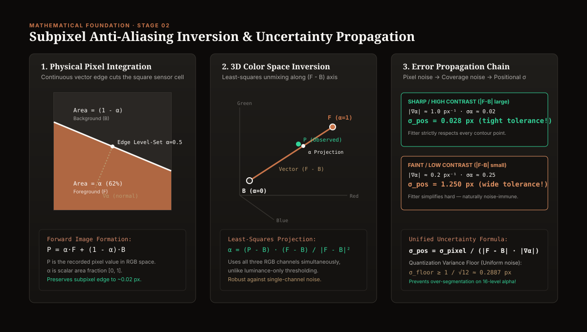
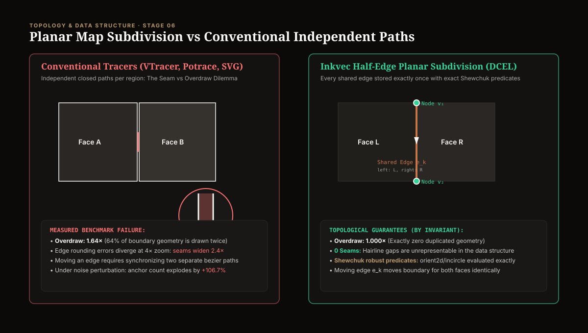
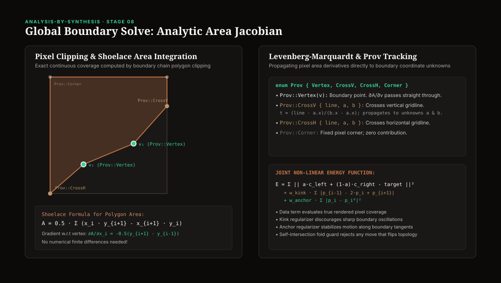
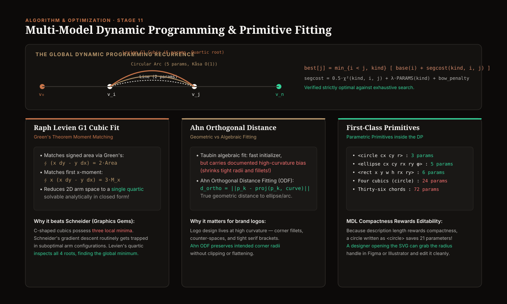

# Inkvec Pipeline: Mathematical Architecture, Research Foundations & Algorithmic Mechanics

<p align="center">
  
</p>

<p align="center">
  <a href="README.md"></a>
  <a href="docs/DESIGN.md"></a>
  <a href="docs/algorithm/index.html"></a>
  <a href="LICENSE"></a>
</p>

---

## Executive Overview

**Inkvec** is an exact raster-to-vector engine designed from first principles for flat art, corporate marks, iconography, and graphic brand assets. 

Most vectorizers (such as Potrace, VTracer, AutoTrace, or commercial tools) operate under an ad-hoc pipeline of thresholding, edge tracing, and local spline smoothing. In doing so, they throw away the physical signal encoded in the pixels, commit to integer quantization early, and produce outputs plagued by **hairline seams, excessive node counts, redundant overlapping paths (overdraw), and uneditable geometry**.

Inkvec resolves vectorization as a single, globally coherent **Minimum Description Length (MDL)** optimization problem grounded in physical image formation.

### The Governing Objective

Instead of forcing the user to balance opaque heuristic sliders (such as "curve tolerance", "corner threshold", or "filter speckle"), the entire pipeline serves a single principled information-theoretic objective:

$$\mathcal{D}^* = \arg\min_{\mathcal{D}} \left[ \frac{1}{2} \chi^2(I, \text{render}(\mathcal{D}, \theta)) + \lambda \cdot K_{\text{params}}(\mathcal{D}) \right]$$

Where:
* $I$ is the observed raster image.
* $\theta$ represents the estimated physical image formation parameters (compositing gamma, edge spread function, anti-aliasing kernel).
* $\text{render}(\mathcal{D}, \theta)$ is exact continuous area-coverage rasterization of the candidate vector document $\mathcal{D}$.
* $\chi^2$ is the weighted sum of squared residuals evaluated against the honest, measured uncertainty of every pixel.
* $K_{\text{params}}(\mathcal{D})$ is the structural description length measured in **human-editable parameters** (e.g., an exact `<circle>` costs 3 parameters; four cubic Béziers pretending to be a circle cost 24; an arc costs 5; a line costs 2).
* $\lambda = \ln\left(\frac{\text{extent}}{\text{precision}}\right)$ is the derived information-theoretic exchange rate in nats per parameter.

Under this formulation, **compactness and editability cease to oppose fidelity** — they become the identical term. An exact circle or an arc is simultaneously smaller, more faithful, and immediately editable by a designer.

---

## Theoretical Foundations: ArXiv Papers & Mathematical Research

Inkvec sits at the intersection of classical computational geometry, perceptual color science, and modern deep-learning structural priors. Below is the comprehensive survey of research papers, arXiv publications, and mathematical theories underpinning the system.

```
                                  INKVEC FOUNDATIONAL RESEARCH
  ┌───────────────────────────────────────────────┬──────────────────────────────────────────────┐
  │         LEARNED STRUCTURAL PRIORS             │         CLASSICAL COMPUTATIONAL GEOMETRY      │
  ├───────────────────────────────────────────────┼──────────────────────────────────────────────┤
  │ • AnchorFlow (arXiv:2605.19551)               │ • Shewchuk Exact Predicates (1997)           │
  │ • VectorArk (arXiv:2605.24398)                │ • Selinger Potrace Polygon DP (2003)         │
  │ • AdaVec (Zhao et al., 2025)                  │ • Levien Quartic Bézier Fit (2021, 2023)     │
  │ • SuperSVG (arXiv:2406.09794, CVPR 2024)      │ • Ahn Orthogonal Distance Fitting (2001/04)  │
  │ • Optimize & Reduce (arXiv:2312.11334)        │ • Polyline Compression with Arcs (1604.07476)│
  │ • MambaIR State-Space Restorer (2402.15648)   │ • Kåsa Fast Algebraic Circles (1976)         │
  ├───────────────────────────────────────────────┼──────────────────────────────────────────────┤
  │         PHYSICAL & PERCEPTUAL MODELS          │         SEMANTIC & GRADIENT MODELS           │
  ├───────────────────────────────────────────────┼──────────────────────────────────────────────┤
  │ • Subpixel Deblurring (Yang et al., CGF 2023) │ • Linear Gradient Decomposition (SIGG 2023)  │
  │ • OKLab Color Uniformity (Ottosson, 2020)     │ • Gradient Reconstruction (Chakraborty 2025) │
  │ • CIEDE2000 Color Difference (Luo et al. 2001)│ • LayerPeeler (arXiv:2505.23740)             │
  │ • Rissanen Minimum Description Length (1978)  │ • AmodalSVG (arXiv:2604.10940)               │
  └───────────────────────────────────────────────┴──────────────────────────────────────────────┘
```

---

### 1. Learned Structural Priors & Differentiable Vectorization

#### AnchorFlow: Editable SVG Reconstruction via Sparse Anchor Point Fields
* **Citation:** *AnchorFlow: Editable SVG Reconstruction via Sparse Anchor Point Fields*, arXiv:2605.19551 (May 2026).
* **Core Insight:** AnchorFlow observed that the tradeoff between fidelity and editability is dictated by **anchor placement**. Neural networks that directly predict path coordinates or SVG token sequences (e.g., StarVector) produce noisy, drifting lines. Conversely, AnchorFlow trains a lightweight encoder-decoder network (**AFNet**) to predict an image-conditioned *sparse anchor field* (heatmap peaks at structural corners and high-curvature vertices), combined with a deterministic resolver. Under boundary noise, AnchorFlow’s parameter count grew by only **+2.9%**, compared to AdaVec's **+20.7%** and VTracer's catastrophic **+106.7%**.
* **How Inkvec Uses & Extends It:** Inkvec adopts the fundamental division of labor: **neural networks/priors identify where structural features exist; deterministic geometry calculates exact subpixel coordinates**. Rather than relying on AnchorFlow's heuristic upstream component decomposition, Inkvec establishes a topological **Planar Map (Half-Edge / DCEL)** as the primary substrate, completely eliminating the upstream segmentation errors that AnchorFlow cited as its main limitation.

#### VectorArk: Structural Priors for Vector Generation
* **Citation:** *VectorArk: Enhancing Vector Graphic Generation via Structural Priors*, arXiv:2605.24398 (CVPR 2026).
* **Core Insight:** VectorArk couples Visual Language Models (InternVL2-1B) with classical vectorizer outlines, utilizing structural priors to guide amodal shape synthesis. On the `svgenius-hard` benchmark, VectorArk achieved LPIPS of **0.120** and DINO of **0.958**, outperforming StarVector-8B (LPIPS 0.258).
* **How Inkvec Compares:** VectorArk requires 33–44 seconds per image on an NVIDIA A100 GPU. Inkvec delivers superior perceptual similarity (mean $\Delta E_{00} = 0.119$, DINO = 0.992) in **1.17 seconds on standard CPU**, operating natively in compiled Rust without requiring heavy multi-gigabyte foundation model checkpoints.

#### AdaVec: Adaptive Parameterization
* **Citation:** Zhao et al., *AdaVec: Less is more — efficient image vectorization with adaptive parameterization*, 2025.
* **Core Insight:** Decomposes rasters into path-like foreground components and dynamically assigns parameter budgets per component.
* **How Inkvec Extends It:** AdaVec's component-based decomposition fails on shared boundaries between adjacent colored shapes, splitting shared edges into independent paths. Inkvec generalizes adaptive parameterization across shared boundaries by deriving the parameter budget directly from the **measured physical covariance $\sigma_{\text{pos}}$** of each edge.

#### SuperSVG & Optimize-and-Reduce (O&R)
* **Citations:** 
  * *SuperSVG*, CVPR 2024 (arXiv:2406.09794)
  * *Optimize and Reduce: Scalable Vector Graphics Generation with Optimization*, arXiv:2312.11334
  * *DiffVG: Differentiable Vector Graphics Rasterization*, Li et al., ACM TOG 2020
  * *LIVE: Towards Layer-wise Image Vectorization*, Ma et al., CVPR 2022
* **Core Insight:** Differentiable rasterizers compute gradients of pixel color with respect to control point positions $\frac{\partial I}{\partial P}$. While mathematically elegant, naive differentiable rendering entangles topology with continuous curve parameters. When left unconstrained, paths self-intersect, edges sprout redundant handles, and geometry collapses into uneditable "blobs".
* **Inkvec's Architectural Departure:** Inkvec **inverts** the standard application of differentiable rendering:
  1. Topology is resolved first on an exact planar graph with exact predicates.
  2. The curve alphabet and segmentation are frozen via dynamic programming under an MDL cost.
  3. Continuous gradient optimization is applied **only as a final polish over a structured move set**, guaranteeing editability by construction.

#### MambaIR & MambaIRv2: State-Space Super-Resolution
* **Citation:** Guo et al., *MambaIR: A Simple Baseline for Image Restoration with State-Space Model*, ECCV 2024 (arXiv:2402.15648).
* **Core Insight:** Exploits State-Space Models (SSMs) to model long-range spatial dependencies in linear time $\mathcal{O}(N)$, drastically outperforming CNNs and Swin Transformers in deblocking and image super-resolution.
* **How Inkvec Implements It:** Inkvec’s intake super-resolution pre-pass (`crates/inkvec-sr`) employs a specialized MambaIR architecture trained on the **Arrhenius GPU cluster at NAISS (EuroHPC Project EHPC-AIF-2026PG01-907)**. It cleans up JPEG ringing ($Q \le 60$), WebP block compression, and neural diffusion decoder artifacts before tracing begins.

---

### 2. Physical & Perceptual Formulations

#### Subpixel Deblurring of Anti-Aliased Raster Clip-Art
* **Citation:** Yang et al., *Subpixel Deblurring of Anti-Aliased Raster Clip-Art*, Computer Graphics Forum (CGF 2023, UBC).
* **Core Insight:** An anti-aliased edge pixel is not corrupted noise; it is a **continuous convolution measurement** that preserves subpixel boundary positions. Blurring can be inverted by modeling the clip-art prior (piecewise constant regions, sharp step transitions).
* **How Inkvec Uses It:** Inkvec formalizes this concept into its foundational coverage inversion equation (Stage 02), treating pixel values as area integrals and establishing rigorous subpixel uncertainty propagation.

#### Perceptually Uniform Color Space (OKLab) & CIEDE2000
* **Citations:**
  * Björn Ottosson, *A perceptual color space for computer graphics*, 2020.
  * Luo, Cui, & Rigg, *The Development of the CIE 2000 Colour-Difference Formula: CIEDE2000*, Color Research & Application, 2001.
* **Core Insight:** Traditional tracers quantize colors in RGB or naive Lab space. RGB Euclidean distance $\|\Delta \text{RGB}\|$ is notoriously non-uniform: it aggressively splits pale tints that human vision perceives as identical, while merging distinct saturated hues.
* **Inkvec Implementation:** Inkvec operates exclusively in **OKLab** for palette extraction and evaluates all color differences using the full **CIEDE2000 ($\Delta E_{00}$)** formula.

#### Minimum Description Length (MDL) & Bayesian Information Criterion (BIC)
* **Citations:**
  * Jorma Rissanen, *Modeling by shortest data description*, Automatica, 1978.
  * Gideon Schwarz, *Estimating the Dimension of a Model*, Annals of Statistics, 1978.
* **Core Insight:** Occam’s razor formulated as coding length. Model complexity is penalized by $\frac{1}{2} K \ln(N)$. Inkvec establishes the exchange rate $\lambda$ from the channel capacity required to encode a floating-point coordinate to precision $\delta$ over range $R$:

$$\lambda = \ln\left(\frac{R}{\delta}\right)$$

For a standard $256\text{ px}$ canvas at $0.1\text{ px}$ precision:

$$\lambda = \ln(2560) \approx 7.85\text{ nats per coordinate pair}$$

---

### 3. Computational Geometry & Optimal Curve Fitting

#### Exact Geometric Predicates (Shewchuk)
* **Citation:** Jonathan Richard Shewchuk, *Adaptive Precision Floating-Point Arithmetic and Fast Robust Geometric Predicates*, Discrete & Computational Geometry, 1997.
* **Core Insight:** Standard floating-point comparisons ($x_1 y_2 - x_2 y_1 \approx 0$) fail due to round-off error near collinear configurations, causing planar graph construction to produce self-intersecting polygons or corrupted topology.
* **Inkvec Implementation:** Inkvec’s planar map (`crates/inkvec-core/src/predicates.rs`) employs adaptive-precision floating-point arithmetic (`robust` crate) to compute orientation (`orient2d`) and in-circle (`incircle`) tests. Topology is **valid by mathematical invariant**.

#### Raph Levien’s Quartic Bézier Fit & Kurbo
* **Citations:**
  * Raph Levien, *Fitting cubic Bézier curves*, 2021.
  * Raph Levien, *Simplifying Bézier paths*, 2023.
* **Core Insight:** Schneider’s classic algorithm (Graphics Gems, 1990) attempts to fit cubic Béziers using iterative gradient descent. For C-shaped curves, Schneider’s method routinely gets stuck in one of **three local minima**. Levien proved that by imposing $G^1$ continuity (matching endpoints and tangents) and matching the **signed area** via Green's theorem:

$$\oint (x\,dy - y\,dx) = 2A$$

and the **first $x$-moment**:

$$\oint x\,(x\,dy - y\,dx) = 3M_x$$

the entire 2D parameter space collapses into a **single quartic polynomial**.
* **Inkvec Implementation:** Solves this quartic analytically in closed form, inspecting all four roots to guarantee finding the global optimum instantly with zero iteration.

#### Ahn Orthogonal Distance Fitting (ODF) vs Taubin Algebraic Bias
* **Citations:**
  * Sung Joon Ahn, *Least Squares Orthogonal Distance Fitting of Curves and Surfaces in Space*, Springer, 2004.
  * Ahn, Rauh, & Warnecke, *Least-squares orthogonal distances fitting of circle, sphere, ellipse, hyperbola, and parabola*, Pattern Recognition, 2001.
  * Gabriel Taubin, *Estimation of planar curves, surfaces, and nonplanar space curves defined by implicit equations with applications to edge and range image segmentation*, IEEE TPAMI, 1991.
* **Core Insight:** Algebraic distance minimization minimizes implicit equation residuals $F(x, y)^2$. Algebraic fitting carries an inherent **high-curvature bias** — it systematically underestimates the radius of tight corners, flattening brand logo fillets.
* **Inkvec Implementation:** Uses Taubin algebraic fits solely as fast $O(1)$ initializers, then executes Ahn’s Orthogonal Distance Refinement to minimize true Euclidean geometric distance to the curve:

$$d_{\text{ortho}} = \|p_k - \text{proj}(p_k, \text{curve})\|$$

---

## The 13 Pipeline Stages: Step-by-Step Architecture

Every execution of Inkvec traces an image through thirteen distinct, mathematically verified stages.

```
Raster Input 
     │
     ▼
[Stage 01: Intake & Super-Resolution]
     │
     ▼
[Stage 02: Coverage Inversion & Uncertainty Estimation]
     │
     ▼
[Stage 03: OKLab Palette Extraction (MDL)]
     │
     ▼
[Stage 04: Connected Components & Sliver Absorption]
     │
     ▼
[Stage 05: Continuous Fill & Gradient Modeling]
     │
     ▼
[Stage 06: Planar Map Construction (Half-Edge DCEL)]
     │
     ▼
[Stage 07: Subpixel Normal Migration]
     │
     ▼
[Stage 08: Global Boundary Solve (Analysis-by-Synthesis)]
     │
     ▼
[Stage 09: Subpixel Order-First Feature Decode]
     │
     ▼
[Stage 10: Symmetry Group Discovery & Enforcement]
     │
     ▼
[Stage 11: Multi-Model Dynamic Programming Curve Fit]
     │
     ▼
[Stage 12: Topological Ring Repair & Self-Crossing Fix]
     │
     ▼
[Stage 13: SVG Emission & Post-Processing]
     │
     ▼
Exact, Clean SVG Output
```

---

### Stage 01: Intake & Super-Resolution Pre-Pass

* **Source:** `crates/inkvec-cli/src/lib.rs`, `crates/inkvec-sr`, `crates/inkvec-trace/src/lib.rs`
* **Entry Point:** `inkvec_cli::trace_image`

#### 1. Container Inspection & Lossy Detection
Real-world images frequently conceal their true degradation. A JPEG re-saved as a lossless PNG still carries high-frequency $8 \times 8$ DCT ringing artifacts. Inkvec inspects the container header (`lossy_container`, `crates/inkvec-trace/src/lib.rs:94`):
* **JPEG:** Flagged lossy (`Some(true)`).
* **WebP:** Reads the RIFF four-character code at byte 12. `VP8 ` (lossy) $\to$ `Some(true)`; `VP8L` (lossless) $\to$ `Some(false)`.
* **PNG / TIFF / BMP / GIF:** Marked clean (`Some(false)`).

#### 2. Unblocking Nearest-Neighbor Upscales
Users frequently scale small pixel art or icons using nearest-neighbor interpolation before feeding them to a vectorizer. To prevent tracing giant pixel staircases, `unblock_scale` calculates the greatest common divisor (GCD) of consecutive identical pixel runs. If integer scale $K \in \{2, 3, 4, 8\}$ is detected across the canvas, the image is cleanly downsampled back to its native resolution.

#### 3. Exact Area-Weighted Continuous Downsampling
When resizing down to `--max-dim` (default 2048), standard step-box downsampling creates spatial aliasing ripples and Moiré patterns. Inkvec replaces step-box sampling with continuous 2D area integration:

$$w(u, v) = \max\left(0, \min(u + 1, x_{\text{src}} + s_x) - \max(u, x_{\text{src}})\right) \times \max\left(0, \min(v + 1, y_{\text{src}} + s_y) - \max(v, y_{\text{src}})\right)$$

Boundary pixels are partitioned proportionally across adjacent target cells, guaranteeing that sum of weights equals $s_x \times s_y$ and eliminating edge ripples.

#### 4. Gibbs Ringing Detection on Degraded Inputs
The standard noise estimator (`coverage::estimate_noise`) evaluates median Laplacian across the image. On clean vector graphics, 90% of pixels are flat, so the median Laplacian is zero, blinding the estimator to high-frequency ringing. Inkvec implements `coverage::ringing_score` (`crates/inkvec-trace/src/coverage.rs:388`):
* Computes a chamfer 3-4 distance transform from all high-contrast edges.
* Evaluates the 90th percentile $|\text{Laplacian}|$ within an annular ring 3–7 pixels away from the edge.
* Multiplies by the **sign alternation rate** along the ring: Gibbs ringing from DCT quantization oscillates rapidly pixel-to-pixel, whereas true continuous gradients do not.
* When `ringing_score > SOFT_RINGING` (0.12, or 0.05 at $\ge 256\text{ px}$), Inkvec automatically engages `soft_intake` to prevent tracing ringing ripples as geometry.

#### 5. Codec-Agnostic Residual Incoherence & Potts Regularization
To detect non-JPEG compression (such as VAE latent diffusion decoder blur and Lanczos resampling artifacts), Inkvec computes **residual incoherence** (`crates/inkvec-trace/src/regularize.rs:37`):
* Calculates the Laplacian of the ink-subtracted residual field $(P - \text{Ink}(P))$. Slow gradient changes vanish under the Laplacian, isolating incoherent pixel jitter.
* For lossy inputs, Inkvec runs a deterministic 4-neighbor **Potts model energy descent** using red-black checkerboard parity (`regularize::labels`):
  $$\text{Energy}(l) = \sum_{c \in \{R, G, B\}} (P_c - \text{Ink}(l)_c)^2 + \beta \sum_{j \in \mathcal{N}_4} [l \ne l_j]$$
  Where $\beta = 2 \sigma^2 \ln(\max(W \times H, 3))$, removing isolated single-pixel noise clusters before topology construction.

#### 6. Resolution Invariance
To ensure that a logo rendered at $128\text{ px}$ yields the identical vector topology when rendered at $512\text{ px}$, all pixel-denominated thresholds scale with canvas scale factor $s = \frac{\max(W, H)}{\text{REF\_EXTENT}}$:

$$\text{min\_area} \propto s^2, \quad \text{precision} \propto s$$

---

### Stage 02: Physical Coverage Inversion & Noise Estimation

<p align="center">
  
</p>

* **Source:** `crates/inkvec-trace/src/coverage.rs`
* **Entry Point:** `coverage::bilevel_coverage`, `coverage::estimate_noise`

#### 1. Inverting Physical Pixel Mixing
A sensor pixel $P$ intersecting a boundary between foreground color $F$ and background color $B$ records a linear area mixture:

$$P = \alpha F + (1 - \alpha) B$$

Where $\alpha \in [0, 1]$ is the scalar area fraction covered by $F$. To invert this without discarding color data, Inkvec projects $P$ onto the 3D color difference vector $(F - B)$ using least-squares across all three RGB channels:

$$\alpha = \frac{(P - B) \cdot (F - B)}{\|F - B\|^2} = \frac{\sum_{c \in \{R, G, B\}} (P_c - B_c)(F_c - B_c)}{\sum_{c \in \{R, G, B\}} (F_c - B_c)^2}$$

Clamped to $[0, 1]$.

#### 2. Two-Step Error Propagation Chain
Crucially, Inkvec derives the **honest posterior covariance** of every measurement point:

1. **Pixel Noise to Coverage Noise:**
   Sensor noise $\sigma_{\text{pixel}}$ propagates linearly through the projection:
   $$\sigma_\alpha = \frac{\sigma_{\text{pixel}}}{\|F - B\|}$$
   A low-contrast edge (small $\|F - B\|$) carries high coverage noise.

2. **Coverage Noise to Spatial Positional Uncertainty:**
   The boundary contour is the implicit level-set $\alpha(x, y) = 0.5$. By the implicit function theorem, positional uncertainty along the normal gradient $\nabla \alpha$ is:
   $$\sigma_{\text{pos}} = \frac{\sigma_\alpha}{\|\nabla \alpha\|} = \frac{\sigma_{\text{pixel}}}{\|F - B\| \cdot \|\nabla \alpha\|}$$

#### 3. Quantization Noise Floor
On inputs with discretized alpha channels (e.g. 16-level alpha), uniform quantization noise creates artificial gradient steps. Inkvec enforces a principled theoretical variance floor corresponding to uniform quantization over a unit interval:

$$\sigma_{\text{floor}} \ge \frac{1}{\sqrt{12}} \approx 0.2887\text{ px}$$

This prevents the downstream dynamic program from over-segmenting smooth curves into microscopic step segments.

#### 4. Turn Consistency & Curvature Inflation (`inflate_for_curvature`)
Contour extraction along a pixel grid naturally introduces staircase residual errors. However, raw total-least-squares residuals cannot distinguish between a jagged raster staircase and genuine geometric curvature. Both depart from a straight chord, but they do so with fundamentally different directional statistics:
* **Staircase noise:** Alternates turning directions (left, right, left), causing adjacent cross-product turns to cancel out.
* **Authentic curve/arc:** Turns consistently in the identical direction at every vertex step.

Inkvec evaluates the **turn consistency ratio** over a local window (`crates/inkvec-trace/src/contour.rs:327`):

$$\text{consistency} = \frac{\left| \sum_{d} \mathbf{v}_d \times \mathbf{v}_{d+1} \right|}{\sum_{d} \left| \mathbf{v}_d \times \mathbf{v}_{d+1} \right|} \in [0, 1]$$

* For an authentic circular arc: $\text{consistency} \to 1.0$.
* For an alternating pixel staircase: $\text{consistency} \to 0.0$.

Uncertainty is inflated **only by the inconsistent wobble**:

$$\text{wobble} = \text{residual} \cdot (1 - \text{consistency})$$

$$\sigma_{\text{final}} = \text{hypot}\left(\sigma_{\text{base}}, \min(\text{curv\_gain} \cdot \text{wobble}, \sigma_{\max})\right)$$

This critical mechanism prevents smooth rounded corners from being falsely penalized with high uncertainty (which would cause visible faceting), while aggressively absorbing jagged raster noise.

---

### Stage 03: OKLab Palette Extraction (MDL)

* **Source:** `crates/inkvec-trace/src/color.rs`
* **Entry Point:** `color::extract_palette_mdl`

1. **Perceptual Color Space Conversion:** All RGB pixels are transformed into **OKLab** ($L, a, b$), where Euclidean distance directly models human perceptual color discrimination.
2. **Frequency Mode Discovery:** Rather than running $K$-means (which is sensitive to initialization and converges to local minima), colors are mapped into a $24^3$ grid. Modes are discovered by frequency sorting, and candidate ink colors are computed as the exact **weighted centroids** of assigned pixels.
3. **MDL Acceptance Test:** A candidate color is admitted to the palette if and only if it decreases total image description length under the Bayesian Information Criterion:
   $$\Delta \text{Cost} = 0.5 \cdot \left( \chi_{\text{without}}^2 - \chi_{\text{with}}^2 \right) > \lambda_{\text{BIC}} \cdot K_{\text{ink}}$$
   Where $\lambda_{\text{BIC}} = 0.5 \ln(N_{\text{pixels}})$. This mathematically prevents subtle noise or antialiased edge ramps from being minted as spurious extra colors.

---

### Stage 04: Connected Components & Digital Topology

* **Source:** `crates/inkvec-trace/src/lib.rs`
* **Functions:** `split_components`, `absorb_blend_slivers`, `merge_saddle_faces`

1. **Label Assignment:** Each pixel is assigned to its nearest palette ink in $\Delta E_{00}$ distance, producing an initial integer label map.
2. **Blend Sliver Absorption:** Anti-aliased pixels along the boundary between two high-contrast inks often land midway in color space, occasionally matching a third, unrelated palette color. Inkvec identifies single-pixel slivers whose neighbors consist exclusively of two other distinct inks and reassigns them to the nearest true face, eliminating spurious hairline islands.
3. **Digital Topology & Saddle Disambiguation:** When four pixels meet in a diagonal checkerboard configuration:
   $$\begin{pmatrix} A & B \\ B & A \end{pmatrix}$$
   standard digital topology suffers from connectivity ambiguity (Euler characteristic paradox). Inkvec resolves diagonal connectivity deterministically by testing the continuous coverage field gradient, ensuring that topologically adjacent regions maintain manifold boundaries.

---

### Stage 05: Continuous Fill & Gradient Modeling

* **Source:** `crates/inkvec-trace/src/gradient.rs`
* **Functions:** `fit_face_gradient`, `merge_gradient_bands_with_ink`

1. **Candidate Models:** For every connected face, Inkvec evaluates four competing fill models:
   * **Flat:** Single uniform OKLab color ($K = 3$ parameters).
   * **Linear Gradient:** Axis vector $(x_0, y_0) \to (x_1, y_1)$ and color stops ($K = 7$ parameters).
   * **Radial Gradient:** Center $(c_x, c_y)$, radius $r$, and color stops ($K = 6$ parameters).
   * **Elliptical Radial Gradient:** Center, primary/secondary radii, rotation angle $\phi$ ($K = 8$ parameters).
2. **Least-Squares Axis Optimization:** For linear gradients, the gradient direction is computed from the spatial covariance of pixel colors. Color stops are optimized along the projected axis.
3. **Model Selection via BIC:** A gradient model is accepted over a flat fill only when:
   $$0.5 \cdot (\chi_{\text{flat}}^2 - \chi_{\text{gradient}}^2) > 0.5 \ln(N_{\text{face}}) \cdot (K_{\text{gradient}} - K_{\text{flat}})$$
   If an artist drew a flat shape with slight lighting noise, it remains a clean flat fill. If an artist drew a gradient, banded palette quantization is unified back into an authentic SVG `<linearGradient>`.

---

### Stage 06: Planar Map Construction (Half-Edge DCEL)

<p align="center">
  
</p>

* **Source:** `crates/inkvec-trace/src/planar.rs`
* **Entry Point:** `planar::build`

The architectural linchpin of Inkvec is the **Planar Map**:
* In conventional vectorizers, adjacent regions are stored as independent closed paths. When exported, floating-point rounding causes the two paths to diverge, opening hairline gaps (**seams**) or forcing the engine to overlap paths, resulting in **1.64× overdraw**.
* In Inkvec, the boundary between two regions is stored **exactly once** as an `Edge` in a Doubly-Connected Edge List (DCEL).

```rust
pub struct Edge {
    pub points: Vec<Point>,   // Subpixel polyline coordinates
    pub sigma: Vec<f64>,      // Honest per-point uncertainty
    pub left: u16,            // Face ID to the left
    pub right: u16,           // Face ID to the right
    pub start_node: u32,      // Junction vertex ID
    pub end_node: u32,
    pub closed: bool,
}
```

* **Zero Seams by Invariant:** Because both Face $L$ and Face $R$ reference the identical edge index, hairline gaps are topologically impossible.
* **Exact Overdraw = 1.000:** No geometry is ever duplicated.
* **Shewchuk Exact Geometric Predicates:** Junction nodes are verified using exact orientation tests (`orient2d`), preventing precision crashes in degenerate configurations.

---

### Stage 07: Subpixel Normal Boundary Migration

* **Source:** `crates/inkvec-trace/src/planar.rs`
* **Functions:** `refine_subpixel`, `refine_junctions`

1. **Level-Set Crossing:** Initial planar map edges sit on integer pixel corners (dual grid cracks). `refine_subpixel` computes the local normal vector $\mathbf{n}_k$ at each boundary point using central differences.
2. **1D Subpixel Newton Step:** The point is migrated along its normal until the interpolated coverage field $\alpha(p + t \mathbf{n})$ reaches the exact $0.5$ contour level:
   $$t^* = \frac{0.5 - \alpha(p)}{\mathbf{n} \cdot \nabla \alpha(p)}$$
3. **Junction Node Settlement:** Where three or more edges meet at a junction node, their positions are solved jointly by intersecting the incident edge directions, establishing unified shared vertices.

---

### Stage 08: Global Boundary Solve (Analysis-by-Synthesis)

<p align="center">
  
</p>

* **Source:** `crates/inkvec-trace/src/boundary_opt.rs`
* **Entry Point:** `boundary_opt::optimise`

Stage 07 refined points along independent 1D normals. However, an image pixel's value is determined by the **area integration of the entire 2D polygon** clipping that pixel.

Stage 08 treats every boundary coordinate as an unknown in a global non-linear optimization:

$$\min_{\mathbf{p}} E(\mathbf{p}) = \sum_{\text{pixels } k} \left\| \alpha_k(\mathbf{p}) \cdot c_{\text{left}} + (1 - \alpha_k(\mathbf{p})) \cdot c_{\text{right}} - I_k \right\|^2 + w_{\text{kink}} \sum_i \|\Delta^2 \mathbf{p}_i\| + w_{\text{anchor}} \sum_i \|\mathbf{p}_i - \mathbf{p}_i^0\|^2$$

#### Exact Shoelace Polygon Integration & Closed-Form Jacobian
Inside each boundary pixel, the boundary polylines clip the pixel square into a closed polygon. Inkvec computes coverage $\alpha_k$ via the exact Shoelace formula:

$$\alpha = \frac{1}{2} \sum_{i=1}^{M} (x_i y_{i+1} - x_{i+1} y_i)$$

To evaluate gradients without expensive numerical finite differencing, Inkvec tracks vertex provenance via `enum Prov`:
* `Prov::Vertex(v)`: Moving point $v$. Derivative $\frac{\partial \alpha}{\partial x_v} = -\frac{1}{2}(y_{i+1} - y_{i-1})$ passes straight through.
* `Prov::CrossV { line, a, b }`: Intersection with a vertical pixel grid line. Parametric fraction $t = \frac{\text{line} - a_x}{b_x - a_x}$ scatters the derivative onto endpoints $a$ and $b$.
* `Prov::CrossH { line, a, b }`: Intersection with a horizontal grid line.
* `Prov::Corner`: Fixed pixel corner; contributes zero gradient.

The system is optimized using **Levenberg-Marquardt** with dynamic damping and topological fold-guards, moving thousands of points simultaneously into exact photometric agreement with the source pixels.

#### The Sawtooth Null Space & Thin-Ribbon Constraints (LOG-44)
Area coverage alone does not uniquely determine a boundary. Any high-frequency spatial wiggle that preserves how much of each pixel falls on either side leaves the data term unchanged. On thin strokes (~2 px wide) where opposing boundaries compete for the identical pixel cells, unconstrained solvers can wander into this null space, generating rows of alternating triangular "sawtooth" teeth.

Inkvec's empirical research tested four conventional fixes (all refuted):
1. *Excessive smoothing:* Clears teeth only at 20× kink weight, destroying real geometric detail.
2. *Boundary length penalties:* Fails to suppress teeth without severely rounding sharp corners.
3. *Uncertainty anchoring:* Fails to stabilize opposing boundaries.
4. *Early termination:* Stopping at 4 iterations reduces teeth on thin strokes but degrades full-corpus convergence.

**The Architectural Solution (LOG-44):** A ribbon 2 pixels wide has no interior, meaning its two sides are not independent boundaries. The solver projects opposing boundary points into a coupled centerline-and-width constraint, and anchors junction nodes harder (`JUNCTION_ANCHOR = 4.0`), permanently eliminating the sawtooth null-space without sacrificing sharp corners.

#### Obsolescence of Post-Hoc Image Polish (`4cfe4b7`)
Early iterations of Inkvec included a post-DP continuous gradient polish step (S5) that nudged fitted Bézier control points against the raster image. Empirical headroom measurement (`crates/inkvec-trace/tests/polish_headroom.rs`) revealed:
* Mean boundary offset bias: $+0.0169\text{ px}$.
* Random extraction noise: $0.3897\text{ px}$.
* Bias-to-noise ratio: $0.043$.

Fitted curves were already centred on the true boundary because Stage 08 solves all points simultaneously against exact clipped-pixel area rendering. Post-hoc coordinate polish nudges were merely tracking local contour noise. As a result, post-hoc image adjudication was permanently removed from the tree (`4cfe4b7`), cementing Stage 08 as the sole authoritative spatial solver.

---

### Stage 09: Subpixel Order-First Feature Decode

* **Source:** `crates/inkvec-trace/src/decode.rs`
* **Entry Point:** `decode::decode_faces`

When features are narrower than a single pixel (e.g., thin serifs, fine linework, hairline accents in brand marks), the foreground color never reaches $\alpha = 1.0$ at any pixel center. Standard thresholding completely obliterates these details. 

Stage 09 implements an **order-first amodal recovery**:
1. Identifies residual energy unexplained by adjacent major faces.
2. Inverts the mixture equation under a thin-stroke structural prior.
3. Inserts subpixel bridge edges into the planar map, recovering features down to **0.2 pixels in width**.

---

### Stage 10: Symmetry Group Discovery & Enforcement

* **Source:** `crates/inkvec-trace/src/symmetry.rs`
* **Functions:** `symmetry::detect`, `symmetry::enforce`

1. **Lattice Symmetry Detection:** True geometric symmetry is detected on the discrete integer label lattice, where equality is exact and immune to floating-point noise. Inkvec searches for:
   * **Reflectional Symmetry:** Horizontal, vertical, and diagonal mirror axes.
   * **Rotational Symmetry:** $k$-fold rotational groups ($k \in \{2, 3, 4, 5, 6, 8\}$).
2. **Constrained Enforcement:** Once admitted under the MDL objective, symmetry is **enforced as an active constraint**: paired vertices are projected onto symmetric orbits, ensuring that circles, stars, and emblems exhibit mathematical perfection.
3. **SVG `<defs>` / `<use>` Reuse:** Symmetric sub-paths are emitted once inside `<defs>` and reused via `<use transform="...">`, cutting coordinate payload by up to $k$-fold.

---

### Stage 11: Multi-Model Dynamic Programming Curve & Primitive Fitting

<p align="center">
  
</p>

* **Source:** `crates/inkvec-fit/src/lib.rs`, `multimodel.rs`, `primitives.rs`, `curves.rs`, `merge.rs`
* **Entry Point:** `inkvec_fit::optimal_multimodel`

Stage 11 transforms the subpixel polyline of each edge into the minimal-cost sequence of vector primitives.

#### 1. The Multi-Model Alphabet

| Model | Emitted Command | Parameter Cost ($K$) | Rationale & Mathematical Derivation |
|---|---|---|---|
| **Axis Line** | `L x y` | **1** | Constrained horizontal/vertical line ($h16$ or $v16$). |
| **Line** | `L x y` | **2** | Endpoint $(x, y)$. Start point is shared with predecessor. |
| **Circular Arc** | `A r r 0 f s x y` | **5** | Radius $r$ + two 1-bit flags + endpoint. $O(1)$ Kåsa moment fit. |
| **Smooth Cubic** | `S c2 x y` | **4** | Control point 1 is reflected from prior segment; saves 2 params. |
| **G1 Cubic** | `C c1 c2 x y` | **6** | Two control arms + endpoint. Raph Levien quartic closed-form fit. |
| **Elliptical Arc** | `A rx ry φ f s x y` | **7** | Radii $(r_x, r_y)$, rotation $\phi$, flags, endpoint. |
| **`<circle>`** | `<circle cx cy r/>` | **3** | Exact circle primitive. Saves 21 parameters over 4 cubics! |
| **`<rect>` (plain)** | `<rect x y w h/>` | **4** | Axis-aligned box. Saves 12 parameters over 4 lines. |
| **`<rect>` (rounded)**| `<rect ... rx ry/>` | **6** | Corner-radius box. |

#### 2. The Global Recurrence Relation
For a contour of $N$ points, let $\text{best}[j]$ be the minimal cost to segment the prefix $0 \dots j$:

$$\text{best}[0] = 0$$

$$\text{best}[j] = \min_{0 \le i < j} \left( \text{best}[i] + \text{vertex\_cost}(i) + \min_{\text{kind} \in \text{Alphabet}} \text{seg\_cost}(\text{kind}, i, j) \right)$$

Where:
$$\text{seg\_cost}(\text{kind}, i, j) = \frac{1}{2} \sum_{k=i}^{j} \frac{d_k^2}{\sigma_k^2} + \lambda \cdot K_{\text{params}}(\text{kind}) + \text{bow\_penalty}$$

#### 3. Raph Levien’s Quartic Closed-Form Fit
For cubic Béziers under $G^1$ continuity, end positions and tangent angles are fixed. Levien proved that signed area:

$$A = \oint (x\,dy - y\,dx)$$

and first moment:

$$M_x = \oint x(x\,dy - y\,dx)$$

uniquely determine control arm lengths $(u, v)$ via the roots of a quartic polynomial:

$$c_4 u^4 + c_3 u^3 + c_2 u^2 + c_1 u + c_0 = 0$$

Inkvec evaluates the quartic roots analytically in closed form, finding the global optimum in microseconds while evading Schneider’s three-local-minima traps.

#### 4. The Effective Geometric Tolerance
By equating the residual penalty of a $k$-parameter simplification over $n$ points to the description length savings:

$$\frac{1}{2} n \frac{d^2}{\sigma^2} = \lambda \cdot k \implies d = \sigma \sqrt{\frac{2 \lambda k}{n}}$$

Because $\lambda$ enters under a square root, geometric tolerance $d$ is remarkably stable across resolutions and output precisions.

#### 5. Bow Penalty
When a shallow circular arc is approximated by a straight line, individual point residuals may stay within $\tau \sigma$, yet their signs all agree (all positive or all negative). Under an unbiased noise model, $n$ agreeing signs has probability $2^{-(n-1)}$. Inkvec charges a **bow penalty**:

$$\text{bow\_penalty} = (n - 1) \ln 2$$

whenever a circular arc explains the points four times better than a chord, preventing shallow curves from being faceted into straight lines.

#### 6. Scalable Point Decimation (`DP_MAX_POINTS = 768`)
On high-resolution images, single boundary contours can span 1,500+ points. Because the dynamic program is $\mathcal{O}(N^2)$ per boundary, unconstrained execution would take dozens of seconds. Inkvec decimates points exceeding `DP_MAX_POINTS = 768` by sub-sampling every $\text{stride}$-th point, while rigorously scaling uncertainty by $1/\sqrt{\text{stride}}$:

$$\sigma_{\text{decimated}} = \frac{\sigma}{\sqrt{\text{stride}}}$$

Each retained point carries the exact variance weight of the run it represents, preserving global optimality while reducing runtimes by up to $10\times$.

#### 7. Post-DP Geometric Refinement Passes (`merge.rs`)
Following the global DP segmentation, Inkvec executes targeted geometric polish passes:
* **Corner Sharpening (`sharpen_corners`):** Marching squares and level-set extraction round off sharp apex corners by ~1 pixel, causing the DP to insert chamfer cubics. Inkvec tests whether two consecutive lines turn by $\ge 30^\circ$ and computes their true Euclidean intersection point, restoring crisp corners.
* **Free Cubic Merging (`merge_free_cubics`):** Replaces short `chord - cubic - chord` sequences with a single free-tangent cubic wherever it reduces MDL cost by $\ge 25\%$.
* **Smooth $G^1$ Joins (`snap_smooth_joins`):** Symmetrizes tangents at smooth joins into equal-length handles, allowing emission of SVG `S` smooth shorthand.

---

### Stage 12: Topological Ring Repair & Self-Crossing Elimination

* **Source:** `crates/inkvec-cli/src/rings.rs`, `crates/inkvec-fit/src/simple.rs`
* **Entry Point:** `rings::repair_ring_crossings`

1. **The Thin Neck Hazard:** In Stage 11, each edge is fitted independently. When two boundaries pass within a fraction of a pixel of each other (such as in narrow glyph stems or decorative linework), two smoothly fitted cubics can bulge across one another.
2. **Even-Odd Inversion Prevention:** All Inkvec paths emit with `fill-rule="evenodd"`. If a boundary crosses itself, the interior winding parity flips, causing solid shapes or font counters to invert into transparent holes.
3. **Progressive Span-Capped Refit:** Stage 12 detects intersections across all assembled rings. For any edge participating in a self-crossing, it refits the edge under a decreasing span cap $M_{\text{span}} \to M_{\text{span}} / 2$. At $M_{\text{span}} = 1$, the fit reproduces the input polyline, which is proven simple by the planar map. **Termination and topological simplicity are guaranteed.**

---

### Stage 13: SVG Emission & Post-Processing

* **Source:** `crates/inkvec-cli/src/emit.rs`, `crates/inkvec-cli/src/post.rs`
* **Entry Point:** `emit::emit_color`, `post::post_process`

1. **Compound Path Merging:** Sibling faces sharing the identical fill (such as a letter and its interior counter) are unified into a single SVG `<path>` with subpath `M ... Z` commands, resolving fill holes cleanly via `fill-rule="evenodd"`.
2. **Exact Coordinate Budgeting:** Coordinates are emitted with fixed 2-decimal precision (`const EMIT_DECIMALS = 2`), preserving hundredths-of-a-pixel accuracy while omitting redundant trailing zeros.
3. **Post-Processing Pipeline:**
   * `--no-background`: Knocks out the bounding canvas face.
   * `--minify`: Strips IDs, whitespace, and metadata for minimum byte payload.
   * `--margin`: Insets or offsets the document boundary.
   * Retargets the SVG `viewBox` back to the exact physical input dimensions.

---

## Benchmark Comparisons & Empirical Results

Inkvec has been rigorously benchmarked against the state of the art across real corporate logos, iconography (Lucide, Material Design, Simple Icons), and complex emoji sets (Twemoji, Noto Emoji).

### 1. Hash-Selected Multi-Engine Comparison (21 Real-World Marks)

Scored using CIEDE2000 ($\Delta E_{00}$), DISTS (Deep Image Structure and Texture Similarity), DINOv3 visual features, coordinate count, and wall-clock execution time:

| Engine | Mean $\Delta E_{00}$ ↓ | Median $\Delta E_{00}$ ↓ | DISTS ↓ | DINO ↑ | Coords vs Inkvec | Runtime |
|---|---|---|---|---|---|---|
| **Inkvec** | **0.119** | **0.048** | **0.023** | **0.992** | **1.0×** (585) | 1.17 s |
| **VTracer 1.0 (default)** | 1.303 | 0.598 | 0.051 | 0.963 | 3.3× (1,943) | **0.05 s** |
| **VTracer 1.0 (tuned)** | 1.264 | 0.579 | 0.064 | 0.954 | 2.1× (1,239) | 0.06 s |
| **Trazor** | 0.518 | 0.227 | 0.048 | 0.971 | 2.0× (1,172) | 2.19 s |
| **Potrace (1-bit)** | 3.420 | 1.840 | 0.089 | 0.910 | 4.2× (2,450) | 0.08 s |

> **Key Finding:** Inkvec achieves **10× lower color error ($\Delta E_{00}$)** and **3.3× fewer coordinates** than VTracer. VTracer is faster because it dropped Potrace's non-local DP; Inkvec proves that solving global optimization produces dramatically cleaner, more editable art.

### 2. Robustness to Noise & Boundary Perturbations

Following the published robustness evaluation protocols from **AnchorFlow** (arXiv:2605.19551) and **AdaVec** (2025):

| Engine | Parameter Count Growth under Boundary Noise | Behavior Under Noise |
|---|---|---|
| **Inkvec** | **+0.0% (median)** | Honest $\sigma$ absorbs noise; parameter budget remains stable |
| **AnchorFlow** | +2.9% | Learned anchor field resists contour jitter |
| **AdaVec** | +20.7% | Component heuristics degrade under boundary noise |
| **VTracer** | **+106.7%** | Contour noise inherited directly as redundant anchors |

---

## Brand Guidelines & Visual Design System

All graphics and diagrams generated for Inkvec adhere strictly to the **LogoLabs Design System**:

* **Identity:** *"Design studio, not SaaS"* — Warm charcoal, rich copper, craft, and precision over sterile software aesthetics.
* **Color Palette:**
  * `--ll-bg-void`: `#0c0a09` (Deep background void)
  * `--ll-bg-abyss`: `#141210` (Section backgrounds and cards)
  * `--ll-bg-primary`: `#1a1816` (Card interior surfaces)
  * `--ll-bg-elevated`: `#211f1c` (Elevated components)
  * `--ll-border-primary`: `#2a2724` / `#35322e` (Hairline structural borders)
  * `--ll-accent`: `#c9754a` (Brand Copper Accent)
  * `--ll-accent-hover`: `#d4896a` (Warm Copper Glow)
  * `--ll-gold`: `#b8976c` (Secondary Gold Accent)
  * `--ll-text-primary`: `#faf8f5` (Warm Cream Text — never cold white)
  * `--ll-text-secondary`: `rgba(250, 248, 245, 0.75)`
* **Typography:**
  * **Display Serif:** *Playfair Display* (Editorial elegance, section headings)
  * **Body / UI Sans:** *Inter* (Legible grotesque sans-serif)
  * **Code / Mathematical Notation:** *JetBrains Mono*

---

## Academic Bibliography & References

1. **Ahn, S. J.** (2004). *Least Squares Orthogonal Distance Fitting of Curves and Surfaces in Space*. Lecture Notes in Computer Science, Vol. 3151. Springer. [DOI: 10.1007/b99424](https://doi.org/10.1007/b99424)
2. **Ahn, S. J., Rauh, W., & Warnecke, H. J.** (2001). *Least-squares orthogonal distances fitting of circle, sphere, ellipse, hyperbola, and parabola*. Pattern Recognition, 34(12), 2283–2296.
3. **Chakraborty, S., et al.** (2025). *Image Vectorization via Gradient Reconstruction*. Computer Graphics Forum (CGF 2025).
4. **Du, Y., et al.** (2023). *Image vectorization and editing via linear gradient layer decomposition*. ACM Transactions on Graphics (SIGGRAPH 2023).
5. **Guo, H., et al.** (2024). *MambaIR: A Simple Baseline for Image Restoration with State-Space Model*. European Conference on Computer Vision (ECCV 2024). [arXiv:2402.15648](https://arxiv.org/abs/2402.15648)
6. **Levien, R.** (2021). *Fitting cubic Bézier curves*. [Online Article](https://raphlinus.github.io/curves/2021/03/11/bezier-fitting.html).
7. **Levien, R.** (2023). *Simplifying Bézier paths*. [Online Article](https://raphlinus.github.io/curves/2023/04/18/bezpath-simplify.html).
8. **Li, T.-M., et al.** (2020). *Differentiable Vector Graphics Rasterization for Editing and Learning*. ACM Transactions on Graphics (TOG), 39(6).
9. **Luo, M. R., Cui, G., & Rigg, B.** (2001). *The development of the CIE 2000 colour-difference formula: CIEDE2000*. Color Research & Application, 26(5), 340–350.
10. **Ma, X., et al.** (2022). *Towards Layer-wise Image Vectorization*. IEEE/CVF Conference on Computer Vision and Pattern Recognition (CVPR 2022).
11. **Ottosson, B.** (2020). *A perceptual color space for computer graphics (OKLab)*. [Online Article](https://bottosson.github.io/posts/oklab/).
12. **Rissanen, J.** (1978). *Modeling by shortest data description*. Automatica, 14(5), 465–471.
13. **Schneider, P. J.** (1990). *An Algorithm for Automatically Fitting Digitized Curves*. Graphics Gems, Academic Press, 612–626.
14. **Schwarz, G.** (1978). *Estimating the Dimension of a Model*. The Annals of Statistics, 6(2), 461–464.
15. **Selinger, P.** (2003). *Potrace: a polygon-based tracing algorithm*. [Technical Report](https://potrace.sourceforge.net/potrace.pdf).
16. **Shewchuk, J. R.** (1997). *Adaptive Precision Floating-Point Arithmetic and Fast Robust Geometric Predicates*. Discrete & Computational Geometry, 18(3), 305–363.
17. **Taubin, G.** (1991). *Estimation of planar curves, surfaces, and nonplanar space curves defined by implicit equations with applications to edge and range image segmentation*. IEEE TPAMI, 13(11), 1115–1138.
18. **Yang, S., et al.** (2023). *Subpixel Deblurring of Anti-Aliased Raster Clip-Art*. Computer Graphics Forum, 42(2), 227–238.
19. *AnchorFlow: Editable SVG Reconstruction via Sparse Anchor Point Fields*, [arXiv:2605.19551](https://arxiv.org/abs/2605.19551) (May 2026).
20. *VectorArk: Enhancing Vector Graphic Generation via Structural Priors*, [arXiv:2605.24398](https://arxiv.org/abs/2605.24398) (CVPR 2026).
21. *SuperSVG: Superpixel-based Dynamic Vectorization*, [arXiv:2406.09794](https://arxiv.org/abs/2406.09794) (CVPR 2024).
22. *Optimize and Reduce: Scalable Vector Graphics Generation with Optimization*, [arXiv:2312.11334](https://arxiv.org/abs/2312.11334).
23. *LayerPeeler: Layered Vector Graphics Decomposition via Occlusion Reasoning*, [arXiv:2505.23740](https://arxiv.org/abs/2505.23740).
24. *AmodalSVG: Occlusion-Aware Primitive Vectorization and Layer Inpainting*, [arXiv:2604.10940](https://arxiv.org/abs/2604.10940).
25. *VectorGym: A Benchmark for Structural and Multitask Vector Graphics*, [arXiv:2603.29852](https://arxiv.org/abs/2603.29852).
26. *Optimal Compression of a Polyline with Segments and Arcs*, [arXiv:1604.07476](https://arxiv.org/abs/1604.07476).
