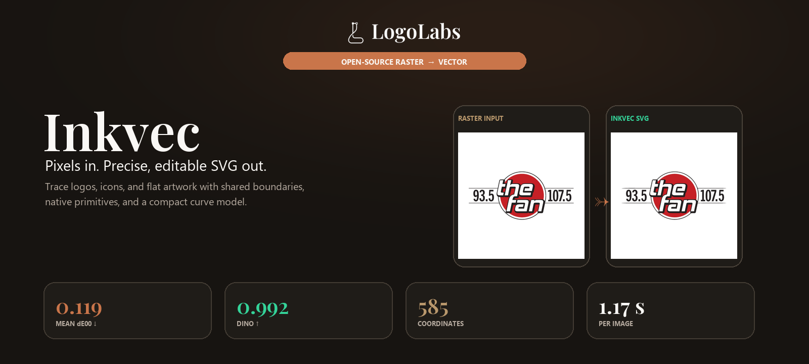
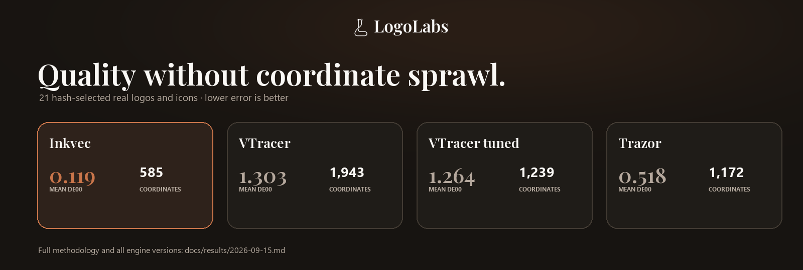
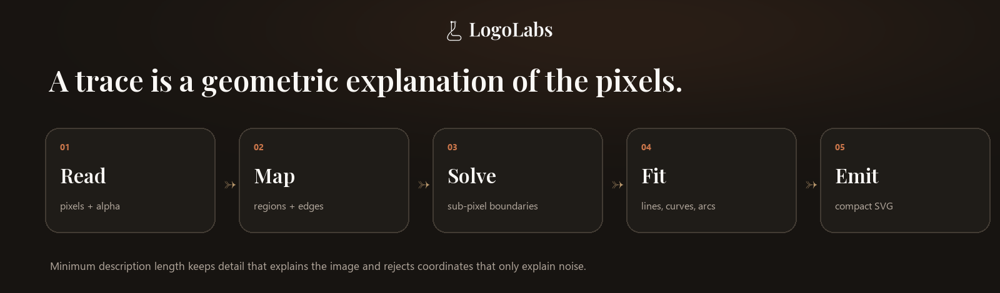
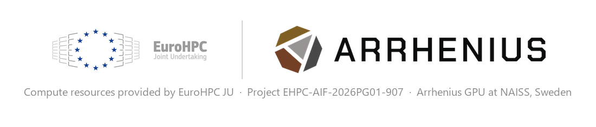

<p align="center">
  
</p>

<p align="center">
  <a href="https://github.com/logolabs/inkvec/actions"></a>
  <a href="https://github.com/logolabs/inkvec/releases"></a>
  <a href="LICENSE"></a>
  <a href="https://huggingface.co/spaces/logolabs/inkvec"></a>
  <a href="https://huggingface.co/Logolabs/inkvec-denoiser-001"></a>
</p>

Inkvec reads a PNG, JPEG, WebP, GIF, BMP or TIFF and writes an SVG whose geometry is decided by the evidence in the pixels:

- A boundary sits where the anti-aliasing says it is, to **a few hundredths of a pixel**.
- A circle is written as `<circle>`, not four cubics pretending to be one.
- A smooth ramp becomes a **real gradient**, not coloured bands.
- The number of coordinates is chosen by **minimum description length** — not a tolerance slider you have to guess at.

Most tracers spend points wherever their curve-fit tolerance lets them. Inkvec spends them where the artist would have: one path per region, a circle where there is a circle, shared edges between shapes that never drift apart.

---

## Results

<p align="center">
  
</p>

Inkvec vs four other engines on **21 hash-selected cases** (real brand logos, icons, emoji), scored with CIEDE2000 colour error, DISTS, DINOv3, and coordinate count:

| Engine | Mean dE00 ↓ | Median dE00 ↓ | DISTS ↓ | DINO ↑ | Coords vs Inkvec | Time |
|---|---|---|---|---|---|---|
| **Inkvec** | **0.119** | **0.048** | **0.023** | **0.992** | **1×** (585) | 1.17 s |
| VTracer 0.6.15 (default) | 1.303 | 0.598 | 0.051 | 0.963 | 3.3× (1,943) | 0.04 s |
| VTracer 1.0.0-alpha.4 (default) | 1.303 | 0.598 | 0.051 | 0.963 | 3.3× (1,943) | 0.05 s |
| VTracer 1.0.0-alpha.4 (tuned) | 1.264 | 0.579 | 0.064 | 0.954 | 2.1× (1,239) | 0.06 s |
| Trazor | 0.518 | 0.227 | 0.048 | 0.971 | 2.0× (1,172) | 2.19 s |

VTracer is meaningfully faster — this is a quality/speed trade, not a free win. Source: [`docs/results/2026-09-15.md`](docs/results/2026-09-15.md).

<p align="center">
  
</p>

> **On the regression corpus** (246 icons from lucide, material-icons, simple-icons, noto-emoji, openmoji, twemoji — the set CI gates on): **mean dE00 0.149**, 1.29× the parameters a human author would use. Source: [`bench/gate/baseline.json`](bench/gate/baseline.json).

### Damaged input: JPEG, WebP, AI-decoder output

Inkvec ships an optional trained restorer that removes compression and decode damage before tracing. On JPEG q60, 40 icons, with the restorer in the loop:

| Metric | With restorer | Without restorer | VectorArk | StarVector |
|---|---|---|---|---|
| LPIPS | **0.0176** | 0.0248 | 0.120 | 0.258 |

End-to-end on 144 image/format pairs across 48 images, the restorer delivers **dE00 −28%, DISTS −53%, parameter count −31%**, neutral-to-slightly-worse on clean input (off by default).

---

## Install

### Pre-built binaries

Download the latest release for your platform from the [Releases page](https://github.com/logolabs/inkvec/releases).

### Build from source

```sh
cargo install --path crates/inkvec-cli
```

or from a checkout:

```sh
cargo build --release -p inkvec-cli
target/release/inkvec logo.png -o logo.svg
```

Requires **Rust 1.88** or newer. `cargo test --release --workspace` runs 200+ tests.

---

## Quickstart

```sh
inkvec logo.png -o logo.svg
```

```
  intake        2x more pixels than detail: scaling min-area x4
logo.png (512x512)
  palette       3 colours, 26 faces (0 gradient)
  planar map    29 shared edges (3 primitive)
  boundary solve  E 285.5 -> 23.0 in 7 iteration(s), 7208 point(s) moved
  symmetry      none in the label map
  repair        0 boundary refit(s) to stop rings crossing
  segments      266  (160 line, 106 cubic) from 9176 measured points, 34.5x reduction
  lambda        8.54
  wrote         logo.svg (7886 bytes)
```

Exit codes: `0` success · `1` usage/input error · `2` flat input under `--strict` · `3` debug-dump write failure.

---

## Usage

```
inkvec <input> [-o <output.svg>] [OPTIONS]
```

| Flag | Default | What it does |
|---|---|---|
| `--restore <auto\|on\|off>` | off | Trained-network cleanup for JPEG/WebP/AI-decoder damage. `auto` only restores if it looks damaged. |
| `--sr <auto\|on\|off>` | off | Super-resolution pre-pass (2-4× upscale), complementary to `--restore`. |
| `--lossy <auto\|on\|off>` | auto | Whether to trust the file as clean or trace with noise-aware intake. |
| `--max-dim <px>` | 2048 | Cap on the longer side; SVG is written at the original size. |
| `--time-budget <s>` | 0 | Advisory wall-clock budget; trace is still correct if it runs out. |
| `--no-background` | off | Drop the face that paints the whole canvas. |
| `--minify` | off | No ids, no groups, no trailing zeros — ~10% smaller, identical geometry. |

Run `inkvec --help` for the full list.

---

## Optional features

| Feature | What it adds | Cost |
|---|---|---|
| `restore-model` | Trained restorer (`--restore`) via ONNX Runtime, CPU | Downloads prebuilt ONNX Runtime at build time |
| `restore-burn` | Same network via Burn, pure Rust, no native library | ~4× slower than `restore-model` |
| `restore-wgpu` | Restorer via Burn on GPU (Vulkan/DX12/Metal) | No CUDA needed |

```sh
cargo build --release -p inkvec-cli --features restore-model
```

The denoiser weights (`restorer.onnx`) are hosted on Hugging Face at [`Logolabs/inkvec-denoiser-001`](https://huggingface.co/Logolabs/inkvec-denoiser-001) under Apache-2.0, and are automatically pulled on first `--restore` use. To pull manually:

```sh
python tools/pull_model.py
```

---

## In the browser

`crates/inkvec-wasm` compiles the same pipeline to WebAssembly. [`web/`](web/) is the static page around it — drop a logo, get the SVG, nothing uploaded.

**Try it live:** [huggingface.co/spaces/logolabs/inkvec](https://huggingface.co/spaces/logolabs/inkvec)

To embed in your own page, call `trace(bytes, precision, min_area, colors, merge, max_dim, time_budget, no_background, minify, margin, content_units)` — see [`crates/inkvec-wasm/src/lib.rs`](crates/inkvec-wasm/src/lib.rs).

---

## Library API

```rust
use inkvec_cli::{trace_image, post_process, Args};
use inkvec_trace::load_image;

fn trace(input: &str) -> Result<String, Box<dyn std::error::Error>> {
    let args = Args { input: input.into(), ..Args::default() };
    let img = load_image(&args.input)?;
    let traced = trace_image(img, &args)?;
    Ok(post_process(&args, traced.svg, traced.width, traced.height))
}
```

`Args::default()` holds every flag's default. `trace_image` is the whole pipeline behind both the CLI and the WASM build.

---

## How it works

<p align="center">
  
</p>

1. **Palette** by minimum description length — an ink survives only if the pixels it explains cost more without it.
2. **Labels → planar map.** Every boundary is shared between exactly two faces, so a moved edge moves for both sides and the output never has a seam.
3. **Boundary solve.** All boundary points simultaneously, against an exact-coverage render, so each edge lands where the anti-aliasing says it is.
4. **Gradient fits.** Flat, linear or radial per face by the same MDL cost; bands that were one gradient are merged back.
5. **Curve fitting** by dynamic programming over lines, cubics, arcs and whole primitives (circle, ellipse, rounded rectangle).
6. **Repair and emit.** Crossing rings are refitted; SVG is written with shared geometry and stable ids.

Full pipeline reference: [`docs/algorithm/`](docs/algorithm/) (start at `docs/algorithm/index.html`). Design rationale: [`docs/DESIGN.md`](docs/DESIGN.md).

---

## Benchmark and CI gate

`bench/` scores against a source SVG with CIEDE2000, DISTS, LPIPS, DINOv2/v3, parameter ratio, bytes and time. CI runs `cargo test` on Linux, Windows and macOS, then `bench/ci_gate.py` against the 246-icon screen set, failing if colour error or anchor turning rise more than 1% or the parameter ratio more than 5%.

---

## Who this is not for

| Scenario | Why |
|---|---|
| Photographs | Inkvec finds inks and boundaries; a photo has neither. |
| Centerline / sketch tracing | `--strokes` emits centerlines, but only on genuinely stroked drawings. |
| Editable text | Lettering is traced as shapes, not re-flowable text. |
| Sub-pixel gaps | Two strokes closer than a pixel become one region. |
| Mesh gradients / blurs | Linear and radial gradients are fitted; exotic gradients become bands. |

---

## Licence

Apache-2.0. See [`LICENSE`](LICENSE). Third-party components: [`docs/THIRD_PARTY.md`](docs/THIRD_PARTY.md). All Rust dependencies are permissive. Potrace (GPL) is used only as a benchmark baseline — never linked or redistributed.

---

## Citation

```bibtex
@software{inkvec2026,
  title  = {Inkvec: exact raster-to-vector tracing by minimum description length},
  author = {{LogoLabs} and Deleanu, Stefan-Lucian},
  year   = {2026},
  url    = {https://github.com/logolabs/inkvec}
}
```

---

## Acknowledgements

<p align="center">
  
</p>

We acknowledge EuroHPC JU for awarding the project ID **EHPC-AIF-2026PG01-907** access to resources on **Arrhenius GPU at NAISS, Sweden**. The Arrhenius system is operated by the National Academic Infrastructure for Supercomputing in Sweden (NAISS). Compute time on Arrhenius enabled the training and evaluation of the denoiser/restorer model shipped with this release.
