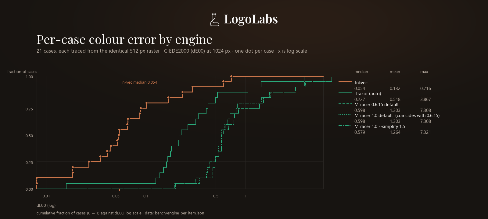
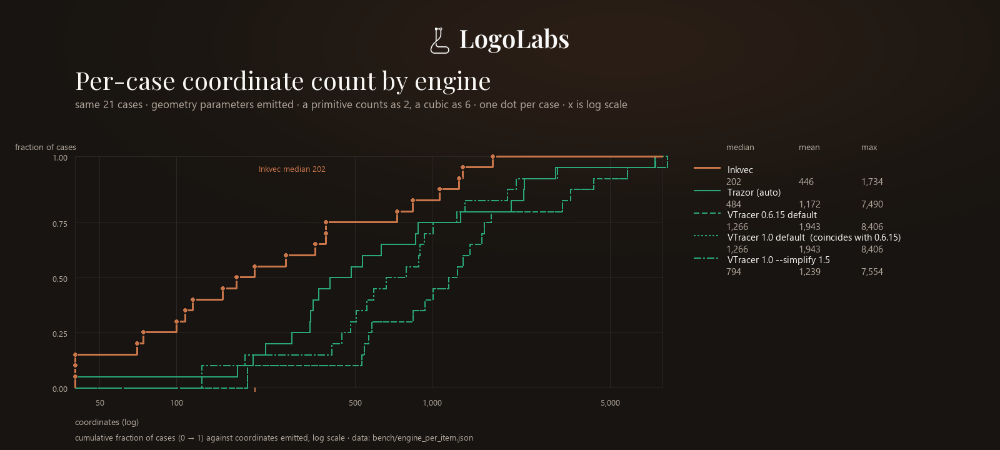
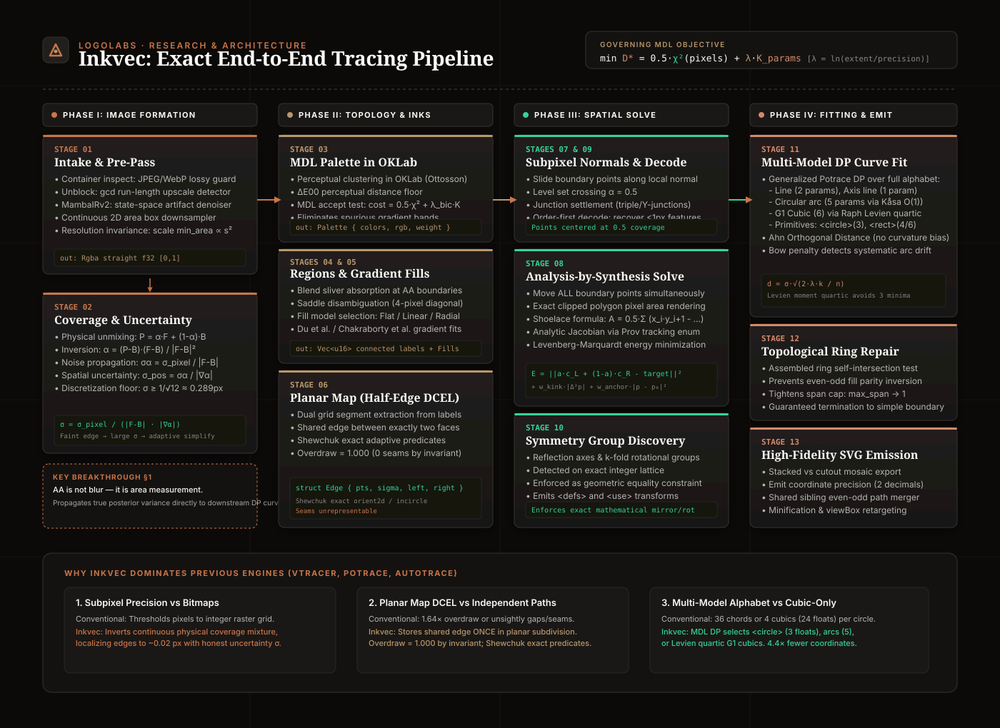

<p align="center">
  
</p>

<p align="center">
  <a href="https://github.com/logolabs/inkvec/actions"></a>
  <a href="https://github.com/logolabs/inkvec/releases"></a>
  <a href="PIPELINE_EXPLANATION.md"></a>
  <a href="docs/AI_USAGE.md"></a>
  <a href="docs/LIMITATIONS.md"></a>
  <a href="LICENSE"></a>
  <a href="https://huggingface.co/spaces/logolabs/inkvec"></a>
  <a href="https://huggingface.co/Logolabs/inkvec-denoiser-001"></a>
  <a href="https://huggingface.co/Logolabs/inkvec-sr-001"></a>
</p>

Inkvec reads a PNG, JPEG, WebP, GIF, BMP or TIFF and writes an SVG whose geometry is decided by the evidence in the pixels:

- A boundary sits where the anti-aliasing says it is — within **~0.05 px** on analytic test circles (the level-set extraction's own resolution limit; `crates/inkvec-trace/src/coverage.rs`), which is a synthetic-input figure, not a corpus one.
- A circle is written as `<circle>`, not four cubics pretending to be one.
- A smooth ramp becomes a **real gradient**, not coloured bands.
- The number of coordinates is chosen by **minimum description length** — not a tolerance slider you have to guess at.

Most tracers spend points wherever their curve-fit tolerance lets them. Inkvec spends them where the artist would have: one path per region, a circle where there is a circle, shared edges between shapes that never drift apart.

---

## Results

<p align="center">
  
</p>

Inkvec vs two other engines (VTracer and Trazor) on **21 cases**, scored with CIEDE2000 colour error, DISTS, DINOv3, and coordinate count. The set is fixed from the selection seed `crosscompare-2026-09-15-v1` (`bench/crosscompare_current.py`): 14 hash-selected real icons (2 per family across lucide, material-icons, simple-icons, twemoji, noto-emoji, openmoji and fluent-emoji), 4 hand-picked synthetic probes (`prim_circle`, `mosaic_pie6`, `gradient_linear`, `gradient_radial`), and 3 real brand logos drawn from an external brand dataset that is not part of this repository — a clean clone selects only the other 18 (see [`docs/results/2026-09-15.md`](docs/results/2026-09-15.md)):

| Engine | Mean dE00 ↓ | Median dE00 ↓ | DISTS ↓ | DINO ↑ | Coords vs Inkvec | Time |
|---|---|---|---|---|---|---|
| **Inkvec** | **0.132** | **0.054** | **0.0236** | **0.991** | **1×** (446) | 1.17 s |
| VTracer (default; 0.6.15 / 1.0.0-alpha.4) | 1.303 | 0.598 | 0.051 | 0.963 | 4.4× (1,943) | 0.04–0.05 s |
| VTracer (tuned, 1.0.0-alpha.4) | 1.264 | 0.579 | 0.064 | 0.954 | 2.8× (1,239) | 0.06 s |
| Trazor | 0.518 | 0.227 | 0.048 | 0.971 | 2.6× (1,172) | 2.19 s |

The two VTracer defaults (0.6.15 and 1.0.0-alpha.4) are the **same engine**: they emit byte-different files but near-identical geometry (per-case dE00 0.0001–0.0012), and only the tuned setting differs materially — they are not independent corroboration. "Coords vs Inkvec" counts each primitive (`<circle>`, `<ellipse>`, `<rect>`) as 2 coordinates and each cubic as 6, which favours engines that emit primitives. Against the artist's own file, Inkvec's like-for-like ratio (`geom_ratio`: geometry parameters ÷ ground-truth geometry parameters) is 1.402 on this set. n = 21, with no error bars or significance test; the timings are approximate.

One engine is deliberately absent from the table: `color-trace` ("potrace-color", [`migvel/color_trace`](https://github.com/migvel/color_trace) — pngquant quantisation + per-layer Potrace) is not apples-to-apples, because it reproduces the raster by drawing every pixel back rather than tracing artist-shaped geometry — on these same 21 cases its median dE00 is 0.229 at a median 25,018 coordinates, against Inkvec's 0.054 at 202 — roughly 124× the coordinates. Full detail in the non-apples-to-apples section of [`docs/results/2026-09-15.md`](docs/results/2026-09-15.md).

VTracer is meaningfully faster — this is a quality/speed trade, not a free win. Source: [`docs/results/2026-09-15.md`](docs/results/2026-09-15.md).

<p align="center">
  
</p>

Per-case colour error (dE00) over the 21 cases — the distribution behind the table's mean and median, not only the summary. Reproduce with `python tools/make_engine_distribution.py`, which reads `bench/engine_per_item.json` (one row per case × engine).

<p align="center">
  
</p>

Per-case coordinate count over the same 21 cases, from the same script and data file.

**Inkvec's row was re-measured on the 0.1.1 release build** (`inkvec.exe` sha256 `73c2f67a4e42194a42f72eba9063815942accb8e05d3e70e472fad1b5d115753`), and these two distribution charts are from that same run; the competitor rows are unchanged because their binaries reproduce exactly (VTracer default 1.303 / 1,943; tuned 1.264 / 1,239; Trazor 0.518 / 1,172).

<p align="center">
  
</p>

> **On the regression corpus** (246 icons from lucide, material-icons, simple-icons, noto-emoji, openmoji, twemoji — the set CI gates on): **mean dE00 0.299**, 1.46× the parameters a human author would use. That mean is a family macro-average and is outlier-driven, so read it next to the **median (per-item) 0.125** — p10 0.024, p90 0.612, worst 5.72, and 13 of the 246 cases above dE00 1.0. The typical icon sits at ~0.125, and the mean is roughly 2.4× the median because a small tail pulls it up. (An earlier 0.149 figure came from a pre-release snapshot that was not reproducible; the baseline was re-recorded against the reproducible release build — see [`CHANGELOG.md`](CHANGELOG.md).) Source: [`bench/gate/baseline.json`](bench/gate/baseline.json).

### Damaged input: JPEG, WebP, AI-decoder output

Inkvec ships an optional trained restorer that removes compression and decode damage before tracing. It is **off by default** (`--restore off`; `--restore auto` enables it only when the input looks damaged). The weights that ship — `restorer.onnx` from [`Logolabs/inkvec-denoiser-001`](https://huggingface.co/Logolabs/inkvec-denoiser-001), pulled on first use or via `tools/pull_model.py` — have **no published benchmark in this repository**, and no LPIPS or ablation figure for them is reported anywhere here. The figures that previously appeared in this section were measured during development on a different checkpoint and are not reproduced for the shipped weights; the VectorArk and StarVector numbers were those projects' own published results, measured under their protocols, not here.

---

## Install

### Pre-built binaries

Download the latest release for your platform from the [Releases page](https://github.com/logolabs/inkvec/releases).

### Build from source

```sh
cargo install --path crates/inkvec-cli
```

or from a checkout:

```sh
cargo build --release -p inkvec-cli
target/release/inkvec logo.png -o logo.svg
```

Requires **Rust 1.88** or newer. `cargo test --release --workspace` runs 200+ tests.

---

## Quickstart

```sh
inkvec logo.png -o logo.svg
```

```
  intake        2x more pixels than detail: scaling min-area x4
logo.png (512x512)
  palette       3 colours, 26 faces (0 gradient)
  planar map    29 shared edges (3 primitive)
  boundary solve  E 285.5 -> 23.0 in 7 iteration(s), 7208 point(s) moved
  symmetry      none in the label map
  repair        0 boundary refit(s) to stop rings crossing
  segments      266  (160 line, 106 cubic) from 9176 measured points, 34.5x reduction
  lambda        8.54
  wrote         logo.svg (7886 bytes)
```

Exit codes: `0` success · `1` usage/input error · `2` flat input under `--strict` · `3` debug-dump write failure.

---

## Usage

```
inkvec <input> [-o <output.svg>] [OPTIONS]
```

| Flag | Default | What it does |
|---|---|---|
| `--restore <auto\|on\|off>` | off | Trained-network cleanup for JPEG/WebP/AI-decoder damage. `auto` only restores if it looks damaged. |
| `--sr <auto\|on\|off>` | off | Super-resolution pre-pass (2-4× upscale), complementary to `--restore`. |
| `--lossy <auto\|on\|off>` | auto | Whether to trust the file as clean or trace with noise-aware intake. |
| `--max-dim <px>` | 2048 | Cap on the longer side; SVG is written at the original size. |
| `--time-budget <s>` | 0 | Advisory wall-clock budget; trace is still correct if it runs out. |
| `--no-background` | off | Drop the face that paints the whole canvas. |
| `--minify` | off | No ids, no groups, no trailing zeros — ~10% smaller, identical geometry. |

Run `inkvec --help` for the full list.

### Shape harmonization (on by default)

After fitting, marks that repeat across the drawing — a run of identical tabs, segmented rings, tiled glyphs — are matched by affine-normalized outline similarity (IoU threshold `--harmonize-threshold`, default 0.92) and redrawn from one consensus geometry per cluster. The pass exists to save parameters: on the 246-icon screen set it trims the parameter ratio from 1.466× to 1.457× the artist's count (−0.6%), concentrated in a couple of dozen drawings with genuinely repeated compound shapes (`osano` halves its path budget; disabling costs the most on `osano`, `badge-russian-ruble`, `perm_media`, `rule_folder`).

The known cost is fidelity on fine-line art. The consensus averages the cluster's members, and on marks near the resolution of the raster — hairlines, thin rings, small rounded details — that average displaces thin lines by about a pixel and stamps rounded details toward the cluster's consensus shape. On the screen set it raises mean dE00 from **0.151** with the flag off to **0.299** with it on: 63 of 246 icons get measurably worse, 4 get better, and the other 179 are untouched (per-icon median 0.110 → 0.125). The worst cases are exactly the repeated-shape drawings the pass exists for — `rule_folder`, `perm_media`, `report`, `badge-russian-ruble`, `cat` — which is why those dominate the Results note above. On artwork of this kind, opt out with `--no-harmonize`. (The 0.149 pre-release mean quoted under Results predates this pass — measured on a build where it did not exist; this build measures 0.151 with the flag off, so the whole 0.15→0.30 move on that set is this pass.)

---

## Optional features

| Feature | What it adds | Cost |
|---|---|---|
| `restore-model` | Trained restorer (`--restore`) via ONNX Runtime, CPU | Downloads prebuilt ONNX Runtime at build time |
| `restore-burn` | Same network via Burn, pure Rust, no native library | ~4× slower than `restore-model` |
| `restore-wgpu` | Restorer via Burn on GPU (Vulkan/DX12/Metal) | No CUDA needed |

```sh
cargo build --release -p inkvec-cli --features restore-model
```

The denoiser weights (`restorer.onnx`) are hosted on Hugging Face at [`Logolabs/inkvec-denoiser-001`](https://huggingface.co/Logolabs/inkvec-denoiser-001) under Apache-2.0, and are automatically pulled on first `--restore` use. To pull manually:

```sh
python tools/pull_model.py
```

---

## In the browser

`crates/inkvec-wasm` compiles the same pipeline to WebAssembly. [`web/`](web/) is the static page around it — drop a logo, get the SVG, nothing uploaded.

**Try it live:** [huggingface.co/spaces/logolabs/inkvec](https://huggingface.co/spaces/logolabs/inkvec)

To embed in your own page, call `trace(bytes, precision, min_area, colors, merge, max_dim, time_budget, no_background, minify, margin, content_units)` — see [`crates/inkvec-wasm/src/lib.rs`](crates/inkvec-wasm/src/lib.rs).

---

## Library API

```rust
use inkvec_cli::{trace_image, post_process, Args};
use inkvec_trace::load_image;

fn trace(input: &str) -> Result<String, Box<dyn std::error::Error>> {
    let args = Args { input: input.into(), ..Args::default() };
    let img = load_image(&args.input)?;
    let traced = trace_image(img, &args)?;
    Ok(post_process(&args, traced.svg, traced.width, traced.height))
}
```

`Args::default()` holds every flag's default. `trace_image` is the whole pipeline behind both the CLI and the WASM build.

### Language bindings

The `inkvec` crate (`crates/inkvec`) is the stable library API -- `inkvec::trace(&png, &inkvec::Options::default())` -- and the base of a C library with a generated header (`crates/inkvec-ffi`) and a Python package (`crates/inkvec-py`: `inkvec.trace("logo.png", colors=16)`). Every binding takes the same options, generated from one schema, and reproduces the same contract fixtures. See [`docs/BINDINGS.md`](docs/BINDINGS.md), including the same shape-harmonization caveat as above.

---

## How it works

<p align="center">
  
</p>

1. **Intake & Super-Resolution.** Lossy container inspection, GCD upscale unblocking, MambaIRv2 state-space restoration, and exact continuous area-weighted downsampling.
2. **Sub-Pixel Coverage.** Linear unmixing across 3D RGB channels inverts anti-aliasing to a fraction of a pixel, establishing honest per-point uncertainty $\sigma_{\text{pos}}$.
3. **Palette.** Minimum description length clustering in OKLab ($\Delta E_{00}$) eliminates spurious bands and fake inks.
4. **Planar Map (DCEL).** Boundaries are stored once between adjacent faces, so the model has no overdraw ($1.000\times$ internally); seams are unrepresentable.
5. **Boundary Solve.** Analysis-by-synthesis moves all boundary points simultaneously under nonlinear conjugate gradient (Fletcher–Reeves) with a backtracking line search and an analytic Shoelace-derived gradient.
6. **Curve Fitting.** Global dynamic programming over lines, arcs, Raph Levien quartic G1 Béziers, and primitives (`<circle>`, `<ellipse>`, `<rect>`).
7. **Repair & Emit.** Capped span refitting eliminates self-crossing rings; output is emitted with shared geometry and clean even-odd paths.

📖 **Comprehensive Technical & Scientific Guide:** See [**`PIPELINE_EXPLANATION.md`**](PIPELINE_EXPLANATION.md) for full mathematical derivations, branded step-by-step diagrams, and an extensive review of all research and arXiv papers used (AnchorFlow, VectorArk, AdaVec, SuperSVG, MambaIR, Levien Bézier fits, Shewchuk exact predicates, and more).

🤖 **AI Provenance & Transparency:** See [**`docs/AI_USAGE.md`**](docs/AI_USAGE.md) for our detailed disclosure separating agentic development tooling, runtime restoration models (EuroHPC Arrhenius-trained denoiser & MambaIR), and the 100% deterministic non-neural mathematical geometry core.

Full stage reference: [`docs/algorithm/`](docs/algorithm/) (start at `docs/algorithm/index.html`). Design rationale: [`docs/DESIGN.md`](docs/DESIGN.md).

---

## Benchmark and CI gate

`bench/` scores against a source SVG with CIEDE2000, DISTS, LPIPS, DINOv2/v3, parameter ratio, bytes and time. CI runs `cargo test` on Linux, Windows and macOS, then `bench/ci_gate.py` against the 246-icon screen set, failing if colour error or anchor turning rise more than 1% or the parameter ratio more than 5%.

---

## Known Limitations & Technical Boundaries

See [**`docs/LIMITATIONS.md`**](docs/LIMITATIONS.md) for our comprehensive architectural boundary disclosure.

Inkvec is engineered specifically for graphic artwork, logotypes, icons, and diagrams. Because the core operates under an exact planar partition and description-length model, specific inputs are outside its design scope:

| Scenario | Expected Behavior / Failure Mode | Recommended Alternative |
|---|---|---|
| **Photographs** | Natural color transitions violate discrete ink models; causes severe color banding and high coordinate counts. | Keep as AVIF/WebP raster or use diffusion curves. |
| **Text & Typography** | Glyphs are traced purely as geometric Bézier contours (`<path>`); no font detection, OCR, or `<text>` tags. | Use an OCR engine (e.g. Tesseract) for semantic text. |
| **Variable-Width Art / Sketches** | Medial axis stroke recovery (`--strokes`) requires uniform width; rough sketches fall back to filled outlines. | Use manual vector pen tools or specialized sketch tracers. |
| **Sub-Pixel Gaps (< 1px)** | Optical anti-aliasing ramps overlap, merging fine gaps into single faces. | Enable `--sr on` (MambaIR) to upsample before tracing. |
| **Exotic Gradients & Blurs** | Linear and radial gradients are supported; mesh gradients, angular sweeps, and drop shadows are quantised into bands. | SVG 1.1 limitation; manual gradient mesh authoring. |
| **Real-Time / 60 FPS Video** | Heavy global optimization (nonlinear conjugate gradient + MDL DP) takes $\approx 1.2\text{s}$ per graphic. | Use Potrace (<0.01s) or VTracer (~0.04s) for interactive speed. |

---

## Roadmap & Future Work

Active engineering initiatives tracked in [**`docs/TODO.md`**](docs/TODO.md):
- **Neural Post-Processing Refinement Pass:** Integrating our 20M vision-conditioned Graph Neural Network (`TraceRefineGNN20M`) with equality-constrained CAD least-squares snapping (KKT solver) and topological collinear edge collapse to eliminate subtle raster quantization and restore sharp $C^0$ corners.
- **High-Volume Benchmarking:** Scaling from the 246-icon regression gate to a multi-thousand-sample suite across diverse complexity tiers, streaming multi-engine Pareto frontiers against Potrace, VTracer, and Adobe Illustrator.

---

## Licence

Apache-2.0. See [`LICENSE`](LICENSE). Third-party components: [`docs/THIRD_PARTY.md`](docs/THIRD_PARTY.md). Every Rust dependency of the default build is permissive; two weakly-copyleft MPL-2.0 crates (`colored`, `option-ext`) are pulled in only by the optional Burn restorer backends (`restore-burn`/`restore-wgpu`/`cuda`), never by default features or the published `default`/`restore-model` archives. Potrace (GPL) is used only as a benchmark baseline — never linked or redistributed.

---

## Citation

```bibtex
@software{inkvec2026,
  title  = {Inkvec: exact raster-to-vector tracing by minimum description length},
  author = {{LogoLabs} and Deleanu, Stefan-Lucian},
  year   = {2026},
  url    = {https://github.com/logolabs/inkvec}
}
```

---

## Acknowledgements

<p align="center">
  
</p>

We acknowledge EuroHPC JU for awarding the project ID **EHPC-AIF-2026PG01-907** access to resources on **Arrhenius GPU at NAISS, Sweden**. The Arrhenius system is operated by the National Academic Infrastructure for Supercomputing in Sweden (NAISS). Compute time on Arrhenius enabled the training and evaluation of the denoiser/restorer model shipped with this release.
