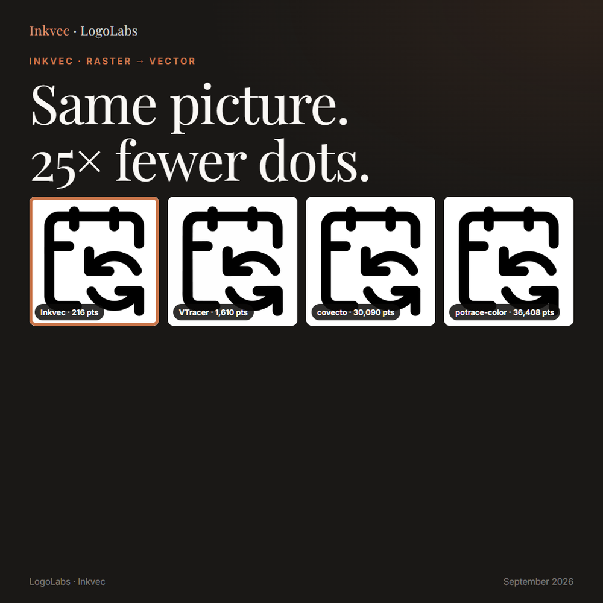
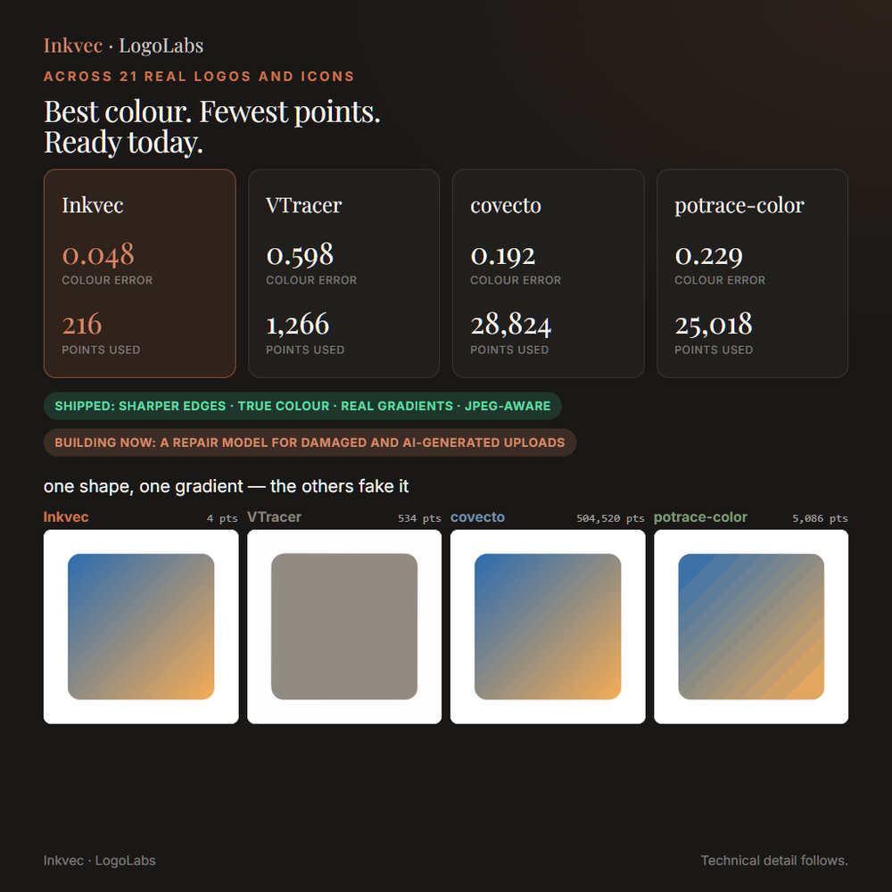

# Inkvec

**Raster to exact vector, for logos, icons and flat artwork.** One binary, no runtime
dependencies, Apache-2.0.

Inkvec reads a PNG, JPEG, WebP, GIF, BMP or TIFF and writes an SVG whose geometry is decided
by the evidence in the pixels: a boundary sits where the anti-aliasing says it is, to a few
hundredths of a pixel; a circle is written as `<circle>`, not four cubics pretending to be
one; a smooth ramp becomes a real gradient; and the number of coordinates is chosen by
minimum description length, not a tolerance slider you have to guess at.

<p align="center">
  
</p>

Most tracers spend points wherever their curve-fit tolerance lets them. Inkvec spends them
where the artist would have: one path per word, a circle where there is a circle, a shared
edge between two shapes that never drifts apart.

## Results

Inkvec vs. four other engines, 21 hash-selected cases (real brand logos, icons, emoji),
scored against the source render with CIEDE2000 (colour), DISTS, DINOv3 and a geometry
(coordinate-count) ratio. Source: [`docs/results/2026-09-15.md`](docs/results/2026-09-15.md)
(regenerate with `bench/crosscompare_competitors.py`).

| engine | mean dE00 | median dE00 | DISTS | DINO | coords vs. Inkvec | seconds |
|---|---|---|---|---|---|---|
| **Inkvec** | **0.119** | **0.048** | **0.023** | **0.992** | **1×** (585) | 1.17 |
| VTracer 0.6.15 (PyPI, default) | 1.303 | 0.598 | 0.051 | 0.963 | 3.3× (1,943) | 0.04 |
| VTracer 1.0.0-alpha.4 (default) | 1.303 | 0.598 | 0.051 | 0.963 | 3.3× (1,943) | 0.05 |
| VTracer 1.0.0-alpha.4 (`--simplify 1.5 --hierarchical cutout`) | 1.264 | 0.579 | 0.064 | 0.954 | 2.1× (1,239) | 0.06 |
| Trazor (PhenX/Trazor, MIT) | 0.518 | 0.227 | 0.048 | 0.971 | 2.0× (1,172) | 2.19 |

VTracer is meaningfully faster — this is a quality/speed trade, not a free win. Seconds were
measured on a machine doing other CPU-bound work at the same time; treat them as approximate.
[RasterTrace](https://github.com/visioncortex/RasterTrace), a WASM tracer some people compare
against separately, is VTracer 1.0 compiled to WebAssembly — not a fifth algorithm.

Two more engines were added for completeness and are **not** apples-to-apples at the geometry
level: **covecto**'s default mode is a pixel-exact tracer that reproduces the source raster's
grid losslessly (30,090 coordinates on the icon above), and **potrace-color** (quantize +
potrace per layer) does the same (36,408). Both win on `--auto`-style raw fidelity by drawing
every pixel back; neither produces artist-shaped geometry. covecto's `--spline` mode, for the
record, is VTracer 0.6.5 running inside covecto's own binary (its SVGs say so in a comment) —
also not an independent algorithm. Source: [`docs/results/2026-09-15.md`](docs/results/2026-09-15.md)
(regenerate with `bench/crosscompare_4way.py`); provenance notes
in [`docs/research/experiments-2026-09-12.md`](docs/research/experiments-2026-09-12.md) §10q.

**On the regression corpus** (246 icons from lucide, material-icons, simple-icons, noto-emoji,
openmoji and twemoji — the set CI gates on): mean dE00 0.149, 1.29× the parameters a human
author would use for the same art. Source: [`bench/gate/baseline.json`](bench/gate/baseline.json).

### Damaged input: JPEG, WebP, AI-decoder output

Inkvec ships an optional trained restorer (below) that removes compression and decode damage
before tracing. On JPEG q60, 40 icons, with the restorer in the loop: **LPIPS 0.0176**, ahead
of the published numbers for two neural vectorisers on the same tier — VectorArk (LPIPS
0.120) and StarVector (0.258). Without the restorer the same input reads LPIPS 0.0248 — still
ahead of both, the restorer roughly triples the margin. Source:
[`docs/results/2026-09-15.md`](docs/results/2026-09-15.md)
(the corrected run — `bench/research/decoding/svgenius_stress_restored.py` — superseding an
earlier run with a ringing-detector bug that read the wrong way; see
[`docs/research/experiments-2026-09-12.md`](docs/research/experiments-2026-09-12.md) for the
fix). *Caveat: this comparison used an earlier checkpoint in the restorer's own training
lineage (`restorer_resid_flat_512mix`, step 30000) rather than the exact checkpoint shipped
today (`restorer_widermask`, step 12000, fine-tuned from that one) — see the restorer's own
release notes below for the number measured on the shipped checkpoint.*

End to end, restoring before tracing (tiled inference + extreme-snap + lenient intake, the
shipped configuration) on damaged input, 144 image/format pairs across 48 images: **dE00
-28%, DISTS -53%, parameter count -31%**, and it is neutral-to-slightly-worse on clean input,
which is why it is off by default. Source: [`docs/research/experiments-2026-09-12.md`](docs/research/experiments-2026-09-12.md)
§10p.D. Full detail on the restorer-only model, including its own release, is in
[`release/restorer-model/`](release/restorer-model/README.md).

<p align="center">
  
  
</p>

## Install

Build from source today; a release workflow for prebuilt binaries is being added
separately.

```
cargo install --path crates/inkvec-cli
```

or build from a checkout:

```
cargo build --release -p inkvec-cli
target/release/inkvec logo.png -o logo.svg
```

Rust 1.88 or newer. `cargo test --release --workspace` runs the workspace's test suite
(200+ tests, `cargo-nextest` or plain `cargo test` both work).

## Quickstart

```
inkvec docs/assets/example.png -o example.svg
```

```
  intake        2x more pixels than detail: scaling min-area x4
docs/assets/example.png (512x512)
  palette       3 colours, 26 faces (0 gradient)
  planar map    29 shared edges (3 primitive)
  boundary solve  E 285.5 -> 23.0 in 7 iteration(s), 7208 point(s) moved
  symmetry      none in the label map
  repair        0 boundary refit(s) to stop rings crossing
  segments      266  (160 line, 106 cubic) from 9176 measured points, 34.5x reduction
  lambda        8.54
  wrote         example.svg (7886 bytes)
```

`inkvec --version` prints the build version. The exit code tells a script what happened
without parsing stderr: `0` on success, `1` on a usage or input error (bad flags, a file
that will not decode), `2` on a flat input under `--strict` (nothing to trace — see
`crates/inkvec-cli/src/args.rs`), `3` if a debug map dump was requested and failed to
write.

### Optional features

Everything above is the base binary: bilevel geometry, palette, planar map, boundary solve,
curve fitting, gradients. The trained restorer pulls in an inference runtime, so it is
feature-gated. The super-resolution pre-pass (`--sr`) needs no feature: it runs the packaged
Python tool in `tools/inkvec_sr`, or any command you pass with `--sr-command`.

| feature | what it adds | cost |
|---|---|---|
| `restore-model` | the trained restorer (`--restore`), through ONNX Runtime, CPU | downloads a prebuilt ONNX Runtime at build time |
| `restore-burn` | the same network through Burn, pure Rust, no native library | ~4× slower than `restore-model` |
| `restore-wgpu` | the restorer through Burn on the GPU (Vulkan/DX12/Metal) | no CUDA needed |

```
cargo build --release -p inkvec-cli --features restore-model
```

The denoiser model weights (`restorer.onnx`) are hosted on Hugging Face at [`Logolabs/inkvec-denoiser-001`](https://huggingface.co/Logolabs/inkvec-denoiser-001) under the Apache-2.0 licence. When using `--restore`, the model is automatically downloaded to the user cache on first use, or can be pulled manually via `python tools/pull_model.py`.

**Windows + `restore-model`:** `ort` links ONNX Runtime statically by default, and that link
needs MSVC 17.10 or newer — with 17.9 (toolset 14.39) it fails on
`__std_find_last_of_trivial_pos_1`. Either update MSVC, or link dynamically: set
`ORT_LIB_PATH=<zip>/lib` and `ORT_PREFER_DYNAMIC_LINK=1` against Microsoft's ONNX Runtime
release zip, and ship `onnxruntime.dll` beside the binary. (From the comments in
[`crates/inkvec-restore/Cargo.toml`](crates/inkvec-restore/Cargo.toml); measured there at
3.6-3.9 s at 512 px and 17.4 s at 1024 px on a 16-thread CPU, bit-identical to Python
onnxruntime. `restore-burn` on the same machine: 15-17 s at 512 px, within 1e-6.)

## Usage

```
inkvec <input> [-o <output.svg>] [OPTIONS]
```

Without `-o` the SVG is written beside the input. The stage log goes to stderr; `-q` silences
it. Run `inkvec --help` for the full list; the ones people actually reach for:

| flag | default | what it does |
|---|---|---|
| `--restore <auto\|on\|off>` | off | Trained-network cleanup for JPEG/WebP/AI-decoder damage before tracing. `auto` traces once, measures the disagreement, and only restores if it looks damaged. |
| `--sr <auto\|on\|off>` | off | Super-resolution pre-pass (upscale 2-4×, trace, halve back) for the same kind of damage, complementary to `--restore`. |
| `--lossy <auto\|on\|off>` | auto | Whether to trust the file as clean or trace with the noise-aware ("soft") intake. `auto` reads the container. |
| `--max-dim <px>` | 2048 | Inputs larger than this on the longer side trace at this size; the SVG is written at the original size. |
| `--time-budget <s>` | 0 (none) | Advisory wall-clock budget; the trace is still correct, just less polished, if it runs out. |
| `--no-background` | off | Drop the face that paints the whole canvas, so the artwork sits on transparency. |
| `--minify` | off | No ids, no groups, no trailing zeros — about a tenth smaller, identical geometry. |

## In the browser

`crates/inkvec-wasm` compiles the same pipeline to WebAssembly, and [`web/`](web/) is the
static page around it — drop a logo, get the SVG, nothing uploaded. Try it at
**https://huggingface.co/spaces/logolabs/inkvec**.

To embed the WASM build in your own page, follow the call sequence in
[`web/worker.js`](web/worker.js): load `inkvec_wasm.js`, await its default init against the
`.wasm` URL, then call `trace(bytes, precision, min_area, colors, merge, max_dim,
time_budget, no_background, minify, margin, content_units)` — see
[`crates/inkvec-wasm/src/lib.rs`](crates/inkvec-wasm/src/lib.rs) for what each argument
does and for `threads_available()` / the `threads` feature (cross-origin isolation
required; falls back to one core otherwise).

## Use it as a library

The CLI's own entry points are public, so a Rust program can trace an image without
shelling out to the binary:

```rust
use inkvec_cli::{trace_image, post_process, Args};
use inkvec_trace::load_image;

fn trace(input: &str) -> Result<String, Box<dyn std::error::Error>> {
    let args = Args { input: input.into(), ..Args::default() };
    let img = load_image(&args.input)?;
    let traced = trace_image(img, &args)?;
    Ok(post_process(&args, traced.svg, traced.width, traced.height))
}
```

`Args::default()` holds every flag's default, so only the fields you want to change need
setting. `trace_image` is the whole pipeline behind both the command line and the
WebAssembly build; `traced.stats` carries the same per-stage log lines the CLI prints to
stderr, and `post_process` applies `--no-background` / `--minify` / `--margin`.

## The desktop app

[`gradio_app/`](gradio_app/) is a local Gradio interface around the native binary: drop a
logo, see the fill, wireframe, anchors and tangent handles beside the source pixels at up
to 8x zoom. It drives `target/release/inkvec` directly, so it needs no browser sandboxing
and traces a 1024px logo in about a second.

```
cargo build --release
python gradio_app/app.py         # http://127.0.0.1:7861
```

See [`gradio_app/README.md`](gradio_app/README.md) for the environment variables, the
transparency and photograph-detection behaviour, and how to deploy it as a Hugging Face
Space.

## How it works, briefly

1. **Palette** by minimum description length — an ink survives only if the pixels it
   explains cost more without it. Anti-aliasing ramps are recognised by shape and never
   become inks.
2. **Labels, then a planar map.** Every boundary is shared between exactly two faces, so a
   moved edge moves for both sides and the output never grows a seam.
3. **Boundary solve.** All boundary points at once, against an exact-coverage render of the
   source image, so each edge lands where the anti-aliasing says it is.
4. **Fits.** Flat, linear or radial per face, by the same MDL cost; bands that were one
   gradient are merged back into one.
5. **Curve fitting** by dynamic programming over lines, cubics, arcs and whole primitives
   (circle, ellipse, rounded rectangle) — a circle costs three numbers and wins whenever the
   evidence supports it.
6. **Repair and emit.** Crossing rings are refitted; the SVG is written with shared geometry
   and stable ids.

The full pipeline reference, stage by stage, is in [`docs/algorithm/`](docs/algorithm/)
(`docs/algorithm/index.html` is the browsable entry point); the design rationale and the
literature it draws on is in [`docs/DESIGN.md`](docs/DESIGN.md).

## Benchmark and regression gate

`bench/` scores against a source SVG with CIEDE2000, DISTS, LPIPS, DINOv2/v3, parameter
ratio, bytes and time. CI runs `cargo test` on Linux, Windows and macOS, then
`bench/ci_gate.py` against the committed 246-icon screen set and
[`bench/gate/baseline.json`](bench/gate/baseline.json), failing if colour error or anchor
turning rise more than 1% or the parameter ratio more than 5%. The rasters and truths are
committed, so the gate runs from a bare checkout.

## Who this is not for

- **Photographs.** Inkvec finds inks and boundaries; a photo has neither. Use a raster
  format for photographic content, or a dedicated photo-to-vector tool if you need one.
- **Centerline/sketch tracing.** Line art is traced as filled outlines by default (`--strokes`
  emits centerline strokes, but only when the drawing is genuinely stroked — it declines
  silently otherwise).
- **Text you want to keep editable.** Lettering is traced faithfully as shapes, not as OCR'd,
  re-flowable text.
- **Sub-pixel gaps.** Two strokes closer than a pixel are one region — no 50%-coverage label
  can hold a gap no pixel is mostly inside.
- **Mesh gradients and blurs.** Linear and radial gradients are fitted; anything more exotic
  is traced as bands, not reconstructed as a mesh.

## Licence

Apache-2.0 (see [`LICENSE`](LICENSE)). Third-party components are listed in
[`docs/THIRD_PARTY.md`](docs/THIRD_PARTY.md); every Rust dependency is under a permissive
licence. Potrace (GPL) is used only as a benchmark baseline in `bench/`, never linked or
redistributed.

## Citation

```bibtex
@software{inkvec2026,
  title  = {Inkvec: exact raster-to-vector tracing by minimum description length},
  author = {{LogoLabs} and Deleanu, Stefan-Lucian},
  year   = {2026},
  url    = {https://github.com/logolabs/inkvec}
}
```
