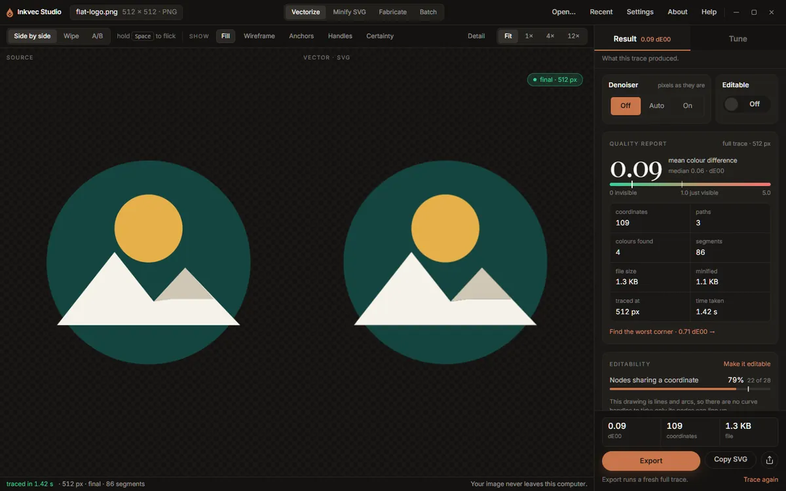
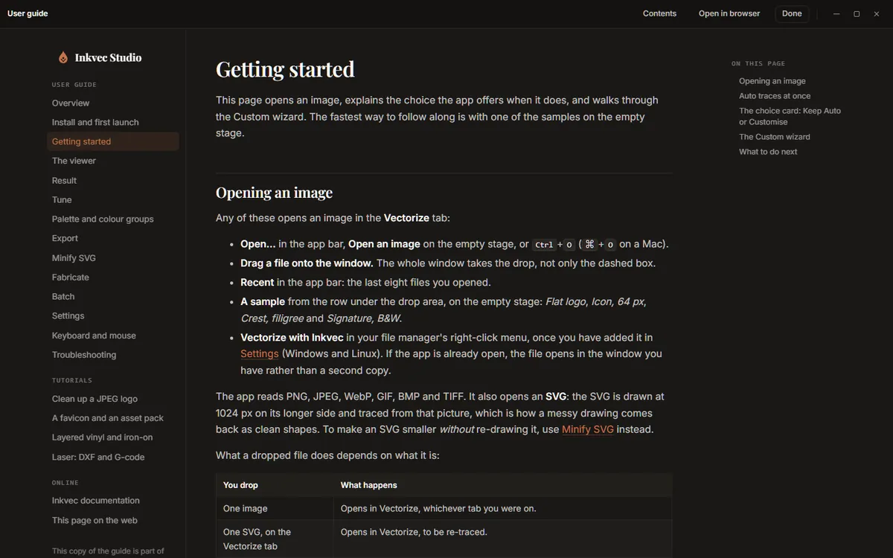

# Inkvec Studio

Inkvec Studio is the desktop app for Inkvec. It turns a raster logo, icon or emoji into an SVG,
shows you how close the SVG is to the image it came from, and prepares the result for the web,
for print or for a cutting machine. It runs on Windows, macOS and Linux, and everything it does
happens on your own computer: your image is never uploaded.

This guide describes the app as it is in version 0.2.0. It covers every screen, and ends with
four tutorials that each take one job from start to finish.

## What is where

The window has four tabs, chosen in the middle of the app bar.

| Tab | What it does | Page |
|---|---|---|
| **Vectorize** | Traces an image into an SVG and shows the two side by side, with a measured report. | [The viewer](viewer.md), [Result](result.md), [Tune](tune.md) |
| **Minify SVG** | Rewrites an SVG you already have with fewer numbers, without moving it. | [Minify SVG](minify.md) |
| **Fabricate** | Turns a drawing into sheets for a vinyl cutter, a sticker, a stencil, a pen or a laser. | [Fabricate](fabricate.md) |
| **Batch** | Traces every image in a folder, one SVG each. | [Batch](batch.md) |

On the right of the app bar are **Open…**, **Recent**, **Settings**, **About** and **Help**.
Help (or <kbd>F1</kbd>) opens this guide inside the app, at the page about what is on screen. The
guide is bundled with the app, so it works without a network; **Open in browser** shows the same
page on the web.

The Vectorize tab is where most of the work happens. Its right-hand rail has two halves:
**Result**, what the last trace produced, and **Tune**, the settings for the next one. Above both
sit the two settings people most often change, the **Denoiser** and **Editable**, and below both
a readout of the three numbers that matter (colour difference, coordinates, file size) with
**Export** beside it.

## How a trace happens

1. You open an image. **Auto** traces it at once with the settings you last used (the **Logo**
   preset, the first time).
2. A small card offers **Custom**: a few steps, each explained, with your result shown beside
   Auto's. You can ignore the card; Auto's trace stands.
3. Every setting you change starts a quick, small **draft** trace so you can see the effect, then
   a **full** trace once you stop moving things. The full trace is what you export.

[Getting started](getting-started.md) walks through this with a sample image.

## Inkvec Studio and Inkvec Studio Lite

**Inkvec Studio Lite** is the same app running in a web browser. It differs from the desktop app
in a few places:

- It cannot add the Windows **Vectorize with Inkvec** right-click entry or put the `inkvec`
  command on your PATH (Settings, Advanced).
- It has no folder batch: the **Batch** tab needs to read and write folders on disk.
- Saving works through your browser's downloads: where this guide says a file is written to a
  folder, Studio Lite downloads it instead.
- The denoiser downloads by itself, in the background, the first time Studio Lite opens, and is
  kept in the browser for later visits (see [the denoiser](settings.md#denoiser)).
- Preferences and the choices you leave the app with are kept in the browser, not in a file.

Where a page describes something Studio Lite does differently, it says so.

## Contents

**Using the app**

- [Install and first launch](install.md)
- [Getting started](getting-started.md): opening an image, Auto and Custom, the wizard
- [The viewer](viewer.md): comparing, zooming, overlays, the pixel grid
- [Result](result.md): the quality report, editability, what could not be recovered
- [Tune](tune.md): presets and every control
- [The palette and colour groups](palette.md)
- [Export](export.md): SVG, PNG, favicon, asset pack, comparison card
- [Minify SVG](minify.md)
- [Fabricate](fabricate.md): vinyl, iron-on, stickers, stencils, pens and lasers
- [Batch](batch.md)
- [Settings](settings.md): preferences, the denoiser, the command line and the right-click menu
- [Keyboard and mouse](shortcuts.md)
- [Troubleshooting and questions](troubleshooting.md)

**Tutorials**

- [Clean up a JPEG logo](tutorials/jpeg-logo.md)
- [A favicon and an asset pack](tutorials/favicon-asset-pack.md)
- [Layered vinyl and iron-on](tutorials/vinyl-htv.md)
- [Laser cutting: DXF and G-code](tutorials/laser.md)

How the tracing itself works, stage by stage, is in [How Inkvec works](../algorithm/README.md).
What it cannot do is in [Limitations](../LIMITATIONS.md).

*The screenshots in this guide were taken from a development build with sample images. The
numbers in them belong to those samples.*
