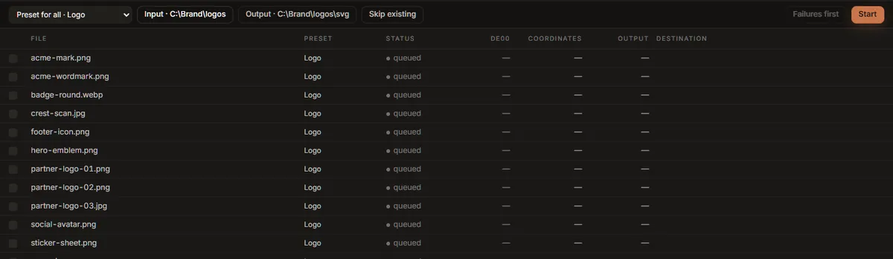

# Batch

The **Batch** tab traces every image in a folder and writes one SVG for each. It is for a set of
icons, a folder of partner logos, or a brand library.

## Running a batch

1. **Choose a folder…** picks the folder of images. Every PNG, JPEG, WebP, GIF, BMP and TIFF in
   it is listed, sorted by name. Subfolders are not included, and SVG files are skipped.
2. **Output** is where the SVGs go. It starts as a folder called `svg` inside the input folder;
   press it to choose another. It is created if it does not exist.
3. **Preset for all** chooses the preset every queued file uses. To give one file a different
   preset, click the preset in its row and choose; the rest stay as they are.
4. **Skip existing** (on at first) leaves a file alone if its SVG is already in the output folder,
   so a batch that was stopped can be run again to finish. Turn it off to overwrite.
5. **Start**.

Each output file has the image's name with `.svg`: `acme-mark.png` becomes `acme-mark.svg`.

Files are traced one at a time, each at full quality: the tracer already uses every processor core
on the file it is working on, so tracing several at once would not be faster. If you trace
something in the Vectorize tab during a batch, it goes first, and the batch waits for it.

**Pause** stops before the next file, and **Resume** carries on; **Cancel** stops the run after
the file in progress. The file being traced is always finished, never left half-written.

## What each row says

| Column | Shows |
|---|---|
| File | The image's name. |
| Preset | The preset for this file. Once a row has run it cannot be changed, because the figures beside it were measured with that preset. |
| Status | *queued*, *running*, *done*, *skipped* or *failed*. |
| dE00 | The mean colour difference of this file's trace, as in the [quality report](result.md#the-quality-report). |
| Coordinates | The coordinates in its SVG. |
| Output | The SVG's size. |
| Destination | Where the SVG was written, or, for a failed row, why it failed. Hover a row to read the whole message. |

The footer shows progress, an estimate of the time left, and once rows have finished, the mean
colour difference, the bytes written, and how much smaller that is than the source images.

Failures stay listed after the run. **Failures first** sorts them to the top, so a failed file
cannot scroll away unnoticed. **Export stats.csv** saves every row (file, preset, status, colour
difference, coordinates, bytes, seconds, destination, message) as a spreadsheet.

## Which settings a batch uses

A batch starts from the controls of your **last trace** in the Vectorize tab, then applies each
row's preset on top: the settings a preset changes from the defaults (Precision, Speckle floor,
Trace size, Max colours, Colour merging, the denoiser, Black & white, Line art, Fewer paths,
Editable structure) come
from the preset, and everything else, the Output settings such as **Minify** and
**Transparent background** included, comes from your last trace. Set the Output group the way you
want it in Vectorize before starting a batch.

Colour groups are never used: they belong to one image.

The batch writes SVGs only. For PNGs, favicons or an asset pack, export each image from Vectorize.

## Dropping files

Several files dropped on the window switch to this tab, but are not queued: a batch works on a
folder. Choose the folder they are in.

## Studio Lite

The Batch tab needs to read and write folders on disk, so it is not in Studio Lite. Trace the
images one at a time in Vectorize, or use the `inkvec` command line in a shell loop, one
`inkvec logo.png -o svg/logo.svg` per file.
