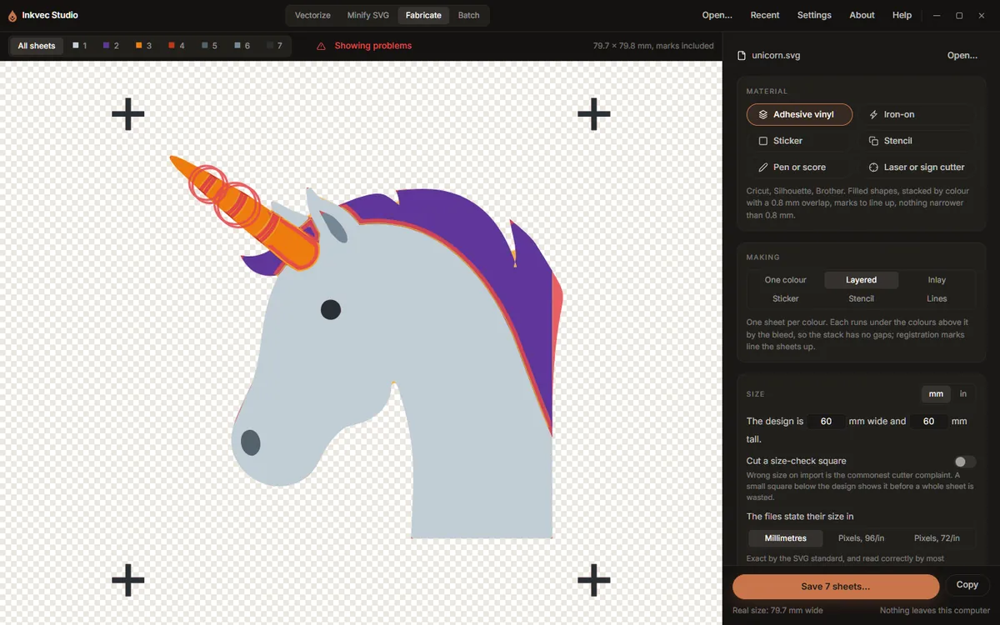

# Fabricate

The **Fabricate** tab turns a drawing into files a cutting machine can use: adhesive vinyl in one
colour or several, iron-on (heat-transfer) vinyl, print-then-cut stickers, stencils, pen and
scoring lines, and laser or CNC cuts with DXF and G-code. It works in real sizes, in millimetres or
inches, and checks the job before anything is cut: a gradient that has to become one vinyl, a
sliver too thin to weed, a file a cutter's software will refuse.

Everything is recomputed on each change, in tens of milliseconds, so the sheets on the stage are
always the ones that will be saved.

## Bringing a drawing in

- **Use the current trace** takes what the Vectorize tab just traced. (Once a drawing is loaded,
  the same button is **Current trace**, at the top of the rail.)
- **Open an SVG** (or **Open…**) takes any SVG file.
- **Drop an SVG** on the window while this tab is showing.

When a drawing arrives, the tab measures it, selects every colour except the page background, and,
if there is more than one colour, switches to **Layered**.

## Material

The quickest start is the material you are cutting. Each button sets several options at once; the
line under the buttons says what it chose.

| Material | Makes | What it sets |
|---|---|---|
| **Adhesive vinyl** | Cricut, Silhouette, Brother | Filled shapes, one sheet per colour stacked with a 0.8 mm overlap, registration marks, nothing narrower than 0.8 mm |
| **Iron-on** | Heat-transfer vinyl | As adhesive vinyl, but every sheet mirrored (HTV is cut face down), a 0.3 mm overlap (0.25 to 0.38 mm is the press-safe range), nothing narrower than 1 mm |
| **Sticker** | Print, then cut | The artwork with a contour 3 mm outside it |
| **Stencil** | Mylar or card, for paint or etching cream | The artwork cut out of one sheet, 1.5 mm bridges, a 10 mm border, nothing narrower than 1.5 mm |
| **Pen or score** | A pen, scoring or foil tool, plotter, or laser engraving lines | Each line drawn once down its middle, 0.4 mm tip, DXF saved too |
| **Laser or sign cutter** | Laser, CNC, sign cutter | Hairline cuts with each sheet in its own colour, inner shapes cut first, parts grown for a 0.15 mm kerf, nothing narrower than 0.3 mm, no registration marks, DXF saved too |

Glitter, holographic and puff HTV go on top of a stack only; the Iron-on note says so too. You can
change anything a material set, below; the material button then lets go.

## Making

What is being made, in six modes:

| Mode | Makes |
|---|---|
| **One colour** | Everything selected, joined into one sheet of one material. |
| **Layered** | One sheet per colour. Each runs under the colours above it by the *bleed*, so the stacked result has no gaps; registration marks line the sheets up. |
| **Inlay** | One sheet per colour, cut exactly and laid edge to edge. Thinner than layered, but unforgiving to line up. |
| **Sticker** | The artwork with a contour around it, to print and then cut. |
| **Stencil** | A sheet with the artwork cut out. Pieces that would fall out, like the middle of an O, are held by thin bridges. |
| **Lines** | For a pen, a scoring blade or a laser line: every line in the drawing is followed once, along its centre, instead of around both edges. Strokes in the file are used as drawn; lines inside filled shapes are found and checked against the shape. |

## Size

*The design is* **100** *mm wide and* **100** *mm tall.* Type either number; the other follows,
keeping the drawing's proportions. **mm** and **in** switch every length on the tab, including the
ones in the findings.

**Cut a size-check square** adds a small square (20 mm, or 1 in) below the design. Measure it once
it is cut: any other size means the cutter's program rescaled the file on import, which is the
most common complaint about cutter files.

**The files state their size in** decides how the saved SVG says how big it is:

| Choice | Read correctly by |
|---|---|
| **Millimetres** | Most programs; exact by the SVG standard. The default. |
| **Pixels, 96/in** | Inkscape, LightBurn, Carbide Create, Fusion, and browsers |
| **Pixels, 72/in** | Cricut Design Space and Silhouette Studio |

If the program you use imports the file at the wrong size, choose the pixel rate it uses.

## Colours

Each colour of the drawing, with its share of the design and a switch to cut it or leave it out.
Badges mark the *page* (the background, left out at first), a *gradient* and a *translucent*
colour. In **Layered**, the list is the stack, bottom sheet first, and **↓** **↑** move a colour
down or up. The largest colour starts at the bottom, which is how a traced logo's colours stack in
nearly every case.

## Cutting

What this card shows depends on the mode.

| Option | Modes | What it does |
|---|---|---|
| Each colour runs *x* under the colours above it | Layered | The bleed: how far each sheet reaches under the ones on top, so they overlap instead of leaving a gap. Default 0.8 mm. |
| The contour is *x* outside the artwork | Sticker | Default 3 mm. |
| Bridges are *x* wide; the sheet reaches *y* past the artwork | Stencil | Defaults 1.5 mm and 10 mm. |
| Parts narrower than *x* are too thin to weed | All but Lines | The smallest width the material holds. Parts narrower than this are reported (and drawn in red with **Show problems**). |
| Remove them | All but Lines | Drops those slivers and necks from the sheets instead of reporting them. |
| Registration marks | Layered, Inlay | Crosses at the same place on every sheet, to line them up. |
| Weeding border *x* outside | All but Lines | A frame around the design that makes weeding easier; 0 for none. |
| Also save a DXF | All | Every sheet as a layer of closed polylines in millimetres, curves as true arcs, for CAD, CNC and laser programs. |
| Also save G-code | All | For GRBL lasers and plotters (see below). |
| Mirror | Not Sticker or Stencil | Flips every sheet, for heat-transfer vinyl, which is cut from the back. |
| Cut lines as: Filled shapes / Hairlines | All but Lines | *Filled shapes* is what Cricut Design Space and Silhouette Studio expect; they cut around every shape. *Hairlines* is the laser and sign-cutter convention: only a hairline is a cut, and each sheet keeps its colour so a laser program can give it its own operation. |
| The cut removes *x* (kerf) | Hairlines | The width the beam or blade removes. Parts are grown by half of it so they come out at the drawn size. |
| Router bit *x* across | All but Lines | Adds a dogbone to every inside corner, so parts cut with a round bit seat square; 0 for none. |
| Cuts stay within *x* of the drawing | All | How closely the cut paths follow the drawing. Default 0.05 mm. A larger value gives fewer segments. |

In **Lines** mode the card is **Drawing** instead: *The pen or tool draws* **0.4** *mm wide* (the
preview shows what the pen will leave), *Lines up to* **0** *mm wide are drawn once* (0 for any
width; wider parts are drawn round their outline), the DXF and G-code switches, and the tolerance.

### G-code

**Also save G-code** writes a `.gcode` file for GRBL lasers and plotters: curves as G2/G3 arcs,
holes and inner parts cut before the part around them, millimetres, origin at the lower left of
the job (marks and borders included). Jog the head to the lower left of the material and zero it
there. The sentence under the switch sets the feed (default 1000 mm/min), the power as GRBL's `S`
value (default 1000, GRBL's usual maximum), and the number of passes.

The file uses GRBL's laser mode (`M4`, power follows speed): turn it on with `$32=1` so the beam is
off between cuts. Test on scrap first: speed and power depend entirely on your machine and material.

## Before you cut

This card summarises the job (sheets, pieces, path segments, the size of the whole job) and lists
anything that will go wrong. With nothing to report it says *Nothing here will trouble the
cutter.*

| Finding | What to do |
|---|---|
| *#colour* is a gradient. Vinyl is one colour, so it is cut as its average colour. | Choose a vinyl close to the average, or leave the colour out. |
| *#colour* is partly transparent. Vinyl is opaque, so it is cut at full strength. | As above. |
| No colour is selected. | Switch at least one colour on. |
| The file contains something with no cut line (such as an image) and it is left out. | Convert it to shapes first, or trace it. |
| *N* mm² in *M* places is narrower than *x* mm and may tear or not stay stuck. | Make the design larger, or turn on **Remove them**. |
| *N* mm² of waste is narrower than *x* mm between cuts and will lift with the design when weeding. | Make the design larger, or weed those spots by hand. |
| *N* pieces are smaller than *x* mm² and are easily lost when weeding. | Make the design larger, or accept losing them. |
| A sheet has more than 5,000 separate cut paths. | Cricut Design Space is reported to refuse such files: turn on **Remove them** or raise the smallest width. |
| A sheet has more than 2,000 path segments. | Cutter software gets slow; a larger tolerance lowers it. |
| Holes and gaps are narrower than the router bit. | The bit cannot enter them: use a smaller bit, or make the design larger. |

Some findings are information rather than warnings: how many bridges hold a stencil together, how
many inside corners got dogbones, how many lines Lines mode draws once, and what the size-check
square is for.

## The stage

**All sheets** shows every sheet stacked, as the finished piece will look; the numbered buttons
show one sheet each (hover one for its material size, pieces and segments). The size of the whole
job is at the right, with *marks included* or *border included* when they add to it. Sheets are
shown on a light ground, where a thin cut line and a pale vinyl are both visible.

**Show problems** (on while there are any) draws the parts too thin to weed in red, the waste gaps
too narrow to weed in amber, and rings the loose specks.

The **Cut list** at the bottom of the rail is the shopping list: each sheet with the piece of
material it needs and how many pieces it has. Click a row to show that sheet.

## Saving

**Save *N* sheets…** asks for a folder and writes:

- one SVG per sheet: `name-1-colour.svg`, `name-2-colour.svg` and so on, bottom sheet first (or
  `name-cut.svg` when there is only one);
- `name-all.svg`, every sheet in one file as separate groups, which cutter software turns into
  layers on import (often the only file you need);
- `name.dxf` and `name.gcode`, if those switches are on.

**Copy** puts the sheet on screen (or all of them, in one file) on the clipboard, to paste into
Design Space, Silhouette Studio or LightBurn. The foot of the rail repeats the real width.

The [layered vinyl tutorial](tutorials/vinyl-htv.md) and the [laser tutorial](tutorials/laser.md)
take a drawing through this tab from start to finish.

## Studio Lite

**Save** downloads the files instead of writing them to a folder.
