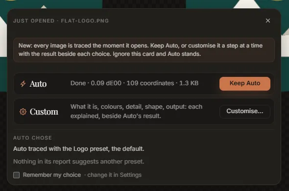
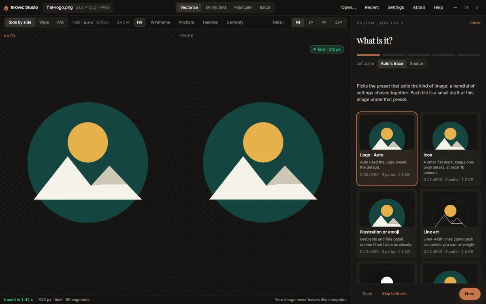

# Getting started

This page opens an image, explains the choice the app offers when it does, and walks through the
Custom wizard. The fastest way to follow along is with one of the samples on the empty stage.

## Opening an image

Any of these opens an image in the **Vectorize** tab:

- **Open…** in the app bar, **Open an image** on the empty stage, or <kbd>Ctrl</kbd>+<kbd>O</kbd>
  (<kbd>⌘</kbd>+<kbd>O</kbd> on a Mac).
- **Drag a file onto the window.** The whole window takes the drop, not only the dashed box.
- **Recent** in the app bar: the last eight files you opened.
- **A sample** from the row under the drop area, on the empty stage: *Flat logo*, *Icon, 64 px*,
  *Crest, filigree* and *Signature, B&W*.
- **Vectorize with Inkvec** in your file manager's right-click menu, once you have added it in
  [Settings](settings.md#advanced) (Windows and Linux). If the app is already open, the file opens
  in the window you have rather than a second copy.

The app reads PNG, JPEG, WebP, GIF, BMP and TIFF. It also opens an **SVG**: the SVG is drawn at
1024 px on its longer side and traced from that picture, which is how a messy drawing comes back
as clean shapes. To make an SVG smaller *without* re-drawing it, use [Minify SVG](minify.md)
instead.

What a dropped file does depends on what it is:

| You drop | What happens |
|---|---|
| One image | Opens in Vectorize, whichever tab you were on. |
| One SVG, on the Vectorize tab | Opens in Vectorize, to be re-traced. |
| One SVG, on the Fabricate tab | Opens in Fabricate, to be cut. |
| One SVG, on another tab | Opens in Minify SVG. |
| Several files | Switches to Batch. The files are not queued: Batch works on a folder, so choose the folder they are in. |

The app bar shows the open file's name, its size in pixels and its format.

**Studio Lite:** there is no right-click entry, and a dropped or chosen file is read by the browser.

## Auto traces at once

The moment an image opens, **Auto** traces it. It uses the controls exactly as you left them the
last time (the first time, the **Logo** preset, which is the default). Nothing has to be chosen
first, and the trace is already on its way when the next thing appears.

## The choice card: Keep Auto or Customise

Over the stage, a small card appears while Auto traces.

- **Auto** shows the trace's progress and, once it lands, its colour difference, coordinates
  and file size. **Keep Auto** closes the card.
- **Custom** opens the wizard (next section), which changes the settings a step at a time with
  your result shown beside Auto's.
- **Auto chose** says what Auto used, and anything its own report suggests. There are at most
  two suggestions, and each is a one-click preset change:

  | Suggestion | When it appears | What **Try** does |
  |---|---|---|
  | Looks like a photo, a scan or a screenshot | The file is a JPEG or a lossy WebP, or its pixels are noisy | Switches to *Photo or scan*, which uses the denoiser |
  | Two colours, black and white | Exactly two inks, one dark and one light, both neutral | Switches to *Black & white* |
  | Drawn with strokes | The report found line work traced as outlines | Switches to *Line art* |
  | A small flat mark | 256 px or smaller, no gradients, at most 16 colours | Switches to *Icon* |

  If the palette has inks that look like the same colour measured twice, a line offers to
  **Accept** them as colour groups (see [the palette](palette.md#colour-groups)).
- **Remember my choice** makes the button you press next the default for every image. Change it
  later in [Settings](settings.md#general), *When an image is opened*: **Ask** (this card),
  **Auto only**, or **Custom wizard**.

Closing the card with **×** or <kbd>Esc</kbd>, or simply carrying on, keeps Auto. Once the card
is gone, the same *Auto chose* note stays at the top of the Result tab while it has something to
offer, with **Customise** and **Hide**.

Nothing here changes a trace by itself. A suggestion you take is an ordinary preset change, shown
under Tune like any other, and **Back to Auto** puts the controls back where Auto had them.

## The Custom wizard

**Customise…** opens the wizard in place of the rail. The big view stays beside it, and its left
pane shows **Auto's trace** (or the **Source**, if you switch it) so you can compare as you go; the
right pane is yours.

Each step says what it does, when to change it, what it costs, and links to the part of
[How Inkvec works](../algorithm/README.md) behind it. The steps are:

1. **What is it?** Tiles for the kinds of image, each a small draft of *this* image under that
   preset: *Logo*, *Icon*, *Illustration or emoji* (the Fine detail preset), *Line art*,
   *Black & white* and *Photo or scan*, plus Auto's own result. Presets Auto suggested come first,
   marked *suggested*. Hover a tile to see its draft large in the left pane; click it to choose it,
   and the full trace follows on the right. The drafts are traced one at a time, after Auto's
   trace, so they never hold it up.
2. **Clean-up.** Only offered when the image looks damaged: a JPEG or a lossy WebP, or pixels that
   measure noisy, and only in builds that include the denoiser. It says why it was offered.
   **Off** traces the pixels as they are; **Auto** cleans compression damage first, where it finds
   some. If the denoiser is not downloaded yet, the step offers the download (see
   [the denoiser](settings.md#denoiser)); in Studio Lite it is already downloading, and the
   step shows how far it has got.
3. **Colours.** The palette, with suggested colour groups, and **Max colours**. For an image with
   transparency, also **Trace transparency**. Hover an ink or a group to single it out in the
   drawing.
4. **Detail.** **Precision** and **Speckle floor**, and a *Compare as* switch (side by side or
   wipe).
5. **Shape.** **Editable structure**, **Fewer paths**, **Match repeated shapes**, **Curve cost**
   and **Smooth-join angle**.
6. **Output.** **Transparent background**, **Margin** and **Minify**, and a list of everything
   you changed from Auto.

From step 4 on, a small table compares Auto's figures with yours: colour difference, nodes, paths
and file size, with the change in each.

What each control does is on the [Tune](tune.md) page; the wizard shows the same controls, only
fewer at a time.

Along the bottom: **Back**, **Skip to finish** (jump to the last step, keeping everything chosen),
and **Next**. On the last step, **Finish** closes the wizard and **Export now** closes it and opens
the export sheet. At the top, **Undo my changes** puts every control and colour group back to where
they were when the wizard opened, and **Close** (or <kbd>Esc</kbd>) leaves, keeping what you chose.

Whatever the wizard changed is an ordinary setting. When it closes, the rail switches to **Tune**
with those controls marked as changed, and a note says how many moved from Auto.

To reopen the wizard for the image that is open, use **Walk me through it** at the top of the Tune
tab, or **Customise** on the *Auto chose* note.

## What to do next

- Look at the result: [the viewer](viewer.md) explains the comparison modes, zoom, and the
  overlays that show nodes and edges.
- Read the numbers: [Result](result.md) explains the quality report.
- Change something: [Tune](tune.md) lists every control.
- Save it: [Export](export.md).
