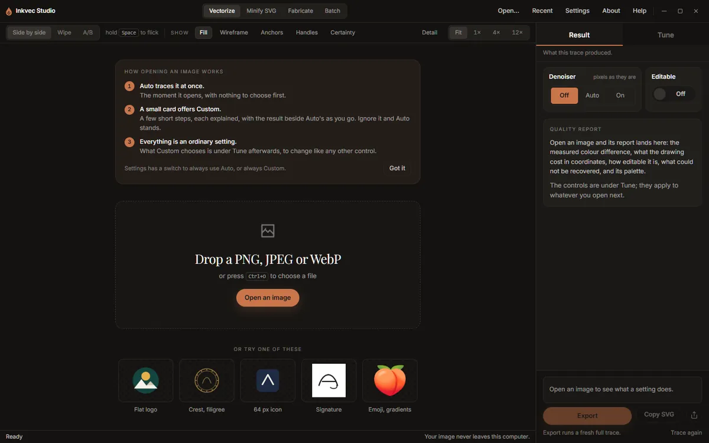

# Install and first launch

Inkvec Studio is published on the project's
[GitHub releases page](https://github.com/logolabs/inkvec/releases). Each release has one
download per platform, named `inkvec-studio-<version>-<target>` with the usual extension.

| System | Download | Oldest system it starts on |
|---|---|---|
| Windows | `.exe` (installer, no administrator rights needed) or `.msi` | Windows 10 with WebView2; the installer fetches WebView2 if it is missing |
| macOS | `.dmg` | macOS 10.15 on Intel, 11.0 on Apple silicon |
| Linux | `.deb`, `.rpm` or `.AppImage` | glibc 2.38, libstdc++ 13 and WebKitGTK 4.1: Ubuntu 23.10, Debian 13, Fedora 39 and newer |

The release notes list a SHA-256 checksum for every file. Checking it is what establishes that a
download is the one the project published:

- Windows: `certutil -hashfile <file> SHA256`
- macOS: `shasum -a 256 <file>`
- Linux: `sha256sum <file>`

## Opening the app the first time

The builds are **not code-signed** on any platform, so each operating system warns about them in
its own way.

- **Windows.** SmartScreen shows "Windows protected your PC" with an unknown publisher. Choose
  **More info**, then **Run anyway**.
- **macOS.** Gatekeeper refuses an unsigned app downloaded from a browser. Open Applications,
  Control-click **Inkvec Studio**, choose **Open**, then **Open** again in the dialog. If macOS
  still refuses, run `xattr -dr com.apple.quarantine "/Applications/Inkvec Studio.app"` in
  Terminal.
- **Linux.** Nothing special for the `.deb` or `.rpm`. An `.AppImage` needs `chmod +x` before it
  will run.

A short splash screen covers start-up, then the main window opens on the **Vectorize** tab with an
empty stage: a drop area, **Open an image**, and four sample images to try.

On the very first launch a card above the drop area explains what happens when an image is
opened. **Got it** hides it for good. The next page, [Getting started](getting-started.md), goes
through the same thing with a sample.

## What the app sends over the network

Tracing never needs a network. The app can make exactly two kinds of outbound request:

- **The update check**, when the app starts. It asks GitHub for the latest release and sends the
  app's version and your operating system (in the request's user agent), nothing else. Turn it off
  in [Settings](settings.md#updates) and the app does not contact the network at all.
- **The denoiser download**, only when you ask for it. See [the denoiser](settings.md#denoiser).
  (Studio Lite, in the browser, downloads it in the background when it opens, unless the browser
  asks to save data.)

Your images, traces and exported files never leave your computer.

## Updates

When the update check finds a newer version, the status strip at the bottom of the Vectorize tab
shows `<version> available` and a **What changed** link to the release notes. The app does not
update itself: download the new release and install it over the old one. Your preferences and
saved presets are kept.

## Uninstalling

Uninstall the app the way your system usually does (Windows: Settings, Apps; macOS: move it to the
Bin; Linux: your package manager). On Windows the uninstaller also removes the two things the app
can add from its Settings screen, the right-click entry and the `inkvec` command, if you added
them. On macOS and Linux, remove those first from [Settings, Advanced](settings.md#advanced) if you
added them.

Two things are left behind on purpose, because they are yours rather than the app's: the
preferences file (your settings, recent files and saved presets) and, if you downloaded it, the
denoiser model. Their locations are listed in [Settings](settings.md#where-things-are-kept).

## Studio Lite

Inkvec Studio Lite needs no installation: it runs in a current desktop browser. Everything on this
page about installers, signing and uninstalling applies only to the desktop app.
