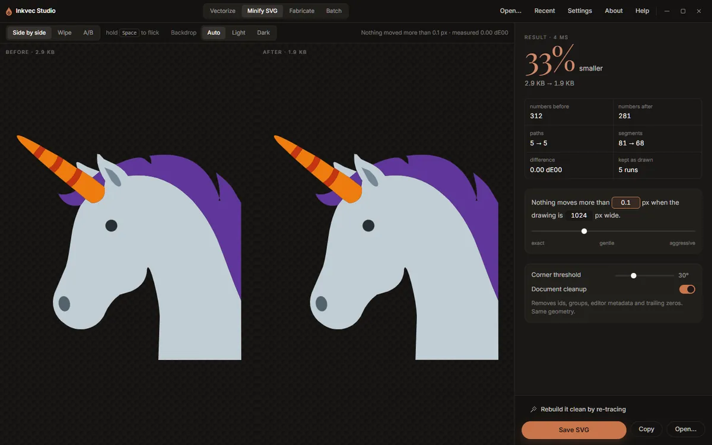

# Minify SVG

The **Minify SVG** tab makes an SVG you already have smaller without changing what it looks like.
It rewrites every path with the fewest segments that stay within a tolerance of the original, and
tidies the rest of the document. It works on any SVG: one from Illustrator, Figma, Inkscape, a
stock site, or Inkvec itself. It takes a few milliseconds, so the result appears as soon as the
file opens and changes as you move a control.

## Opening an SVG

Press **Open an SVG** (or **Open…** at the foot of the rail), or drop an SVG anywhere on the window
while this tab is showing. An SVG dropped on another tab opens here too, except on Vectorize (which
re-traces it) and Fabricate (which cuts it).

## Checking that nothing moved

The two panes show the drawing **Before** and **After**, each with its file size. The same three
arrangements as the Vectorize viewer are here: **Side by side**, **Wipe** (drag the divider) and
**A/B** (hold <kbd>Space</kbd> to flick to the original).

**Backdrop** chooses what the drawings sit on. **Auto** picks a light backdrop for dark artwork and
a dark one for light artwork, so a black logo does not vanish into the dark stage; **Light** and
**Dark** force one.

The line at the right of the toolbar states the promise and its measurement: *Nothing moved more
than 0.1 px · measured 0.00 dE00*. The colour difference is measured the same way the quality
report measures a trace, by rendering both files and comparing them.

## The result

The large figure is how much smaller the file is, with the sizes before and after. Under it:

| Figure | What it counts |
|---|---|
| numbers before / after | The numbers in the path data. |
| paths | Drawn elements before → after. Paths that are really circles, ellipses or rectangles are written as those. |
| segments | Lines and curves before → after. |
| difference | The measured colour difference between the two renders, in dE00. |
| kept as drawn | Runs of segments where the cheaper fit strayed past the tolerance, so the original was kept. The promise is kept by falling back, and this says how often that happened. |

When document cleanup removed anything, a **Removed** list says what and how much.

## The controls

**The tolerance sentence.** *Nothing moves more than* **0.1** *px when the drawing is* **1024**
*px wide.* Both numbers can be typed into. The first is the largest distance any point may move;
the second is the width the drawing is judged at, so the tolerance means the same thing for a
16-unit icon and a 2000-unit poster. The slider under it runs from *exact* through *gentle* to
*aggressive* (0 to 1 px); most of the useful range is in its first part.

**Corner threshold** (default 30°). A join that turns more sharply than this is a corner, and is
kept exactly. Lower it if soft corners are being rounded off.

**Document cleanup** (on). Removes ids, groups, editor metadata and trailing zeros. The geometry is
the same. Turn it off to leave everything but the path data exactly as it was, for example when
something relies on the ids.

## Saving

**Save SVG** asks where, suggesting `name.min.svg`. **Copy** puts the result on the clipboard.

## Rebuild it clean by re-tracing

Minifying keeps every path the file has. Some SVGs are messy in ways no rewrite can fix: shapes
stacked on shapes, translucent overlaps, outlines broken into pieces, thousands of nodes from an
auto-trace. **Rebuild it clean by re-tracing** sends the drawing to the Vectorize tab, where it is
drawn at 1024 px on its longer side and traced again from that picture. It comes back as a few
clean shapes, and the quality report measures the new drawing against the old one.

The re-trace starts with your current controls; the choice card is not shown, but
**Walk me through it** on the Tune tab opens the wizard as usual.

A re-trace is a reconstruction: small text and hairlines narrower than a pixel at 1024 px will not
survive it. Compare before you replace the original.

## Studio Lite

**Save SVG** downloads the file.

**Command line:** the same minifier is `inkvec-svgmin`, with `--tolerance`, `--judge`,
`--corner-degrees` and `--no-document`.
