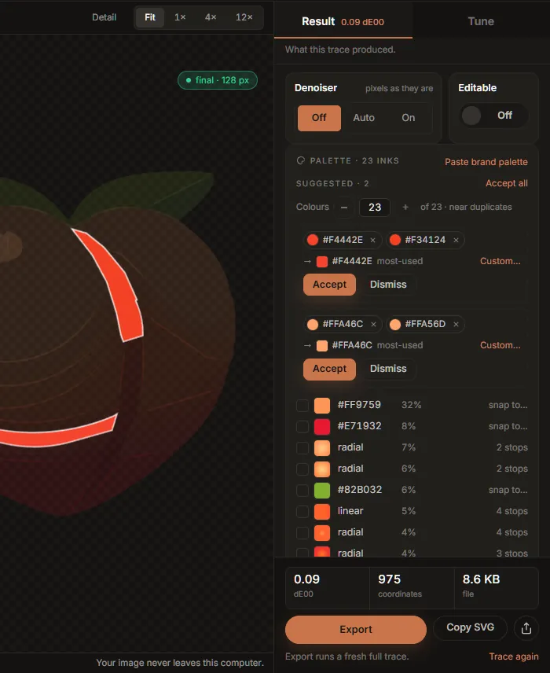

# The palette and colour groups

The palette card, at the bottom of the Result tab, lists every ink in the drawing: each flat
colour, and each gradient. It is where you correct a colour, match the drawing to a brand palette,
and tell the tracer that two colours are really one.

## The inks

Each row shows the ink's swatch, its hex value (or *linear* / *radial* for a gradient), the share
of the canvas it covers, and on the right what can be done with it. Inks are listed largest first.

**Hover or focus any ink** and the drawing singles it out: everything else dims and the ink's
shapes are outlined, so you can see exactly where a colour is used, even a piece one pixel wide.
The same works for groups and their members, below.

**Copy all as CSS** copies the flat inks as CSS custom properties, `--ink-1`, `--ink-2` and so on,
in the same order, each with its share of the canvas in a comment.

## Snapping an ink to an exact colour

Click a flat ink to open the snap popover. It shows the colour that was measured (*traced*) and
how much of the canvas it covers, and takes a new colour from the picker or as a hex value.
**Snap** repaints that ink in the new colour.

Snapping rewrites the fills only; it does not trace again, so it is instant and the shapes do not
change. The ink's row then says *snapped* with the colour difference between what was measured and
what you chose. The popover says it plainly: you are overriding a measurement.

A snap belongs to the image, not to one trace. Any new trace measures the colours again, and your
snaps are applied to it as it lands: a moved control, a colour group and Export's own fresh trace
all keep them, and the files Export writes carry the snapped colours. A snap finds its ink again
even when the new trace measures it a hair differently; one whose ink is gone (merged into another
by a colour group, say) is dropped. Snap an ink back to its traced colour to undo it. Opening
another image starts without snaps.

A gradient cannot be snapped: it has no single colour. Its row shows how many stops it has.

## Paste a brand palette

**Paste brand palette** takes a list of colours, one per line or separated by commas, as hex
(`#12443E`), RGB (`rgb(207, 198, 180)`) or CSS custom properties (`--brand-green: #12443E;`). Each flat ink of the drawing is then matched to the
nearest colour you pasted. The preview lists every match with its colour difference: *exact* when
the two are indistinguishable, green under 0.5 dE00, gold above. **Snap** applies them all.

Two things to know:

- *Every* flat ink is snapped to its nearest pasted colour, including inks that are far from all of
  them. Paste every colour the design has (its white and black too), and check the gold rows before
  you press Snap.
- Hex needs its `#` unless it has six digits: `bad` or `add` are read as words, not colours.

This is the quickest fix for a logo traced from a JPEG or a screenshot, whose colours carry the
compression's error: paste the brand's real values and every ink lands on them. Pasted colours are
snaps, so they reach every file Export writes.

## Colour groups

A **colour group** is a set of inks you want drawn as one. Unlike a snap, a group re-traces: the
engine merges the group's colours in the image before tracing, so the shapes between them really
join into one, rather than two shapes of the same colour side by side.

Groups are how you fix the most common palette problems:

- a flat colour that came back as two nearly identical inks (anti-aliasing or compression measured
  it twice);
- more colours than the design has;
- a shadow or a highlight you want to fold into the colour under it.

### Suggested groups

After each full trace the card proposes groups under **Suggested**. By default these are *near
duplicates*: inks that look like the same colour measured twice. Nothing is applied until you say
so.

- **Accept** turns a suggestion into a group (and re-traces). **Accept all** takes every
  suggestion at once.
- **Dismiss** drops it; it will not be proposed again for this image.
- A suggestion can be edited before you accept it: take a member out with its **×**, or drag
  another ink onto it.

**Colours** *N* **of** *M*, with **−** and **+**, asks for a smaller palette: set it to the number
of colours the design really has, and the suggestions change to groups that merge the palette down
to that many. Back at the full count, the suggestions are near duplicates again.

### Making a group yourself

Any of these works:

- **Drag an ink onto another ink.** The two become a new group, or the dragged ink joins the group
  the other is already in.
- **Drag an ink onto a group** (or a suggestion) to add it.
- **Tick inks and press Merge.** The tick box is at the left of each row; <kbd>Space</kbd> ticks it
  from the keyboard. **Merge** puts the ticked inks in one group (or into the group one of them is
  already in). **Clear** unticks them.

To take a colour out of a group, press the **×** on its chip, or drag the chip out of the group and
drop it anywhere else. A group left with one member stops being a group.

### What a group becomes

Under each group's members, an arrow shows the colour it will be drawn in:

- **most-used** (the default): the member that covers most of the image.
- **Click a member** to make the group that colour. If the member is a gradient, the gradient is
  extended over the whole group. Click it again to go back to most-used.
- **Custom…** paints the whole group one colour of your choosing (hex `#RRGGBB`). **Most-used**
  undoes it.

### What the engine did

After the re-trace, each group says what was merged, or warns you:

- *Merged on the next trace*: the group is new and its trace has not landed yet.
- *#C0392B is no longer in the image; the rest merged*: a member matched nothing (usually after a
  control change moved the colours). The others were still merged.
- *Left alone: fewer than two of these colours are in the image now*: nothing to merge.

**Ungroup** traces a group's inks on their own again; **Clear groups** removes every group.

### Groups belong to one image

Colour groups name colours of the picture that is open. They are not saved with presets or
preferences, are not used by Batch, and are cleared when you open another image. They do go with
every trace of the current image, drafts included, and the Custom wizard's **Undo my changes**
restores them with the controls.

**Command line:** the same grouping is `inkvec --merge-colors`, for example
`--merge-colors "#c0392b,#e74c3c;#123456,#abcdef=#ffffff"` (groups separated by `;`, members by
`,`, an optional `=` target).
