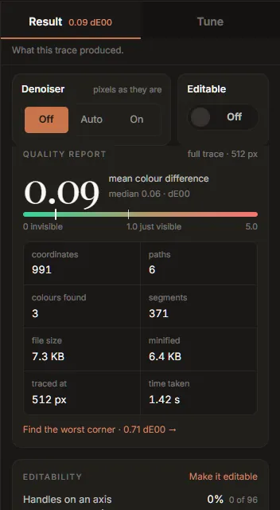

# Result: reading the quality report

The **Result** half of the rail is what the last trace produced. It is a measurement, not a
score: the SVG is rendered and compared with your image pixel by pixel, and the figures are what
that comparison found.

From the top, the Result tab shows:

1. The **Denoiser** and **Editable** settings (shared with Tune; see
   [Tune](tune.md#the-denoiser-and-editable)).
2. **Auto chose**, while it has something to offer (see
   [Getting started](getting-started.md#the-choice-card-keep-auto-or-customise)).
3. The **quality report**.
4. **Editability**.
5. **What this trace could not recover**.
6. The **palette** ([its own page](palette.md)).
7. One line comparing Inkvec with another tracer on the project's published benchmark. It is
   labelled as such: it is not a measurement of your file.

While a trace runs, a list of the engine's stages appears at the top, each ticked with the time it
took as it finishes.

## The quality report

The large number is the **mean colour difference** between the SVG and the image, in **dE00**
(CIEDE2000), the standard measure of how different two colours look to a person. It is averaged
over every pixel, so most of it comes from anti-aliased edges.

| dE00 | What it means |
|---|---|
| 0 | Identical. |
| about 0.1 | Typical for a clean PNG logo. |
| under 1.0 | Not visible side by side. |
| about 1.0 | Where a trained eye starts to see a difference. |
| well above 1 | Visible: a colour is off, or a detail is missing. |

The meter under it runs from 0 to 5 on a square-root scale, with a tick at 1.0, *just visible*.
Beside the mean is the **median**, the difference at the typical pixel. A median much lower than
the mean says the error is concentrated somewhere (often one small detail) rather than spread
evenly.

The header says what was measured: **full trace** or **draft**, and the size it was traced at.
The card fades while a new trace is running.

The figures below the meter:

| Figure | What it counts |
|---|---|
| coordinates | Numbers in the drawing's geometry. The best single measure of how heavy the file is to edit and to ship. |
| paths | Drawn elements: paths, circles, rectangles. |
| colours found | Distinct inks in the drawing. |
| segments | Lines, curves and arcs, across all paths. |
| file size | The SVG as written. |
| minified | What [Minify](tune.md#output) would make it, or *already* if it is on. |
| traced at | The size the image was traced at, on its longer side. |
| time taken | How long the trace took. |

**Find the worst corner** zooms the viewer to 12× on the place where the SVG and the image
disagree most, with the [pixel grid](viewer.md#detail-the-pixel-grid-under-the-edge) on, and says
how large that disagreement is.

## The readout at the foot

Pinned under both halves of the rail are the three numbers that matter most, **dE00**,
**coordinates** and **file**, each with what it changed by since the previous full trace. Fewer
coordinates and a smaller file are shown as good news; a higher colour difference turns amber,
since that is the cost. Drafts are never compared (they are smaller, so they would show changes
nobody made); the readout compares full trace with full trace.

This is how to judge a control: move it, and read what it bought and what it cost here.

Under the readout are **Export**, **Copy SVG** and the comparison-card button (see
[Export](export.md)), and **Trace again**, which runs a full trace with the controls as they are.

## Editability

A trace is fitted for the pixels alone, so the file it makes does not have the habits of a file
an artist drew by hand. This card counts three of those habits on your drawing:

| Row | What it counts | Hand-drawn files |
|---|---|---|
| Handles on an axis | Curve handles pointing exactly along x or y | 34% |
| Smooth joins | Places two curves meet without a kink | 89% |
| Nodes sharing a coordinate | Nodes with the same x or y as another node, so they can be aligned in one move | 86% |

Each bar shows your drawing's share, with the count, and a tick where hand-drawn files sit: the
median of 1,544 SVGs drawn by artists, measured the same way. A plain trace starts near zero on
the first two. **Make it editable** turns on [Editable structure](tune.md#the-denoiser-and-editable),
which moves the bars towards the ticks. It costs a little colour accuracy (about 0.04 dE00 on
icons); the quality report shows the price on your image.

A drawing made only of lines and arcs has no curve handles and no curve joins, so only the last row
is shown, with a note saying why.

## What this trace could not recover

This panel is always there. When it finds nothing it says *Nothing we can detect was lost*. When it
finds something, each row says what, with **Why** for the measurement behind it and, sometimes, one
link.

| Row | What it means | What you can do |
|---|---|---|
| The lettering came back as outlines, not editable text. | Six or more shapes of matching height sit on one baseline. Tracing recovers their shapes, not the typeface, so the words cannot be re-typed. | Set the text again in a vector editor if you need it live. |
| The source is a JPEG (or WebP), so these colours carry its compression damage. | The colours measured are the ones in the file, which are not quite the ones the artwork was drawn with. | Turn on the [denoiser](settings.md#denoiser), and check the colours against your brand values ([paste a brand palette](palette.md#paste-a-brand-palette)). |
| Stroke widths are baked into filled outlines. | Several shapes are outlines drawn around lines rather than the lines themselves; an editor sees closed shapes, not strokes. | Try the *Line art* preset. |
| Line art was asked for, and the stroke widths vary too much to recover. | Strokes need one width per path; this drawing's widths change along the line. | Nothing: this drawing is not uniform-stroke line art. |
| Part of this image is a continuous ramp, which is something SVG cannot hold. | Part of the image is a smooth shade (a blur, a mesh, a photographic shadow) that no SVG gradient reproduces within a visible difference. | Nothing in the settings; it is the closest arrangement of fills. |
| *N* very small features did not survive the trace at this size. | Small islands of detail were painted over. | Raise **Trace size**, or lower **Speckle floor** (see [Tune](tune.md#detail)). |

The first row in this panel is also copied into the asset pack's README when you export one.
