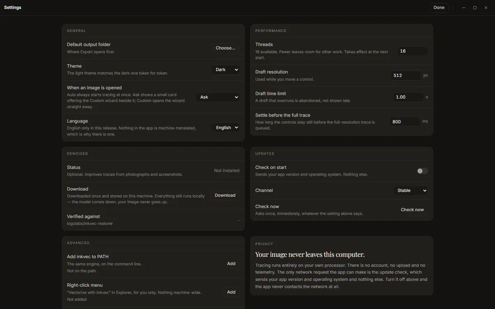

# Settings

**Settings** in the app bar (or <kbd>Ctrl</kbd>+<kbd>,</kbd>, <kbd>⌘</kbd>+<kbd>,</kbd> on a Mac)
opens the preferences on one page. Changes apply as you make them; **Done** or <kbd>Esc</kbd>
returns to where you were.

## General

- **Default output folder**: where the export sheet starts. Without one, Export asks each time.
- **Theme**: *System* (follow the operating system), *Dark* or *Light*.
- **When an image is opened**: what the app offers besides Auto's trace, which always starts at
  once. *Ask* shows the choice card; *Auto only* shows nothing; *Custom wizard* opens the wizard
  straight away. See [Getting started](getting-started.md#the-choice-card-keep-auto-or-customise).
- **Language**: English only in this release.

## Performance

- **Threads**: how many processor threads the tracer may use; fewer leaves room for other work.
  Takes effect the next time the app starts.
- **Draft resolution** (default 512 px): the size a [draft](viewer.md#draft-and-full-traces) is
  traced at, on its longer side, while you move a control.
- **Draft time limit** (default 0.4 s): a draft that takes longer is dropped rather than shown late.
- **Settle before the full trace** (default 800 ms): how long the controls must be still before the
  full trace starts.

On a slow computer, a lower draft resolution keeps the controls responsive; on a fast one, a
higher one makes drafts closer to the final.

## Denoiser

The denoiser is a trained model that repairs JPEG, WebP and screenshot damage before tracing, which
usually halves the colour error on a photographed or screenshotted logo. It is optional and not
included in the installer (it is about 80 MB).

- **Status**: *Not installed*, or *Installed* with its size.
- **Download** explains the download before anything is fetched: where it comes from (the
  `Logolabs/inkvec-denoiser-001` repository on Hugging Face), what it adds to each trace (about
  0.6 s), and that it is checked against its published SHA-256 when it arrives. Press **Download**
  to start. You can keep tracing while it downloads, and **Cancel download** really stops it.
- **Remove** deletes it again.
- **Verified against** shows the repository and the start of the checksum.

The model runs on your computer like everything else: it comes down, your image never goes up.
Once it is installed, the command-line `inkvec --restore` uses the same file.

The Intel macOS build does not include the denoiser, and says *Not in this build*. The Windows,
Linux and Apple-silicon macOS builds do.

**In Studio Lite** there is nothing to press. The denoiser (about 76 MB of weights and 26 MB of
ONNX Runtime Web, the runtime that runs it in the browser) starts downloading in the background
as soon as the page has loaded its engine, at low priority, and is kept in the browser's storage,
so later visits start with it already there. While it downloads, the status strip at the bottom
left shows how far it has got (*Denoiser 34 of 102 MB · 33%*) and then goes away. If you turn the
denoiser **On** (or pick **Auto**, or a preset that uses it) before it has arrived, the trace you
see is made without it for the moment, the **Denoiser** control shows the download (*Downloading
the denoiser, 34 of 102 MB, 33%*, then *Preparing the denoiser…*), and the image is traced again
with it, by itself, once it is ready. If the download fails, the control says why and offers
**Retry**; a download that breaks off is also retried once by itself, from where it stopped.

The background download is skipped when your browser asks sites to save data (Chrome's and
Edge's data saver, or a metered connection set to save data). Turning the denoiser on then
downloads it, with the same progress. **Remove** clears the browser's copy. It only works on the
Space's own tab (a page that is *cross-origin isolated*); inside the Hugging Face frame the
control says *needs its own tab*, and nothing is downloaded there.

## Updates

- **Check on start** (on): looks for a newer version when the app starts, sending your app version
  and operating system and nothing else. Off, the app never contacts the network (except for a
  denoiser download you ask for).
- **Channel**: *Stable* or *Prerelease*.
- **Check now**: asks once, whatever the setting above says. A newer version is announced in the
  status strip, with a link to what changed.

## Advanced

Both entries here add something to your system *for your user only*: no administrator rights,
nothing machine-wide. Each row shows whether it is in place and where, and **Remove** takes it back
out.

**Add inkvec to PATH** puts the `inkvec` command, the same engine at the same version as the app,
where a terminal finds it:

| System | Where |
|---|---|
| Windows | a copy at `%LOCALAPPDATA%\Microsoft\WindowsApps\inkvec.exe` |
| macOS, Linux | a link at `~/.local/bin/inkvec` |

On Windows, open a new terminal afterwards. On macOS and Linux, `~/.local/bin` must be on your
`PATH` (it is on most Linux distributions; on macOS, add it if `inkvec` is not found). Being a
copy, the Windows command does not follow app updates: after installing a new version, press
**Remove** and **Add** again.

**Right-click menu** adds **Vectorize with Inkvec** to the file manager's menu for PNG, JPEG, WebP,
BMP and TIFF files. Choosing it opens the image in the Studio (in the window already open, if there
is one).

| System | What is added |
|---|---|
| Windows | A per-user entry in the registry, under `HKEY_CURRENT_USER\Software\Classes\SystemFileAssociations`. On Windows 11 it is under **Show more options**. |
| Linux | A desktop entry, `~/.local/share/applications/inkvec-studio-vectorize.desktop`; it appears under *Open With* in most file managers. |
| macOS | Nothing to add: Finder already offers Inkvec Studio under **Open With**. |

On Windows, uninstalling the app also removes both entries.

**Reset settings** puts every preference, the trace controls and the remembered choices (see
below) back to their defaults and clears the recent files. **Your saved presets are kept** (forget
one from the preset tray), nothing you have traced or exported is touched, the denoiser stays
installed, and the window stays where it is.

## What the app remembers

Besides the settings on this screen, the app remembers how you left it, and opens that way next
time: the trace controls and the selected preset, the **Denoiser** and **Editable** switches, the
tab you were on, the half of the rail (**Result** or **Tune**) and which Tune groups were open, the
viewer's arrangement (**Side by side**, **Wipe**, **A/B**), its layers (**Fill**, **Wireframe**,
**Anchors**, **Handles**, **Certainty**) and **Detail**, the formats and sizes ticked in the
export sheet, the Minify tab's controls and backdrop, the Fabricate tab's settings (without the
colours of one drawing), the Batch tab's switches, and, on the desktop, the window's size and
position (on a monitor that is no longer connected, it opens centred instead). There is no save
button: a change is kept about half a second after you make it.

What belongs to one image is not kept: its colour groups, snapped colours, and the zoom and pan.
They start fresh with the next image.

## Privacy

The last card says what the rest of this guide says too: tracing runs on your own processor, there
is no account, no upload and no telemetry, and the update check is the only request the app makes
on its own.

## Where things are kept

| What | Windows | macOS | Linux |
|---|---|---|---|
| Preferences, remembered choices, recent files, saved presets | `%APPDATA%\inkvec-studio\preferences.json` | `~/Library/Application Support/inkvec-studio/preferences.json` | `~/.config/inkvec-studio/preferences.json` |
| The denoiser model | `%LOCALAPPDATA%\inkvec\models\restorer.onnx` | `~/.cache/inkvec/models/restorer.onnx` | `~/.cache/inkvec/models/restorer.onnx` |

## About

**About** shows the app's version, the engine's version and the build target, links to the user
guide, the source and the online demo, the compute acknowledgement for the denoiser's training, and
the licence and third-party notices (**Open** shows them in full).

## Studio Lite

Studio Lite keeps its preferences, remembered choices and saved presets in the browser's local
storage for the Space's site, and the denoiser in its Cache Storage; clearing the site's data in
the browser removes both. In a private window, or with site data blocked, nothing can be kept:
the app works the same and starts from the defaults each time. It has no **Advanced** entries (no
command on the PATH, no right-click menu) and no default output folder, since files are
downloaded.
