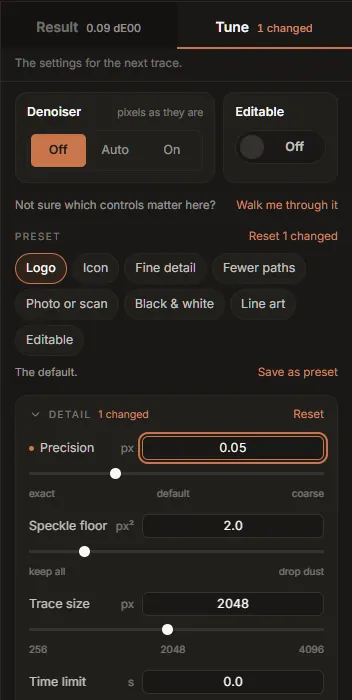

# Tune: presets and every control

The **Tune** half of the rail holds the settings for the next trace: eight presets, any presets you
saved, and twenty-two controls. Moving any of them starts a draft at once and a full trace a moment
later (see [draft and full traces](viewer.md#draft-and-full-traces)); the readout at the foot of
the rail shows what the change bought or cost.

The tab's label says how many controls are away from the selected preset (*2 changed*). If you
are not sure where to start, **Walk me through it** at the top opens the
[Custom wizard](getting-started.md#the-custom-wizard) for the image that is open.

## How the controls work

- **Sliders** move a readout while you drag and apply when you let go. The arrow keys move them one
  step at a time. The words under a slider (*exact*, *default*, *coarse*) name the ends of its
  scale; several sliders are not linear, so that the useful range gets most of the track.
- **Number fields** beside each slider take a value typed in; it applies on <kbd>Enter</kbd> or
  when you leave the field, and is held to the control's range.
- **Switches** apply at once.
- **Hover or focus a control's name** to read what it does. The text is the engine's own
  documentation for the option, unedited.

A control you have moved is marked with a dot. Each group (**Detail**, **Colour**, **Shape**,
**Output**) folds open and shut from its heading, says how many of its controls are changed, and
has its own **Reset**. **Output** starts folded.

The controls are the same ones the `inkvec` command line has; the Studio only gives them
plain-language names. The table at the end of this page maps them.

## The denoiser and Editable

Two settings sit above both halves of the rail, big, because they are the two people most often
come for. Each is one control, shown once.

**Denoiser**: **Off**, **Auto** or **On**. The denoiser is a trained model that repairs JPEG, WebP
and screenshot damage at the image's own size before tracing, so the colours are the ones the
artwork was drawn with rather than the ones the compression left.

- **Off** (the default) traces the pixels as they are. On a clean PNG the denoiser costs a little
  colour accuracy, which is why it is off.
- **Auto** traces, measures the fit, and cleans only if the trace disagrees with the image where it
  claims to be flat.
- **On** always cleans first.

It adds about 0.6 s to each full trace; drafts skip it. It is a one-time download of about 80 MB
(see [the denoiser](settings.md#denoiser)). If you choose Auto or On before downloading it, the
trace carries on without it and **Download it** appears in its place. A build without the denoiser
(the Intel macOS build) shows *not in this build*.

**Editable**: a switch for **Editable structure**. After fitting, it spends parameters on structure
an artist can edit: joins that are smooth, handles that lie on an axis and have equal lengths, nodes
lined up with each other, and shapes that are symmetric locked into exact mirrors. The outline stays
within the same tolerance; the [Editability card](result.md#editability) shows what it changed, and
the quality report shows its price (about 0.04 dE00 on icons).

## Presets

A preset is a handful of settings chosen together. The tray shows the eight built-ins; the line
under it describes the one selected.

| Preset | For | What it changes from Logo | Shortcut |
|---|---|---|---|
| **Logo** | The default | Nothing | <kbd>Ctrl</kbd>+<kbd>1</kbd> |
| **Icon** | Small flat marks | Speckle floor 1 px², Max colours 16 | <kbd>Ctrl</kbd>+<kbd>2</kbd> |
| **Fine detail** | Filigree, crests, emoji | Precision 0.05 px | <kbd>Ctrl</kbd>+<kbd>3</kbd> |
| **Fewer paths** | The smallest file | Fewer paths on, Colour merging doubled (0.07) | <kbd>Ctrl</kbd>+<kbd>4</kbd> |
| **Photo or scan** | Photographed or screenshotted marks | Denoiser Auto | <kbd>Ctrl</kbd>+<kbd>5</kbd> |
| **Black & white** | Stamps, signatures | Black & white on | <kbd>Ctrl</kbd>+<kbd>6</kbd> |
| **Line art** | Uniform-stroke drawings | Line art on | <kbd>Ctrl</kbd>+<kbd>7</kbd> |
| **Editable** | Tidy nodes for an artist to edit | Editable structure on | <kbd>Ctrl</kbd>+<kbd>8</kbd> |

On a Mac the shortcuts use <kbd>⌘</kbd>. Choosing a preset sets *every* control to that preset's
values, so anything you had moved goes back. Moving a control after choosing a preset keeps the
preset selected and counts the control as changed; **Reset *N* changed** puts them back.

**Photo or scan** needs the denoiser to do what it says. Without it the trace still runs, and the
stage says the denoiser is missing and offers the download.

### Saving your own

**Save as preset** stores all twenty-two controls exactly as they stand, under a name you give
(up to 40 characters). It appears in the tray after the built-ins; the **×** on its chip forgets
it. You can keep up to twelve. A saved preset is a complete snapshot rather than a list of
differences, so it does not change if a future version changes the defaults.

Colour groups are never saved in a preset: they name colours of one image.

## Detail

**Precision** (px, 0.02 to 0.5, default 0.1). How much a coordinate has to earn its place.
Smaller values follow the edge more closely and spend more coordinates doing it; larger values give
a lighter file that follows less closely. It does not change how many decimals are written
(always two).
*Change it when* a crest or fine lettering loses detail (lower it), or when a simple mark has more
nodes than it needs (raise it).

**Speckle floor** (px², 0 to 64, default 2). Features smaller than this area are dropped.
*Raise it* to drop scanner dust and JPEG specks; *lower it* to keep tiny serifs, dots and
one-pixel details.

**Trace size** (px, 256 to 4096, default 2048). An image larger than this on its longer side is
traced at this size, and the SVG is still written at the image's full size. Smaller images are
traced at their own size. Tracing time grows with the number of pixels.
*Raise it* when a large image has small details that come back missing; *lower it* when a trace is
slow or runs out of memory.

**Time limit** (s, 0 to 60, default 0: none). A budget for the trace. Two expensive steps stop
early to meet it (merging gradient bands stops at 60% of it, the boundary solve gets 25%); the
result is still a correct trace, with more fills or a less polished outline. With a time limit the
output depends on how fast and how busy the computer is, so the same image can trace differently
twice. Leave it at 0 unless a batch of very large images must finish in time.

## Colour

**Max colours** (2 to 2048, default 64). The largest palette the trace may use. The transparent
background does not count towards it.
*Lower it* to force a small palette on a scan with many near-identical shades. To merge particular
colours, [colour groups](palette.md#colour-groups) are more precise.

**Colour merging** (0 to 0.2, default 0.035). How close two colours must be (a distance in the
OKLab colour space) to be treated as one ink.
*Raise it* when shades that should be one colour come back as several; *lower it* when two
genuinely different colours were merged.

**Flat fills instead of gradients** (off). Skips gradient fitting and fills every region with one
colour. For flat artwork, or when the SVG must not contain gradients.

**Black & white** (off). Two inks only: the Potrace-style mode, for stamps, signatures and scans
of print.

**Trace transparency** (on). Transparency is traced as it is: holes stay holes, every ink carries
its own opacity, and soft shadows, glows and feathered edges come back as translucent fills. Turned
off, the image is laid on a solid background first and traced as solid colours, which fills holes
and gaps with that background. It changes nothing for an image without transparency.

The denoiser's setting (*Clean up damage*) belongs to this group but is shown at the top of the
rail.

## Shape

**Match repeated shapes** (on). Marks that repeat across the drawing (a row of stars, the dots of
several i's) are redrawn from one shared shape, which saves coordinates. A mark takes the shared
shape only where that stays within 0.1 px of its own traced outline and actually costs less; a
fitted circle or rounded rectangle, and a shape another shape is drawn against, are never moved.

**Match threshold** (0.5 to 1, default 0.92). How alike two marks' outlines must be to count as
the same shape. Towards 1, only near-identical marks are matched.

**Fewer paths** (off). Scales the fit tolerances with the image, so a large, simple drawing costs
what a small one would. It trades accuracy for a smaller file: small squares can come back as
circles, and thin rings broken. Used by the *Fewer paths* preset.

**Line art** (off). Writes line art as strokes, one path and one width each, instead of as the
filled outlines around the lines, so the lines can be re-weighted in an editor. On anything that is
not uniform-stroke line art it does nothing, and the Result tab says so.

**Repair crossing rings** (on). A pass after fitting that fixes outlines that cross themselves.
Turned off, each outline is exactly as the fitter wrote it, crossings included. Leave it on.

**Curve cost** (parameters, 2 to 12, default 6). What one Bézier curve costs the fit; a straight
line costs 2. At 6, a chain of short lines is often cheaper than the one curve that describes it,
which is why traces come out less curvy than hand-drawn artwork.
*Lower it* for more curves and fewer lines, at some cost in file size.

**Smooth-join angle** (degrees, 1 to 60, default 10). The turn at a join that counts as a full
corner; gentler bends are charged less.
*Raise it* to let gentle bends stay smooth, which tends to give more curves and a little more
detail in a slightly larger file.

*Editable structure* belongs to this group but is shown at the top of the rail, as **Editable**.

## Output

These rewrite the drawing rather than change the trace.

**Minify** (off). No ids or groups, no trailing zeros: the same geometry in a file typically about
a tenth smaller. Export always writes a minified copy as well, so you only need this if you copy or
batch the SVG.

**Transparent background** (off). The shape that covers the whole canvas is not painted, so the
artwork sits on transparency. Use it for a logo that will go on coloured backgrounds.

**Margin** (0 to 0.25, default 0). Transparent space around the drawing, as a fraction of its
longer side: 0.05 adds 5% on every side. The canvas grows; the drawing does not move.

**Holes as cutouts** (off). Carries the image's transparency into the SVG as holes: a region the
image drew transparent becomes a hole, one drawn at a single opacity keeps that opacity, and white
artwork on a transparent background survives. It changes nothing for an image without
transparency. With **Trace transparency** on (the default) holes already stay holes, so this
matters mainly when that is off.

## The same controls on the command line

| Studio | `inkvec` option |
|---|---|
| Precision | `--precision` |
| Speckle floor | `--min-area` |
| Trace size | `--max-dim` |
| Time limit | `--time-budget` |
| Max colours | `--colors` |
| Colour merging | `--merge` |
| Flat fills instead of gradients | `--no-gradients` |
| Black & white | `--bilevel` |
| Trace transparency | on by default; `--no-native-alpha` turns it off |
| Denoiser (Clean up damage) | `--restore off`, `--restore auto`, `--restore on` |
| Match repeated shapes | on by default; `--no-harmonize` turns it off |
| Match threshold | `--harmonize-threshold` |
| Fewer paths | `--content-units` |
| Line art | `--strokes` |
| Repair crossing rings | on by default; `--no-repair` turns it off |
| Editable structure | `--editability` |
| Curve cost | `--bezier-cost` |
| Smooth-join angle | `--corner-angle` |
| Minify | `--minify` |
| Transparent background | `--no-background` |
| Margin | `--margin` |
| Holes as cutouts | `--cutout` |
| Colour groups ([palette](palette.md#colour-groups)) | `--merge-colors` |

`inkvec --help` lists them all with their exact spelling.
