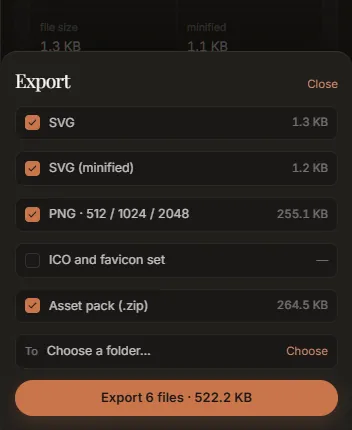

# Tutorial: a favicon and an asset pack

This tutorial takes a mark from a PNG to the set of files a website or a brand folder needs: an
SVG, a minified SVG, PNGs at three sizes, a favicon, a palette, and a zip holding all of them with a
README. About five minutes.

## 1. Start from the right image

A favicon is drawn at 16 by 16 pixels in a browser tab. At that size a wordmark is a grey smudge;
use the **symbol** on its own. And the export's PNG and favicon files are square (in version 0.2.0
a non-square drawing is stretched to fill them), so the image should be **square**, with the mark
centred. If your logo is wide, crop the symbol to a square in any image editor first.

A PNG with a transparent background is best. A JPEG works too; see
[Clean up a JPEG logo](jpeg-logo.md) first.

## 2. Open and trace it

Drop the PNG on the window. Auto traces it at once. For a small, flat mark the choice card may
suggest *Icon*, which keeps one-pixel details and allows at most 16 colours; press **Try Icon** if
it does. Otherwise **Keep Auto**.

Look at the Result tab: a clean PNG mark should land near 0.1 dE00. Turn on **Anchors** in the
viewer to see how many nodes it has; a favicon does not need many.

## 3. Set the output

Open **Tune** and unfold **Output**.

- **Transparent background**: on, if the image has a solid background you do not want in the
  favicon. (An image that is already transparent stays transparent without it.)
- **Margin**: a little room around the mark keeps it off the edges of the tab: 0.05 adds 5% of the
  mark's size on every side. Without one, the mark touches the edges of its 16 px square.
- **Minify**: leave it off. The export writes a minified copy anyway, beside the readable one.

These options rewrite the drawing rather than re-trace it, so the readout at the foot barely
moves.

## 4. Export

Press **Export** (or <kbd>Ctrl</kbd>+<kbd>E</kbd>).



1. Tick **ICO and favicon set**. (It is off at first.)
2. Leave **SVG**, **SVG (minified)**, **PNG · 512 / 1024 / 2048** and **Asset pack** ticked, or
   untick the loose files if the zip is all you want: the zip always holds the complete set.
3. **Choose** a folder.
4. Press **Export *N* files**.

The export runs a fresh full trace, then writes, for an image called `mark.png`:

```
mark.svg                  the drawing
mark.min.svg              the same, smaller
png/mark-512.png          512 x 512
png/mark-1024.png         1024 x 1024
png/mark-2048.png         2048 x 2048
favicon/favicon.ico       16, 32 and 48 px in one file
favicon/favicon-16.png
favicon/favicon-32.png
favicon/favicon-48.png
palette.json              every colour, with its share of the drawing
mark-assets.zip           all of the above, plus README.txt
```

**Show in folder** on the note that appears opens the folder.

## 5. Put the favicon on a site

Copy `favicon.ico` and `mark.min.svg` to the root of the site, and add to the page's `<head>`:

```html
<link rel="icon" href="/favicon.ico" sizes="any">
<link rel="icon" href="/mark.min.svg" type="image/svg+xml">
```

Browsers that read SVG favicons use the SVG, sharp at every size; the rest use the ICO.

## 6. Hand over the pack

`mark-assets.zip` is made to be handed to someone else. Its `README.txt` says what the files were
traced from, at what size, the measured colour difference and coordinate count, what each file
is, and, if the trace could not recover something (lettering as outlines, JPEG colours), that too.
`palette.json` lists each colour's hex value and how much of the drawing it covers, in order:

```json
{
  "generator": "...",
  "inks": [
    { "hex": "#14453f", "traced": "#14453f", "share": 0.56 }
  ]
}
```

For the colours as CSS custom properties instead, use **Copy all as CSS** in the palette.

## Variations

- **A wide logo as well.** Trace the full logo separately and take its SVG; skip the PNG rows
  (they would be stretched square) and render PNGs from the SVG in your design tool.
- **A dark-mode favicon.** Trace a light version of the mark, or edit the colours in the SVG.
- **Only the SVG.** **Copy SVG** at the foot of the rail puts it on the clipboard without writing
  any files.
