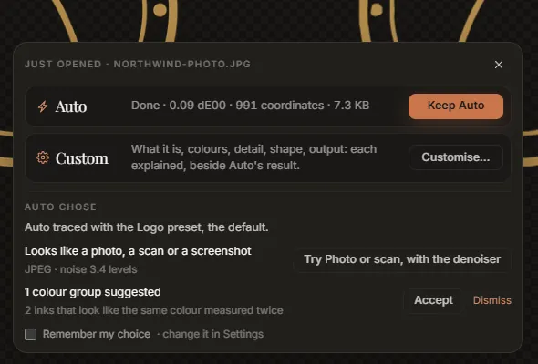
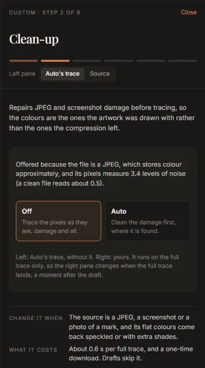

# Tutorial: clean up a JPEG logo

A logo saved as a JPEG, or captured in a screenshot, is the most common thing people need to
vectorize, and the hardest to trace well. JPEG compression leaves faint blocks and halos around
every edge and shifts the colours slightly, and a faithful trace reproduces all of it: flat
colours come back speckled, one colour comes back as three, and the edges wobble. This tutorial
removes the damage first, then settles the palette, then checks the result.

You need a JPEG (or a lossy WebP, or a screenshot) of a logo. About 10 minutes, plus a one-time
download of about 80 MB.

## 1. Get the denoiser

The denoiser is the trained model that repairs compression damage before tracing. It is not in the
installer. Open **Settings**, and under **Denoiser** press **Download**. The dialog says where it
comes from and what it costs; press **Download** again. It is checked against its published
checksum when it arrives, and it runs on your computer: nothing is uploaded.

You can do this later, from the prompts in the steps below; doing it first means the first trace is
already a clean one.

## 2. Open the JPEG

Drop the file on the window, or press <kbd>Ctrl</kbd>+<kbd>O</kbd>. Auto traces it at once, and
the choice card appears over the stage. When Auto's trace lands, **Auto chose** says what it
noticed:

*Looks like a photo, a scan or a screenshot* appears because the file is a JPEG, or because its
pixels measure noisy (the evidence is on the second line, as a noise level: a clean file reads
about 0.5).

## 3. Turn the clean-up on

Either press **Try Photo or scan, with the denoiser** on the card, which switches to the *Photo or
scan* preset, or press **Customise…** and go through the wizard: its second step, **Clean-up**, is
there because the image looks damaged.

Choose **Auto**: the trace is measured, and the damage is cleaned where the trace disagrees with the
image in places that should be flat. (Tune's **Denoiser** switch at the top of the rail is the same
setting: **Off**, **Auto**, **On**.)

The denoiser runs on the full trace only, so the right pane changes a moment after the draft. With
the wizard open, the left pane shows Auto's trace without it, for comparison.

## 4. Settle the palette

Compression turns one flat colour into a cluster of near-identical ones. Open the **Colours** step
in the wizard (or the palette at the bottom of the Result tab).

- Accept the **suggested** groups whose members are the same colour measured twice. Hover a
  suggestion first: the drawing singles out the shapes it would join.
- If the logo has, say, three colours and the palette still has more, set **Colours** to 3 and look
  at the groups it proposes. Accept the ones that are right; **Dismiss** the others.

Each accepted group re-traces, so the shapes between the merged colours really join into one.
See [the palette](../palette.md#colour-groups) for everything groups can do.

## 5. Check the edges

Close the wizard (**Finish**), or stay on the Result tab.

1. Read the quality report. The mean colour difference measures the trace against the JPEG,
   damage and all, so a cleaned trace can show a *higher* number than a faithful one: it no longer
   copies the noise. Judge by eye.
2. Press **Find the worst corner**. The viewer zooms to 12× with the pixel grid on, at the place of
   largest disagreement. On a JPEG this is usually a halo the trace has rightly ignored.
3. Turn on **Certainty**. Red bands show edges the pixels could not pin down. If whole outlines are
   red, the JPEG was small or heavily compressed; a larger source helps more than any setting.
4. Hold <kbd>Space</kbd> in **A/B** to flick between the JPEG and the SVG.

If small specks survived, raise **Speckle floor** (Tune, Detail) a little. If a detail was lost,
lower it, or lower **Precision**.

## 6. Match the brand colours

The colours now come from the cleaned image, which is closer to the artwork than the JPEG, but
still a measurement. If you know the brand's real values:

1. In the palette, press **Paste brand palette**.
2. Paste the colours, one per line, as hex (`#12443E`) or CSS variables. Include every colour the
   logo uses, white and black too: every ink is matched to its nearest pasted colour.
3. Check the preview. A gold figure means a large move; make sure it is the right colour.
4. Press **Snap**.

## 7. Take it out

Snapped colours live on the drawing on screen. In version 0.2.0, **Export** re-traces first and
writes the measured colours, so after snapping use **Copy SVG** and paste the drawing where it is
going. If you did not snap, **Export** (or <kbd>Ctrl</kbd>+<kbd>E</kbd>) writes the SVG, a minified
copy, PNGs and an asset pack; see [Export](../export.md).

The Result tab will still list *The source is a JPEG, so these colours carry its compression
damage*. That is a fact about the file you started from, and it goes into the asset pack's README
so whoever uses the files knows to check the colours.

## Why not trace the JPEG as it is?

You can: with the denoiser **Off**, the trace reproduces the JPEG faithfully, and the colour
difference is lower because it copies the damage. That is the right choice when the damage is part
of what you want to keep. For a logo, it almost never is.
