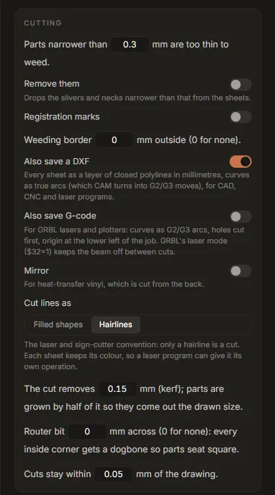

# Tutorial: laser cutting, DXF and G-code

This tutorial turns a logo into files for a laser cutter or a CNC router: hairline cut paths in
real millimetres, compensated for the width of the cut, as an SVG for LightBurn, a DXF for CAD and
CAM programs, and G-code for a GRBL machine. About 15 minutes, plus a test cut.

## 1. Trace it, or bring an SVG

Trace the logo in **Vectorize** as usual (see [Getting started](../getting-started.md)), then open
**Fabricate** and press **Use the current trace**. Or open any SVG in Fabricate with **Open an
SVG**.

For cutting, fewer and simpler outlines are better: every outline is a path the head has to
follow. Accept the palette's colour-group suggestions, and consider the *Fewer paths* preset
before you bring the trace over.

## 2. Choose "Laser or sign cutter"

Under **Material**, press **Laser or sign cutter**. It sets:

- **Inlay** mode: one sheet per colour, cut exactly, nothing stacked;
- **Hairlines**: only a hairline is a cut, and each sheet keeps its colour so a laser program can
  give each colour its own operation (LightBurn reads the colours as layers);
- a **kerf** of 0.15 mm, inner shapes cut before the parts around them;
- a smallest width of 0.3 mm, no registration marks;
- **Also save a DXF** on.

To cut one outline from one sheet of material rather than one sheet per colour, choose **One
colour** under **Making**: every selected colour is joined into a single cut.

To *engrave* lines rather than cut shapes (a pen, a scoring tool, or a laser line along the middle
of each stroke), choose **Pen or score** instead: each line is followed once, down its centre.

## 3. Set the size, and the units the file states

Type the finished width under **Size**. Then set **The files state their size in**:

- **Pixels, 96/in** for LightBurn, Inkscape, Carbide Create and Fusion, which read a bare pixel
  size at 96 per inch;
- **Millimetres** for everything else.

The DXF and the G-code are always in millimetres, whatever this says.

Turn on **Cut a size-check square** for the first cut: a 20 mm square below the design, to measure.

## 4. Measure and set the kerf

The beam (or the bit) removes a strip of material as wide as the kerf. Without compensation every
part comes out smaller than drawn by that much, and every hole larger. With **Hairlines**, the tab
grows each part by half the kerf, so it comes out at the drawn size.

Typical kerfs: a CO₂ laser 0.1 to 0.2 mm, a diode laser 0.15 to 0.3 mm. Yours depends on the
machine, the lens, the focus and the material, so measure it:

1. Cut the size-check square with the kerf set to 0.
2. Measure the square with calipers. The kerf is `20 mm − measured size`.
3. Type it into *The cut removes* **x** *mm (kerf)*.

## 5. For a router: dogbones and the bit

A round router bit cannot cut a sharp inside corner, so parts meant to fit into each other will not
seat. Type the bit's diameter into *Router bit* **x** *mm across*: every inside corner gets a
dogbone, a small round relief, so parts seat square. If some holes or gaps are narrower than the
bit, **Before you cut** says so: the bit cannot get into them.

Leave it at 0 for a laser.

## 6. Check before you cut

**Before you cut** lists the job (sheets, pieces, path segments, overall size) and anything that
will cause trouble: parts narrower than the smallest width, more than 2,000 path segments (slow in
most programs; raise *Cuts stay within* **x** *mm* to lower it), gaps the bit cannot enter.
**Show problems** draws them on the stage.

## 7. G-code for a GRBL machine

For a diode laser or a pen plotter running GRBL, turn on **Also save G-code** and set the sentence
under it: *Cut at* **1000** *mm/min, power S* **1000**, **1** *pass*.

- **Speed and power** depend entirely on your machine and material. Start from the material's
  recommended settings, and test on scrap. `S` is in GRBL's power units; `S1000` is full power with
  GRBL's default `$30=1000`.
- **Passes**: thick material needs several passes at a speed that cuts cleanly.
- The file uses **laser mode**. Set `$32=1` on the controller once, so the beam is off during moves
  between cuts; under laser mode, power follows speed (`M4`), so corners do not burn.
- **Origin**: the lower left of the job, marks and borders included, in millimetres. Jog the head
  to the lower-left corner of the material and zero it there before running the file.
- Curves are written as arcs (`G2`/`G3`), and holes and inner parts are cut before the part around
  them, so a part never shifts before its holes are cut.

Always run the file first with the laser at low power (or off, with a pointer), to check the
position and the size.

## 8. Save

Press **Save *N* sheets…** and choose a folder. You get one SVG per colour, `name-all.svg` with
every colour as its own group, `name.dxf` and, if on, `name.gcode`.

- **LightBurn**: import `name-all.svg` (or the DXF). Each colour arrives as its own layer; set a
  cut operation per layer.
- **CAD and CAM programs** (Fusion, FreeCAD, VCarve, Carbide Create): import `name.dxf`. It is R12
  DXF, the version every program reads, one layer per colour, closed polylines in millimetres,
  curves as true arcs, which CAM turns into `G2`/`G3` moves.
- **GRBL**: send `name.gcode` with your usual sender.

**Studio Lite:** Save downloads the files.

## Engraving lines with "Pen or score"

**Pen or score** sets the **Lines** mode: every line in the drawing is followed once, along its
centre, rather than around both of its edges. The **Drawing** card sets the tip width (the preview
shows the line the tool will leave) and which lines count as lines: *Lines up to* **x** *mm wide are
drawn once* (0 for any width); wider parts are drawn round their outline. The DXF has lines as open
polylines and outlines as closed ones. G-code works as above.
