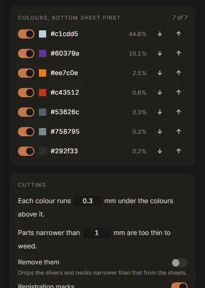

# Tutorial: layered vinyl and iron-on

This tutorial takes a colour logo to cut files for a Cricut, Silhouette or Brother machine: one
sheet per colour, stacked so there are no gaps between colours, with marks to line the sheets up.
The same steps make iron-on (heat-transfer vinyl, HTV) for a T-shirt; the differences are in step 4.
About 15 minutes.

## 1. Trace with the cutter in mind

Open the logo in the **Vectorize** tab. Every colour in the drawing will become a sheet of vinyl,
so the palette decides the job:

- **Fewer colours means fewer sheets.** In the palette, accept the suggested colour groups, and set
  **Colours** to the number of vinyl colours you will actually use. See
  [the palette](../palette.md#colour-groups).
- **Vinyl is one flat colour.** A gradient is cut as its average colour. Turn on **Flat fills
  instead of gradients** (Tune, Colour) so the trace makes that choice where you can see it.
- **The background is not a sheet.** Fabricate leaves out the colour that covers the page. If the
  background is a colour you want cut, it can be switched back on later.

Check the trace in the viewer at 4× and 12×: slivers and specks you see here are pieces you will
have to weed.

## 2. Bring it into Fabricate

Switch to the **Fabricate** tab and press **Use the current trace**. The tab measures the drawing,
selects every colour but the background, and, with more than one colour, chooses **Layered**.

(Any SVG works here too: **Open an SVG**, or drop one on the window.)

## 3. Choose the material and the size

Under **Material**, press **Adhesive vinyl**. It sets filled-shape cuts, a 0.8 mm overlap between
layers, registration marks, and a smallest width of 0.8 mm.


Under **Size**, type the finished width: *The design is* **120** *mm wide*. The height follows.
Switch to **in** if you work in inches; every length on the tab switches with it.

Turn on **Cut a size-check square**. It adds a 20 mm square (1 in) below the design. Measure it
after cutting: if it is any other size, the cutter's program rescaled the file on import.

Set **The files state their size in** for your cutter's software: **Pixels, 72/in** for Cricut
Design Space and Silhouette Studio, **Millimetres** otherwise.

## 4. For iron-on: mirror, and a thinner overlap

Press **Iron-on** instead of Adhesive vinyl. It changes three things:

- **Mirror** is on: HTV is cut from the back, face down on the mat.
- The overlap is **0.3 mm**. Every layer of HTV is another pressing; 0.25 to 0.38 mm is the range
  that stays put without building up a ridge.
- The smallest width is **1 mm**: thin parts of HTV lift in the wash.

Glitter, holographic and puff HTV do not take another layer on top of them: put them at the top of
the stack (next step), or cut them as one colour on their own.

## 5. The colours and their order



In Layered mode the **Colours** list is the stack, **bottom sheet first**. Each colour runs under
the colours above it by the overlap, so the bottom one is the largest piece. The largest colour of
the drawing starts at the bottom, which suits most logos. Use **↓** and **↑** to change the order,
and the switch at the left of a colour to leave it out, for example the colour of the shirt itself.

The stage shows **All sheets**, stacked as the finished piece. The numbered buttons above it show
one sheet at a time; the **Cut list** at the bottom of the rail says how big a piece of vinyl each
sheet needs.

## 6. Fix what will go wrong

**Before you cut** lists the problems, and **Show problems** draws them on the sheets: parts too
thin to weed in red, waste gaps too narrow to weed in amber, loose specks ringed. For each:

- **Parts narrower than the smallest width** will tear or not stick. Make the design larger, or
  turn on **Remove them** under Cutting, which drops those slivers from the sheets.
- **Waste narrower than the smallest width** lifts with the design when you weed. Make the design
  larger, or plan to weed those spots by hand.
- **Specks** smaller than a few square millimetres are lost on the transfer tape. Accept it, or go
  back to Vectorize and raise **Speckle floor** so they are not in the drawing.
- **A gradient** or **a partly transparent colour** is cut at its average colour, at full
  strength. Choose a vinyl close to it.
- **More than 5,000 cut paths** in a sheet: Cricut Design Space is reported to refuse such files.
  Turn on **Remove them**, or raise the smallest width.

Changing the size is usually the real fix: at 60 mm a detailed logo has dozens of thin parts; at
120 mm most of them are gone. The findings update as you type.

## 7. Save and cut

Press **Save *N* sheets…** and choose a folder. For a logo called `mark` you get:

```
mark-1-c1cdd5.svg      bottom sheet
mark-2-60379a.svg
...
mark-all.svg           every sheet in one file, one group per sheet
```

In Cricut Design Space or Silhouette Studio, upload **`mark-all.svg`**: it arrives as one layer per
colour, already registered. The single-sheet files are there for software that wants one file per
cut. **Copy** puts the sheet on screen (or all of them) on the clipboard instead.

Cut the size-check square first and measure it. Then cut each colour, weed, and stack the sheets
bottom first, lining up the registration crosses. For HTV, press each layer briefly and the top
layer fully, following the vinyl's instructions.

**Studio Lite:** Save downloads the files instead of asking for a folder.

## Other things this tab makes

- **One colour**: every selected colour joined into one sheet, for a single-colour decal.
- **Inlay**: colours cut exactly and laid edge to edge instead of stacked. Thinner, but hard to
  line up.
- **Sticker**: the artwork with a contour 3 mm around it, for print-then-cut.
- **Stencil**: the design cut out of one sheet, with bridges holding the middles of letters.

All of them are described in [Fabricate](../fabricate.md).
