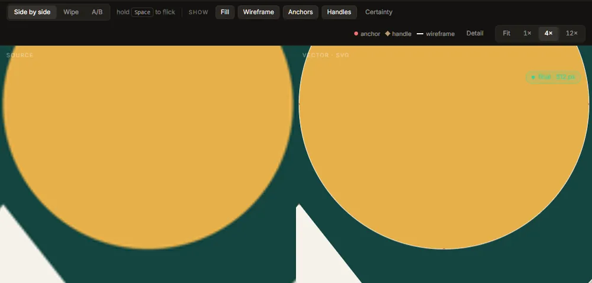
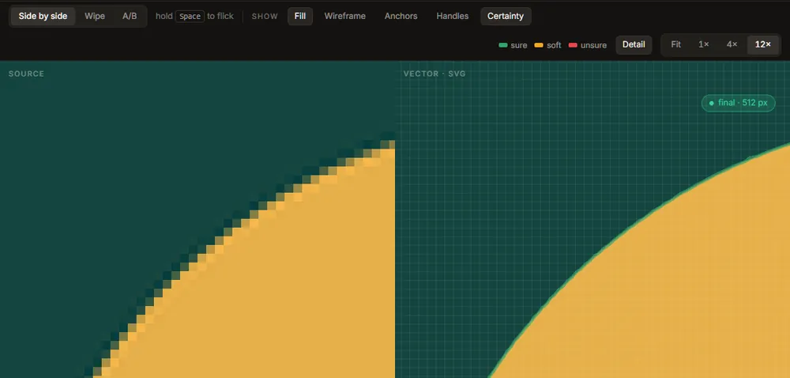

# The viewer

The stage of the Vectorize tab shows the image you opened (**Source**) beside the SVG it became
(**Vector · SVG**). Both panes share one pan and one zoom, so the same spot is always under the
same place in both. The SVG pane is drawn as a real vector at every zoom: at 12× an edge is still
an edge, not an enlarged bitmap.

## Comparing: side by side, wipe, A/B

The three buttons at the left of the toolbar arrange the two panes.

- **Side by side**: the two panes next to each other.
- **Wipe**: one pane over the other, with a divider. Drag the divider to move it; the source is on
  the left of it and the SVG on the right.
- **A/B**: one pane at a time, the SVG. Hold <kbd>Space</kbd> to see the source instead, and
  release to go back. Flicking between the two in place is the quickest way to see a small
  difference.

## Zooming and panning

| To | Do this |
|---|---|
| Zoom about a point | Scroll the wheel (or pinch on a trackpad) over either pane |
| Pan | Drag with the left button |
| Fit the drawing to the window | Double-click a pane, press <kbd>0</kbd>, or press **Fit** |
| Zoom to a fixed stop | **1×**, **4×** or **12×** in the toolbar |
| Zoom in or out a step | <kbd>+</kbd> and <kbd>-</kbd> |

Zoom runs from a quarter of the image's size to 64×. The view fits the window until you zoom or
pan; after that it stays where you put it when the window is resized. From 4× up, the source is
drawn with square pixels rather than smoothed, because those pixels are the evidence the trace was
measured against.

## Overlays: what the SVG is made of

The **Show** toggles draw on the SVG pane.

- **Fill**: the drawing's colours. Turned off, the fill dims rather than disappears, so the
  outlines still have something to sit on.
- **Wireframe**: every outline as a thin line.
- **Anchors**: every node, as a dot.
- **Handles**: the Bézier control handles, as lines with a diamond at the end.
- **Certainty**: how sure each edge is (below).

A key to the marks appears at the right of the toolbar while any overlay is on. Anchors and
handles are how you judge what the file will be like to edit: fewer nodes, and handles that line
up, are easier to work with. [Editable structure](tune.md#the-denoiser-and-editable) is the setting
that moves them towards what an artist would draw.

## Detail: the pixel grid under the edge

**Detail** draws the source's pixel grid under the SVG, one cell per source pixel, and zooms to
12× if you are further out (the grid is only drawn from 6× up, where a cell is big enough to see).
It shows where a vector edge falls inside the partly covered pixels along the source's
anti-aliased boundary: a good trace cuts through them where their shade says the boundary is.

While Detail is on, a small note on the stage names the **worst corner**: the place where the
trace and the source disagree most, with its colour difference and position. **Jump to it** goes
there at 12×. The same jump is **Find the worst corner** in the [quality report](result.md).

## Certainty

**Certainty** draws a band along each boundary showing where that boundary could be, measured from
the pixels: two standard deviations either side of the traced edge.

| Colour | Means | Band's typical half-width |
|---|---|---|
| **sure** (green) | A crisp edge; the curve sits where the pixels say | up to 0.1 px |
| **soft** (amber) | A softer edge; still well placed | up to 0.3 px |
| **unsure** (red) | A blurred, soft or compressed edge; the curve here is a best guess | more than 0.3 px |

A thin green line everywhere is what a clean PNG gives. Wide red bands usually mean the image was
enlarged, blurred or compressed; the [denoiser](settings.md#denoiser) or a better source helps
more than any setting.

If a trace has no certainty information, the toggle is greyed out until the next trace.

## Draft and full traces

Every change to a control starts a **draft** straight away: the same settings, traced small
(512 px on the longer side by default) with a short time limit, so the picture keeps up with you.
When the controls have been still for a moment (0.8 s by default), the **full** trace starts. A
chip at the top right of the stage says which one you are looking at:

- **draft · 512 px** (gold): a draft; the full trace is queued.
- **final · 1024 px** (green): the full trace, at the size it was traced.
- **re-tracing · …** (copper): a trace is running; the drawing on screen is the previous one.

The chip flashes when a draft is replaced by its full trace, so the swap is never silent. Draft
size, draft time limit and the wait before the full trace are in
[Settings, Performance](settings.md#performance).

Only the full trace is ever exported: [Export](export.md) always runs one first.

## The status strip

The line along the bottom of the stage says what is happening: the stage the trace is on and the
time so far (with <kbd>Esc</kbd> to cancel), or how long the last trace took, at what size, and
how many segments it has. When the update check has found a new version, it says so here and
nowhere else. The right end always carries the same sentence: *Your image never leaves this
computer.*

## When the stage is not showing a drawing

| The stage says | What it means | What to do |
|---|---|---|
| Reading *file* | The image is being decoded; tracing starts as soon as it is in memory. | Wait. |
| This image is one flat colour | There is no boundary to trace; the whole output would be one rectangle. | Open another image. |
| This file will not decode | The file is damaged or not an image the app reads. The message says why. | Open another image. |
| The trace would run out of memory | The trace size needs more memory than is free; the card gives the estimate. | **Retry at** the smaller size it suggests; it usually costs nothing visible. |
| The trace stopped | Something failed; the message says what. | **Trace again**. |
| Trace cancelled | You pressed <kbd>Esc</kbd> or **Cancel**. The last full trace is still on screen and still exportable. | **Trace again** when you want. |
| This preset wants the denoiser | You chose *Photo or scan*, or turned the denoiser on, before downloading it. The trace runs without it. | **Download the denoiser**, or carry on. |
| No network | The update check could not connect. Tracing never needed a network. | Nothing. |

A large image is traced at the **Trace size** (2048 px on the longer side by default) and the SVG
is still written at the image's full size. When that happens a note says so; it is normal, and the
SVG scales without limit.
